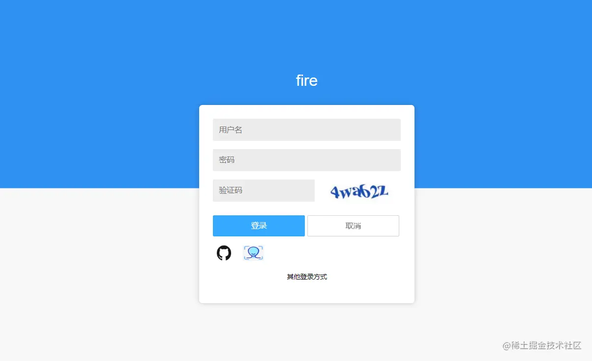

# OAuth2.0 

## 一、OAuth2.0 为何物

`OAuth` 简单理解就是一种授权机制，它是在客户端和资源所有者之间的授权层，用来分离两种不同的角色。在资源所有者同意并向客户端颁发令牌后，客户端携带令牌可以访问资源所有者的资源。

`OAuth2.0` 是`OAuth` 协议的一个版本，有`2.0`版本那就有`1.0`版本，有意思的是`OAuth2.0` 却不向下兼容`OAuth1.0` ，相当于废弃了`1.0`版本。


**举个小栗子解释一下什么是 OAuth 授权？**

在家肝文章饿了定了一个外卖，外卖小哥30秒火速到达了我家楼下，奈何有门禁进不来，可以输入密码进入，但出于安全的考虑我并不想告诉他密码。

此时外卖小哥看到门禁有一个高级按钮“`一键获取授权`”，只要我这边同意，他会获取到一个有效期 2小时的令牌（`token`）正常出入。


令牌（`token`）和 `密码` 的作用虽然相似都可以进入系统，但还有点不同。`token` 拥有权限范围，有时效性的，到期自动失效，而且无效修改。


## 二、OAuth2.0 授权方式

`OAuth2.0` 的授权简单理解其实就是获取令牌（`token`）的过程，`OAuth` 协议定义了四种获得令牌的授权方式（`authorization grant` ）如下：

- 授权码（`authorization-code`）
- 隐藏式（`implicit`）
- 密码式（`password`）：
- 客户端凭证（`client credentials`）

但值得注意的是，不管我们使用哪一种授权方式，在三方应用申请令牌之前，都必须在系统中去申请身份唯一标识：客户端 ID（`client ID`）和 客户端密钥（`client secret`）。这样做可以保证 `token` 不被恶意使用。


下面我们会分析每种授权方式的原理，在进入正题前，先了解 `OAuth2.0` 授权过程中几个重要的参数：

-  `response_type`：code 表示要求返回授权码，token 表示直接返回令牌
- `client_id`：客户端身份标识
- `client_secret`：客户端密钥
- `redirect_uri`：重定向地址
- `scope`：表示授权的范围，`read`只读权限，`all`读写权限
- `grant_type`：表示授权的方式，`AUTHORIZATION_CODE`（授权码）、`password`（密码）、`client_credentials`（凭证式）、`refresh_token` 更新令牌
- `state`：应用程序传递的一个随机数，用来防止`CSRF`攻击。


### 1、授权码

`OAuth2.0`四种授权中授权码方式是最为复杂，但也是安全系数最高的，比较常用的一种方式。这种方式适用于兼具前后端的`Web`项目，因为有些项目只有后端或只有前端，并不适用授权码模式。

下图我们以用`WX`登录掘金为例，详细看一下授权码方式的整体流程。


用户选择`WX`登录掘金，掘金会向`WX`发起授权请求，接下来 `WX`询问用户是否同意授权（常见的弹窗授权）。`response_type` 为 `code` 要求返回授权码，`scope` 参数表示本次授权范围为只读权限，`redirect_uri` 重定向地址。

```
https://wx.com/oauth/authorize?
  response_type=code&
  client_id=CLIENT_ID&
  redirect_uri=http://juejin.im/callback&
  scope=read
```


用户同意授权后，`WX` 根据 `redirect_uri`重定向并带上授权码。

```
http://juejin.im/callback?code=AUTHORIZATION_CODE
```


当掘金拿到授权码（code）时，带授权码和密匙等参数向`WX`申请令牌。`grant_type`表示本次授权为授权码方式 `authorization_code` ，获取令牌要带上客户端密匙 `client_secret`，和上一步得到的授权码 `code`。

```
https://wx.com/oauth/token?
 client_id=CLIENT_ID&
 client_secret=CLIENT_SECRET&
 grant_type=authorization_code&
 code=AUTHORIZATION_CODE&
 redirect_uri=http://juejin.im/callback
```


最后 `WX` 收到请求后向 `redirect_uri` 地址发送 `JSON` 数据，其中的`access_token` 就是令牌。

```
{    
  "access_token":"ACCESS_TOKEN",
  "token_type":"bearer",
  "expires_in":2592000,
  "refresh_token":"REFRESH_TOKEN",
  "scope":"read",
  ......
}
```


### 2、隐藏式

上边提到有一些`Web`应用是没有后端的， 属于纯前端应用，无法用上边的授权码模式。令牌的申请与存储都需要在前端完成，跳过了授权码这一步。

前端应用直接获取 `token`，`response_type` 设置为 `token`，要求直接返回令牌，跳过授权码，`WX`授权通过后重定向到指定 `redirect_uri` 。

```
https://wx.com/oauth/authorize?
  response_type=token&
  client_id=CLIENT_ID&
  redirect_uri=http://juejin.im/callback&
  scope=read
```


### 3、密码式

密码模式比较好理解，用户在掘金直接输入自己的`WX`用户名和密码，掘金拿着信息直接去`WX`申请令牌，请求响应的 `JSON`结果中返回 `token`。`grant_type` 为 `password` 表示密码式授权。

```
https://wx.com/token?
  grant_type=password&
  username=USERNAME&
  password=PASSWORD&
  client_id=CLIENT_ID
```

这种授权方式缺点是显而易见的，非常的危险，如果采取此方式授权，该应用一定是可以高度信任的。


### 4、凭证式

凭证式和密码式很相似，主要适用于那些没有前端的命令行应用，可以用最简单的方式获取令牌，在请求响应的 `JSON` 结果中返回 `token`。

`grant_type` 为 `client_credentials` 表示凭证式授权，`client_id` 和 `client_secret` 用来识别身份。

```
https://wx.com/token?
  grant_type=client_credentials&
  client_id=CLIENT_ID&
  client_secret=CLIENT_SECRET
```


## 三、令牌的使用与更新

### 1、令牌怎么用？

拿到令牌可以调用 `WX` API 请求数据了，那令牌该怎么用呢？

每个到达`WX`的请求都必须带上 `token`，将 `token` 放在 `http` 请求头部的一个`Authorization`字段里。

如果使用`postman` 模拟请求，要在`Authorization` -> `Bearer Token` 放入 `token`，**注意**：低版本`postman` 没有这个选项。


### 2、令牌过期怎么办？

`token`是有时效性的，一旦过期就需要重新获取，但是重走一遍授权流程，不仅麻烦而且用户体验也不好，那如何让更新令牌变得优雅一点呢？

一般在颁发令牌时会一次发两个令牌，一个令牌用来请求`API`，另一个负责更新令牌 `refresh_token`。`grant_type` 为 `refresh_token` 请求为更新令牌，参数 `refresh_token` 是用于更新令牌的令牌。

```
https://wx.com/oauth/token?
  grant_type=refresh_token&
  client_id=CLIENT_ID&
  client_secret=CLIENT_SECRET&
  refresh_token=REFRESH_TOKEN
```


# OAuth2.0实战  Github 做授权登录

最近在做自己的开源项目（`fire`），`Springboot` + `vue` 的前后端分离框架才搭建完，刚开始做登录功能，做着做着觉得普通账户密码登录太简单了没啥意思，思来想去为显得逼格高一点，决定再加上 `GitHub`授权 和 `人脸识别`等多种登录方式。



而`GitHub`授权登录正好用到了`OAuth2.0`中最复杂的授权码模式，正好拿我这个案例给大家分享一下`OAuth2.0`的授权过程，后续项目功能会持续更新。


## 一、授权流程

在具体做`GitHub`授权登录之前，咱们再简单回顾一下`OAuth2.0`授权码模式的授权流程，如果 `fire` 网站允许 用`GitHub` 账号登录，流程大致如下图。


用户想用`GitHub` 账号去登录 `fire` 网站：

- `fire` 网站先让用户跳转到 `GitHub` 进行授权，会弹出一个授权框。
- 用户同意后，`GitHub` 会根据`redirect_uri` 重定向回 `fire` 网站，同时返回一个授权码code。
- `fire` 网站使用授权码和客户端密匙`client_secret`，向 GitHub 请求令牌`token`，检验通过返回令牌。
- 最后`fire` 网站向`GitHub` 请求数据，每次调用 GitHub 的 `API` 都要带上令牌。


## 二、身份注册

梳理完授权逻辑，接下来我们还有一些准备工作。

要想得到一个网站的`OAuth`授权，必须要到它的网站进行身份注册，拿到应用的身份识别码 `ClientID` 和 `ClientSecret`。

注册 [传送门](https://link.juejin.cn?target=https%3A%2F%2Fgithub.com%2Fsettings%2Fapplications%2F1334665) `https://github.com/settings/applications/1334665`，有几个必填项。

- `Application name`：我们的应用名；
- `Homepage URL`：应用主页链接；
- `Authorization callback URL`：这个是`github` 回调我们项目的地址，用来获取授权码和令牌。


提交后会看到就可以看到客户端`ClientID` 和客户端密匙`ClientSecret`，到这我们的准备工作就完事了。


## 三、授权开发

### 1、获取授权码

为了更好的看效果，获取授权码我处理的比较粗暴，直接在`JS`里拼装好了授权链接，但实际工作开发中一定要考虑到安全问题。

```
https://github.com/login/oauth/authorize?
client_id=ad41c05c211421c659db&
redirect_uri=http://47.93.6.5:8080/authorize/redirect
```

前端 `vue` 的逻辑也非常简单，只需要 `window.location.href` 重定向一下。

```vue
<script>
export default {
  methods: {
    loginByGithub: function () {
      window.location.href = 'https://github.com/login/oauth/authorize?client_id=ad41c05c211421c659db&redirect_uri=http://47.93.6.5:8080/authorize/redirect'
    }
  }
}
</script>
```

请求后会提示让我们授权，同意授权后会重定向到`authorize/redirect`，并携带授权码`code`；如果之前已经同意过，会跳过这一步直接回调。


### 2、获取令牌

授权后紧接着就要回调 `fire` 网站接口，拿到授权码以后拼装获取令牌 `access_token`的请求链接，这时会用到客户端密匙`client_secret`。

```
https://github.com/login/oauth/access_token? 
    client_id=${clientID}& 
    client_secret=${clientSecret}& 
    code=${requestToken}
```

`access_token` 会作为请求响应返回，结果是个串字符，需要我们截取一下。

```
access_token=4dc43c2f43b773c327f97acf5dd66b147db9259c&scope=&token_type=bearer
```

有了令牌以后开始获取用户信息，在 `API` 中要带上`access_token`。

```
https://api.github.com/user?access_token=4dc43c2f43b773c327f97acf5dd66b147db9259c
```

返回的用户信息是 `JSON` 数据格式，如果想把数据传递给前端，可以通过 `url` 重定向到前端页面，将数据以参数的方式传递。

```
{
    "login": "chengxy-nds",
    "id": 12745094,
    "node_id": "",
    "avatar_url": "https://avatars3.githubusercontent.com/u/12745094?v=4",
    "gravatar_id": "",
    "url": "https://api.github.com/users/chengxy-nds",
    "html_url": "https://github.com/chengxy-nds",
    "followers_url": "https://api.github.com/users/chengxy-nds/followers",
    "following_url": "https://api.github.com/users/chengxy-nds/following{/other_user}",
    "gists_url": "https://api.github.com/users/chengxy-nds/gists{/gist_id}",
    "starred_url": "https://api.github.com/users/chengxy-nds/starred{/owner}{/repo}",
    "subscriptions_url": "https://api.github.com/users/chengxy-nds/subscriptions",
    "organizations_url": "https://api.github.com/users/chengxy-nds/orgs",
    "repos_url": "https://api.github.com/users/chengxy-nds/repos",
    "events_url": "https://api.github.com/users/chengxy-nds/events{/privacy}",
    "received_events_url": "https://api.github.com/users/chengxy-nds/received_events",
    "type": "",
    "site_admin": false,
    "name": "程序员内点事",
    "company": null,
    "blog": "",
    "location": null,
    "email": "",
    "hireable": null,
    "bio": null,
    "twitter_username": null,
    "public_repos": 7,
    "public_gists": 0,
    "followers": 14,
    "following": 0,
    "created_at": "2015-06-04T09:22:44Z",
    "updated_at": "2020-07-13T06:08:57Z"
}
```

下边是 `GitHub` 回调我们 `fire`网站后端处理流程的部分代码，写的比较糙，后续继续优化吧！

```java
/**
     * @param code
     * @author xiaofu
     * @description 授权回调
     * @date 2020/7/10 15:42
     */
   @RequestMapping("/authorize/redirect")
    public ModelAndView authorize(@NotEmpty String code) {

        log.info("授权码code: {}", code);

        /**
         * 重新到前端主页
         */
        String redirectHome = "http://47.93.6.5/home";

        try {
            /**
             * 1、拼装获取accessToken url
             */
            String accessTokenUrl = gitHubProperties.getAccesstokenUrl()
                    .replace("clientId", gitHubProperties.getClientId())
                    .replace("clientSecret", gitHubProperties.getClientSecret())
                    .replace("authorize_code", code);

            /**
             * 返回结果中直接返回token
             */
            String result = OkHttpClientUtil.sendByGetUrl(accessTokenUrl);
            log.info(" 请求 token 结果：{}", result);

            String accessToken = null;
            Pattern p = Pattern.compile("=(\\w+)&");
            Matcher m = p.matcher(result);
            while (m.find()) {
                accessToken = m.group(1);
                log.info("令牌token：{}", m.group(1));
                break;
            }

            /**
             * 成功获取token后，开始请求用户信息
             */
            String userInfoUrl = gitHubProperties.getUserUrl().replace("accessToken", accessToken);

            String userResult = OkHttpClientUtil.sendByGetUrl(userInfoUrl);

            log.info("用户信息：{}", userResult);

            UserInfo userInfo = JSON.parseObject(userResult, UserInfo.class);

            redirectHome += "?name=" + userInfo.getName();

        } catch (Exception e) {
            log.error("授权回调异常={}", e);
        }
        return new ModelAndView(new RedirectView(redirectHome));
    }
```

最后我们动图看一下整体的授权流程，由于`GitHub`的访问速度比较慢，偶尔会有请求超时的现象。

