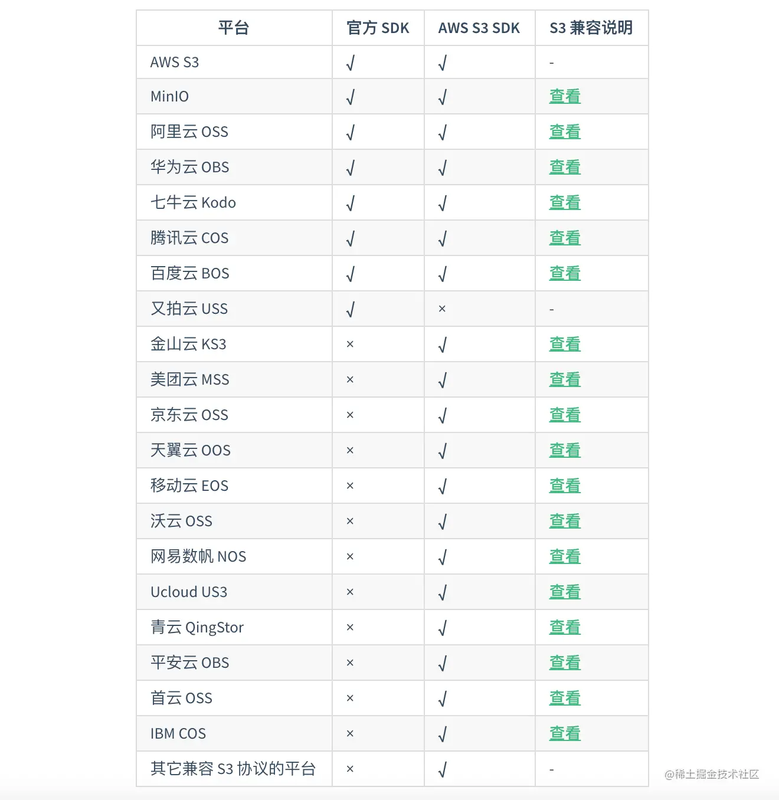
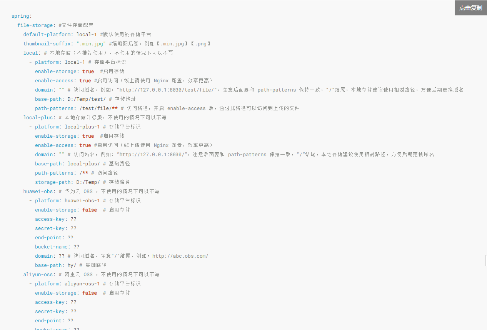
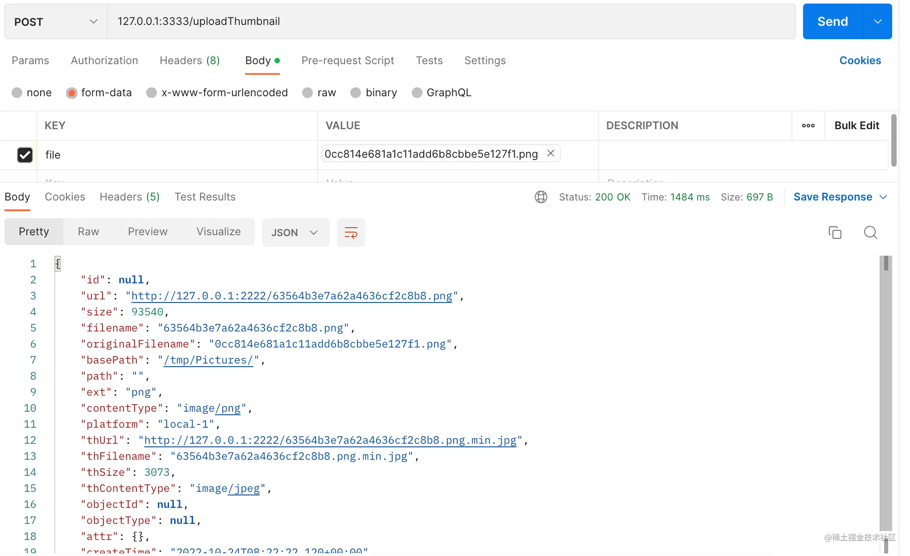
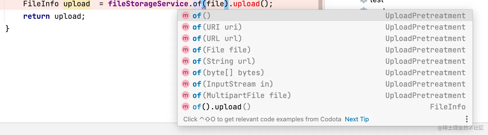

# Spring File Storage文件上传工具

## 一、简介

​		`Spring File Storage`，上传文件只要些许配置**一行代码**搞定，开发效率杠杠的

```
官网：spring-file-storage.xuyanwu.cn
```

​		`Spring File Storage`工具几乎整合了市面上所有的OSS对象存储平台，包括`本地`、`FTP`、`SFTP`、`WebDAV`、`阿里云OSS`、`华为云OBS`、`七牛云Kodo`、`腾讯云COS`、`百度云 BOS`、`又拍云USS`、`MinIO`、`京东云 OSS`、`网易数帆 NOS`等其它兼容 S3 协议的平台，只要在springboot中通过极简的方式就可以实现文件存储。



## 二、简单配置

下边以本地和Aliyun OSS上传为例，`pom.xml`中引入必要的`spring-file-storage.jar`

**注意：** 如果要上传文件到OSS平台，需要引入对应平台的SDK包。

```xml
<!-- spring-file-storage 必须要引入 -->
<dependency>
    <groupId>cn.xuyanwu</groupId>
    <artifactId>spring-file-storage</artifactId>
    <version>0.5.0</version>
</dependency>

<!-- 阿里云oss -->
<dependency>
    <groupId>com.aliyun.oss</groupId>
    <artifactId>aliyun-sdk-oss</artifactId>
    <version>3.10.2</version>
</dependency>
```

`application.yml`文件中配置些基础信息。

- `enable-storage`：只有状态开启才会被识别到
- `default-platform`：默认的上传平台
- `domain`：生成的文件url中访问的域名
- `base-path`：存储地址
- `thumbnail-suffix`：缩略图后缀

要是上传OSS对象存储平台，将`aliyun oss`提供的变量配置到相应的模块上即可。

```yaml
spring:
  #文件存储配置(本地、oss)
  file-storage:
    default-platform: local-1
    thumbnail-suffix: ".min.jpg" #缩略图后缀
    local:
      - platform: local-1 # 存储平台标识
        enable-storage: true #是否开启本存储（只能选一种）
        enable-access: true #启用访问（线上请使用 Nginx 配置，效率更高）
        domain: "http://127.0.0.1:2222" #访问域名，注意后面要和path-patterns保持一致，“/”结尾
        base-path: /tmp/Pictures/ # 存储地址
        path-patterns: /** #访问路径
    aliyun-oss:
      - platform: aliyun-oss
        enable-storage: true
        access-key: xxxx
        secret-key: xxxx
        end-point: xxx
        bucket-name: firebook
        domain: http://fire100.top
        base-path: #云平台文件路径
```

详见官网

````
https://spring-file-storage.xuyanwu.cn/#/%E5%BF%AB%E9%80%9F%E5%85%A5%E9%97%A8
````



`springboot`启动类中增加注解`@EnableFileStorage`，显式的开启文件上传功能，到这就可以用了

```java
@EnableFileStorage // 文件上传工具
@SpringBootApplication
public class SpringbootFileStorageApplication {

    public static void main(String[] args) {
        SpringApplication.run(SpringbootFileStorageApplication.class, args);
    }
}
```

## 三、使用示例

### 1.上传文件

接下来在业务类中引入`FileStorageService`服务，如下只要一行代码就可以完成文件上传，是不是So easy，下载也是如法炮制。

```java
@RestController
public class FileController {

    @Autowired
    private FileStorageService fileStorageService;

    /**
     * 上传文件
     */
    @PostMapping(value = {"/upload"})
    public Object upload(MultipartFile file) {
        FileInfo upload  = fileStorageService.of(file).upload();
        return upload;
    }
}
```

我们用`postman`测试上传一张图片，看到图片已经成功传到了`/tmp/Pictures`目录下，返回结果中包含了完整的访问文件的URL路径。



不仅如此`spring-file-storage`还支持多种文件形式，`URI`、`URL`、`String`、`byte[]`、`InputStream`、`MultipartFile`，使开发更加灵活。



文件上传功能，更多时候我们都是在上传图片，那就会有`动态裁剪图片`、`生成缩略图`的需求，这些 spring-file-storage 都可以很容易实现。

```java
/**
 * 上传图片裁剪大小并生成一张缩略图
 */
@PostMapping("/uploadThumbnail")
public FileInfo uploadThumbnail(MultipartFile file) {
    return fileStorageService.of(file)
            .image(img -> img.size(1000,1000))  //将图片大小调整到 1000*1000
            .thumbnail(th -> th.size(200,200))  //再生成一张 200*200 的缩略图
            .upload();
}
```

### 2.下载文件

下载文件也同样的简单，可以直接根据文件url或者文件流下载。

```java
/**
 * 下载文件
 */
@PostMapping("/download")
public void download(MultipartFile file) {
    // 获取文件信息
    FileInfo fileInfo = fileStorageService.getFileInfoByUrl("http://file.abc.com/test/a.jpg");
    
    // 下载到文件
    fileStorageService.download(fileInfo).file("C:\\a.jpg");

    // 直接通过文件信息中的 url 下载，省去手动查询文件信息记录的过程
    fileStorageService.download("http://file.abc.com/test/a.jpg").file("C:\\a.jpg");

    // 下载缩略图
    fileStorageService.downloadTh(fileInfo).file("C:\\th.jpg");
}
```

提供了监听下载进度的功能，可以清晰明了的掌握文件的下载情况。

```java
// 下载文件 显示进度
fileStorageService.download(fileInfo).setProgressMonitor(new ProgressListener() {
    @Override
    public void start() {
        System.out.println("下载开始");
    }

    @Override
    public void progress(long progressSize,long allSize) {
        System.out.println("已下载 " + progressSize + " 总大小" + allSize);
    }

    @Override
    public void finish() {
        System.out.println("下载结束");
    }
}).file("C:\\a.jpg");
```

### 3.文件存在、删除

我们还可以根据文件的URL地址来判断文件是否存在、以及删除文件。

```java
//直接通过文件信息中的 url 删除，省去手动查询文件信息记录的过程
fileStorageService.delete("http://file.abc.com/test/a.jpg");
```

```java
//直接通过文件信息中的 url 判断文件是否存在，省去手动查询文件信息记录的过程
boolean exists2 = fileStorageService.exists("http://file.abc.com/test/a.jpg");
```

### 4.切面

工具还提供了每种操作的切面，可以在每个动作的前后进行干预，比如打日志或者玩点花活，实现`FileStorageAspect`类重写对应动作的xxxAround方法。

```java
**
 * 使用切面打印文件上传和删除的日志
 */
@Slf4j
@Component
public class LogFileStorageAspect implements FileStorageAspect {

    /**
     * 上传，成功返回文件信息，失败返回 null
     */
    @Override
    public FileInfo uploadAround(UploadAspectChain chain, FileInfo fileInfo, UploadPretreatment pre, FileStorage fileStorage, FileRecorder fileRecorder) {
        log.info("上传文件 before -> {}",fileInfo);
        fileInfo = chain.next(fileInfo,pre,fileStorage,fileRecorder);
        log.info("上传文件 after -> {}",fileInfo);
        return fileInfo;
    }
}
```

