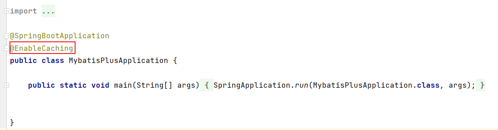
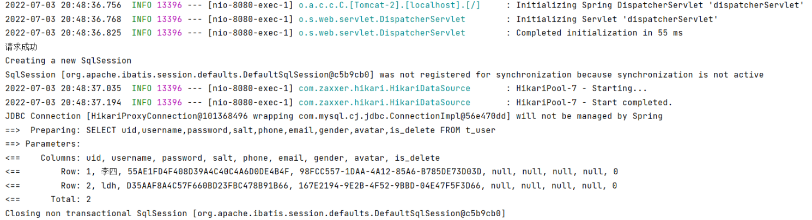
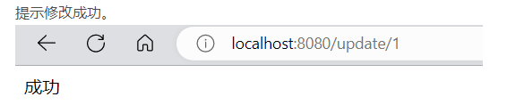
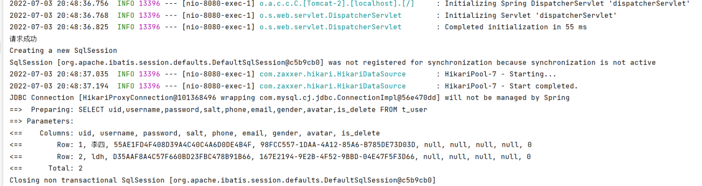

# SpringBoot提供的缓存机制

Spring为我们提供了几个注解来支持Spring Cache。

**使用@Cacheable标记的方法在执行后Spring Cache将缓存其返回结果，而使用@CacheEvict标记的方法会在方法执行前或者执行后移除Spring Cache中的某些元素。**

使用缓存的前提是需要在启动类上添加@EnableCache注解，注明开启Spring缓存



## 1、@Cacheable

**将数据存放在Spring缓存中，在下次执行方法时，查询Spring Cache中是否已有缓存，有则不执行方法，否则执行方法，并将结果存储到Spring Cache中。**

源码

```java
@Target({ElementType.TYPE, ElementType.METHOD})
@Retention(RetentionPolicy.RUNTIME)
@Inherited
@Documented
public @interface Cacheable {
    @AliasFor("cacheNames")
    String[] value() default {};

    @AliasFor("value")
    String[] cacheNames() default {};

    String key() default "";

    String keyGenerator() default "";

    String cacheManager() default "";

    String cacheResolver() default "";

    String condition() default "";

    String unless() default "";

    boolean sync() default false;
}
```

```
value、cachenames：表示的都是当前缓存区的名称，
key：表示缓存区中数据的唯一标识，相当于Map中的Key
keyGenerator：自定义的Key生成器
cacheManager：自定义的缓存管理器
cacheResolver：自定义的缓存处理器
condition、unless：对缓存的数据进行过滤
sync：是否异步将数据存储进Spring缓存中
```

**在本质上@Cache维护着一个Map<Object,Object>**

```java
public class ConcurrentMapCache extends AbstractValueAdaptingCache {

	private final String name;

	private final ConcurrentMap<Object, Object> store;
	
//不重要的代码没有复制
```

**使用**

```java
 @GetMapping("/user")
 @Cacheable(cacheNames = "userList",key = "'abc'")
 // 指定缓存区名称和数据的唯一标识
 public List<User> getUser(){
     System.out.println("请求成功"); // 判断是否成功进入该方法
     List<User> userList = userService.list(); // 访问数据库
     return userList; //返回结果
 }	
```

@Cache中的key可以使用Spring[EL表达式](https://so.csdn.net/so/search?q=EL表达式&spm=1001.2101.3001.7020)也可以使用自定义的名称。

```
@Cacheable(cacheNames = “userList”,key = “#id”)
以方法的形参作为Key
```

```
@Cacheable(cacheNames = “userList”,key = “‘abc’”)
自定义Key名称，但是，必须要打 ‘ ’ 符号，不然就会报错
```


## 2、@CachePut

**功能与@Cache相同，但是，每次执行请求都会执行方法，不会对Spring Cache区进行搜索。**

源码

```java
@Target({ElementType.TYPE, ElementType.METHOD})
@Retention(RetentionPolicy.RUNTIME)
@Inherited
@Documented
public @interface CachePut {
    @AliasFor("cacheNames")
    String[] value() default {};

    @AliasFor("value")
    String[] cacheNames() default {};

    String key() default "";

    String keyGenerator() default "";

    String cacheManager() default "";

    String cacheResolver() default "";

    String condition() default "";

    String unless() default "";
}
```

效果与@Cache完全相同，唯一不同的是会跳过搜索Spring Cache这个步骤，每一次都会执行方法，然后将返回的数据保存在Spring Cache中。


## 3、CacheEvict

**清除指定的缓存区**

源码

```java
@Target({ElementType.TYPE, ElementType.METHOD})
@Retention(RetentionPolicy.RUNTIME)
@Inherited
@Documented
public @interface CacheEvict {
    @AliasFor("cacheNames")
    String[] value() default {};

    @AliasFor("value")
    String[] cacheNames() default {};

    String key() default "";

    String keyGenerator() default "";

    String cacheManager() default "";

    String cacheResolver() default "";

    String condition() default "";

    boolean allEntries() default false;

    boolean beforeInvocation() default false;
}
```

```
allEntries：是否直接清空指定的缓存区中的数据，默认是false，表示一个一个数据进行删除
beforeInvocation：是否在方法执行前清空指定的缓存区，默认是false，表示在方法执行完毕后清空缓存区，如果改成true有弊端的，因为在方法执行过程中出现了错误，不需要执行清除缓存区的操作，因为改成了true，所以，缓存区也会被清除。
```

**使用**

```java
// 清除指定的缓存区
@CacheEvict(cacheNames = "userList",key = "'abc'") 
@GetMapping(value = "/update/{id}")
public String updateUser(@PathVariable("id") Integer id){
    User user = getUser(id);
    user.setUsername("李四"); // 对数据库中的数据进行更新
    userService.updateUserInfo(user);
    return "成功";
}
```

1、**第一次访问 ’abc‘ 这个缓存区**，因为不存在，所以会执行指定的方法，
也就是@Cacheable所在的方法。



2、然后调用**updateUser(User user)** 这个方法进行数据的更新。并清除指定的缓存区。

数据库进行修改 




3、重新获取用户列表，也就是 @Cacheable(cacheNames = “userList”,key = “‘abc’”)所在的方法。



方法体重新被执行了，也就代表 ‘abc’ 这个缓存区成功被清除了


## 4、总结

使用Spring所提供的缓存，只适合小型的开发项目，像大型的项目中，基本上都是用Redis来做项目的缓存策略。