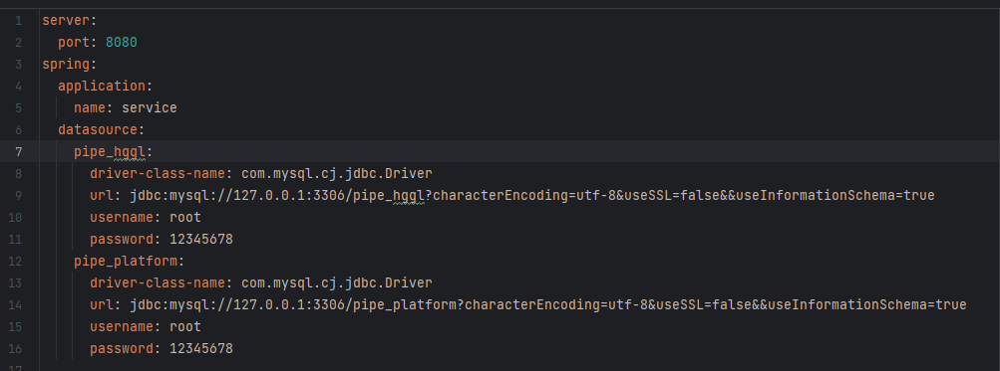
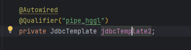
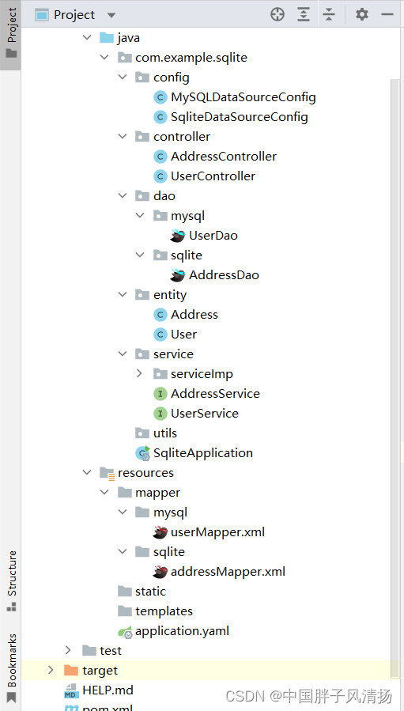
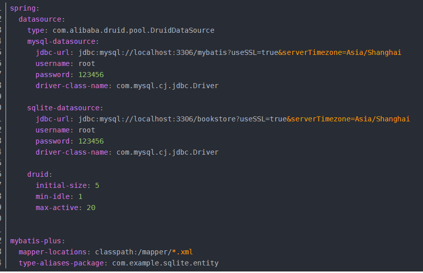
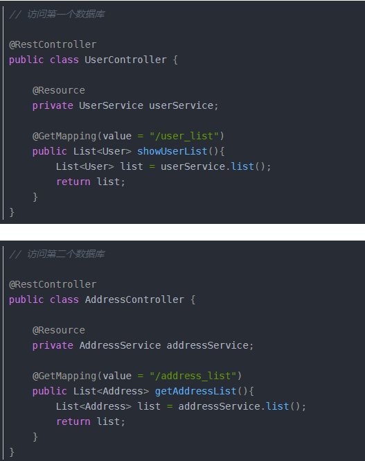

# SpringBoot配置多数据源

## 第一种方式

### application.yml配置



### 启动类


### 配置类DataSourceConfig

```java
@Configuration
public class DataSourceConfig {
    @Autowired
    private Environment env;

    //配置数据源1
    @Bean(name = "pipe_hggl_datasource")
    @Primary
    public DataSource mysqlDataSource() {
        DriverManagerDataSource dataSource = new DriverManagerDataSource();
        dataSource.setDriverClassName(env.getProperty("spring.datasource.pipe_hggl.driver-class-name"));
        dataSource.setUrl(env.getProperty("spring.datasource.pipe_hggl.url"));
        dataSource.setUsername(env.getProperty("spring.datasource.pipe_hggl.username"));
        dataSource.setPassword(env.getProperty("spring.datasource.pipe_hggl.password"));
        return dataSource;
    }

    @Bean(name = "pipe_hggl")
    public JdbcTemplate mysqlJdbcTemplate(@Qualifier("pipe_hggl_datasource") DataSource dataSource) {
        return new JdbcTemplate(dataSource);
    }

    //配置数据源2
    @Bean(name = "pipe_platform_datasource")
    public DataSource gbaseDataSource() {
        DriverManagerDataSource dataSource = new DriverManagerDataSource();
        dataSource.setDriverClassName(env.getProperty("spring.datasource.pipe_platform.driver-class-name"));
        dataSource.setUrl(env.getProperty("spring.datasource.pipe_platform.url"));
        dataSource.setUsername(env.getProperty("spring.datasource.pipe_platform.username"));
        dataSource.setPassword(env.getProperty("spring.datasource.pipe_platform.password"));
        return dataSource;
    }

    @Bean(name = "pipe_platform")
    public JdbcTemplate gbaseJdbcTemplate(@Qualifier("pipe_platform_datasource") DataSource dataSource) {
        return new JdbcTemplate(dataSource);
    }
}
```

### ServiceImpl中




## 第二种方式

### 项目的目录结构



### application.yml配置



### 配置类

#### 数据源一

```java
@Configuration
@MapperScan(basePackages = "com.example.sqlite.dao.mysql", sqlSessionFactoryRef = "MySQLSqlSessionFactory")
public class MySQLDataSourceConfig {

    @Bean(name = "MySQLDataSource")
    @Primary
    @ConfigurationProperties(prefix = "spring.datasource.mysql-datasource")
    public DataSource getDateSource1() {
        return DataSourceBuilder.create().build();
    }


    @Bean(name = "MySQLSqlSessionFactory")
    @Primary
    public SqlSessionFactory test1SqlSessionFactory(
            @Qualifier("MySQLDataSource") DataSource datasource) throws Exception {
        MybatisSqlSessionFactoryBean bean = new MybatisSqlSessionFactoryBean ();
        bean.setDataSource(datasource);
        bean.setMapperLocations(// 设置mybatis的xml所在位置
                new PathMatchingResourcePatternResolver().getResources("classpath*:mapper/mysql/*.xml"));
        return bean.getObject();
    }


    @Bean("MySQLSqlSessionTemplate")
    @Primary
    public SqlSessionTemplate test1SqlSessionTemplate(
            @Qualifier("MySQLSqlSessionFactory") SqlSessionFactory sessionFactory) {
        return new SqlSessionTemplate(sessionFactory);
    }

    @Bean
    public PlatformTransactionManager transactionManager(@Qualifier("MySQLDataSource")DataSource dataSource) {
        return new DataSourceTransactionManager(dataSource);
    }

}
```

#### 数据源二

```java
@Configuration
@MapperScan(basePackages = "com.example.sqlite.dao.sqlite", sqlSessionFactoryRef = "SqliteSqlSessionFactory")
public class SqliteDataSourceConfig {

    @Bean(name = "SqliteDateSource")
    @ConfigurationProperties(prefix = "spring.datasource.sqlite-datasource")
    public DataSource getDateSource1() {
        return DataSourceBuilder.create().build();
    }

    @Bean(name = "SqliteSqlSessionFactory")
    public SqlSessionFactory test1SqlSessionFactory(
            @Qualifier("SqliteDateSource") DataSource datasource) throws Exception {
        MybatisSqlSessionFactoryBean  bean = new MybatisSqlSessionFactoryBean();
        bean.setDataSource(datasource);
        bean.setMapperLocations(
                new PathMatchingResourcePatternResolver().getResources("classpath*:mapper/sqlite/*.xml"));
        return bean.getObject();
    }

    @Bean("SqliteSqlSessionTemplate")
    public SqlSessionTemplate test1SqlSessionTemplate(
            @Qualifier("SqliteSqlSessionFactory") SqlSessionFactory sessionFactory) {
        return new SqlSessionTemplate(sessionFactory);
    }

    @Bean
    public PlatformTransactionManager transactionManager(@Qualifier("SqliteDateSource")DataSource dataSource) {
        return new DataSourceTransactionManager(dataSource);
    }
}
```

@MapperScan注解中的basePackages指向的是指定的Dao层。
@MapperScan注解中sqlSessionFactoryRef 用来指定使用某个SqlSessionFactory来操作数据源。
bean.setMapperLocations(
	new PathMatchingResourcePatternResolver()
	.getResources(“classpath*:mapper/sqlite/*.xml”)); 指向的是操作执行数据库的Mapper层。

$\textcolor{red}{如果使用SQLite数据库，那么就必须在项目中内嵌SQLite数据库，这个一个轻量级的数据库，不同于Mysql，SQLite不需要服务器，SQLite适合使用于移动APP开发。}$
像微信，用户的聊天记录就是使用这个数据库进行存储。SQLite也可以使用在Web端，只是不太方便。


### 使用

