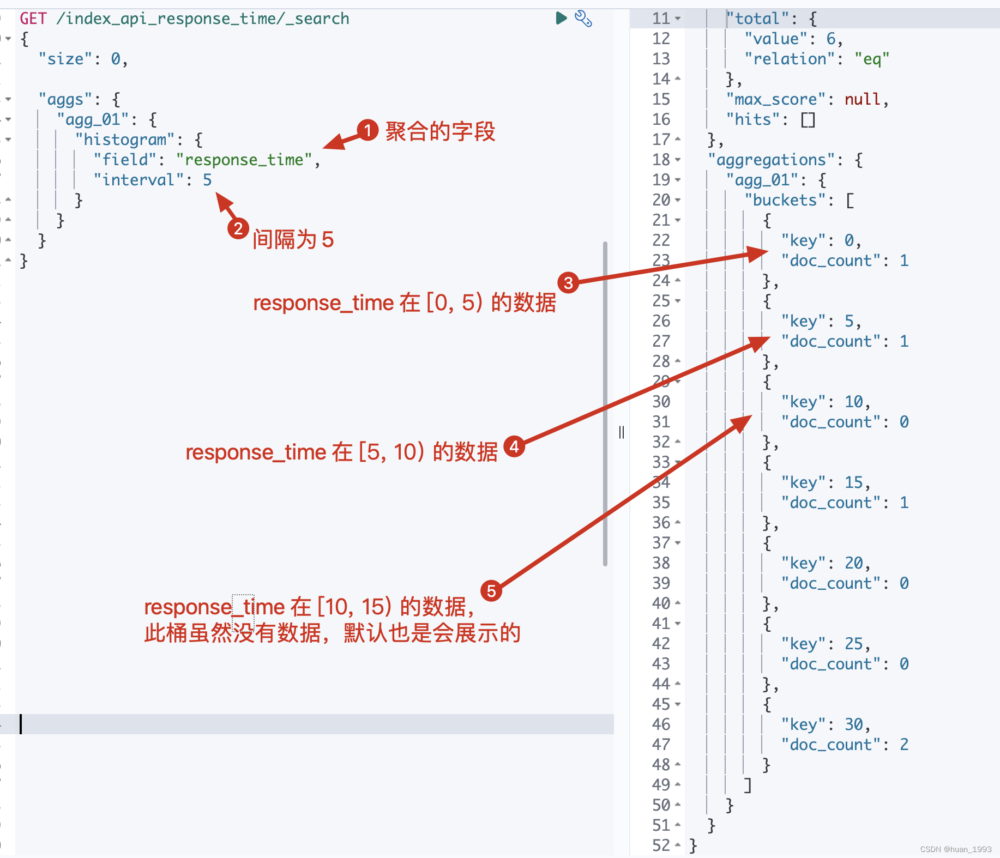
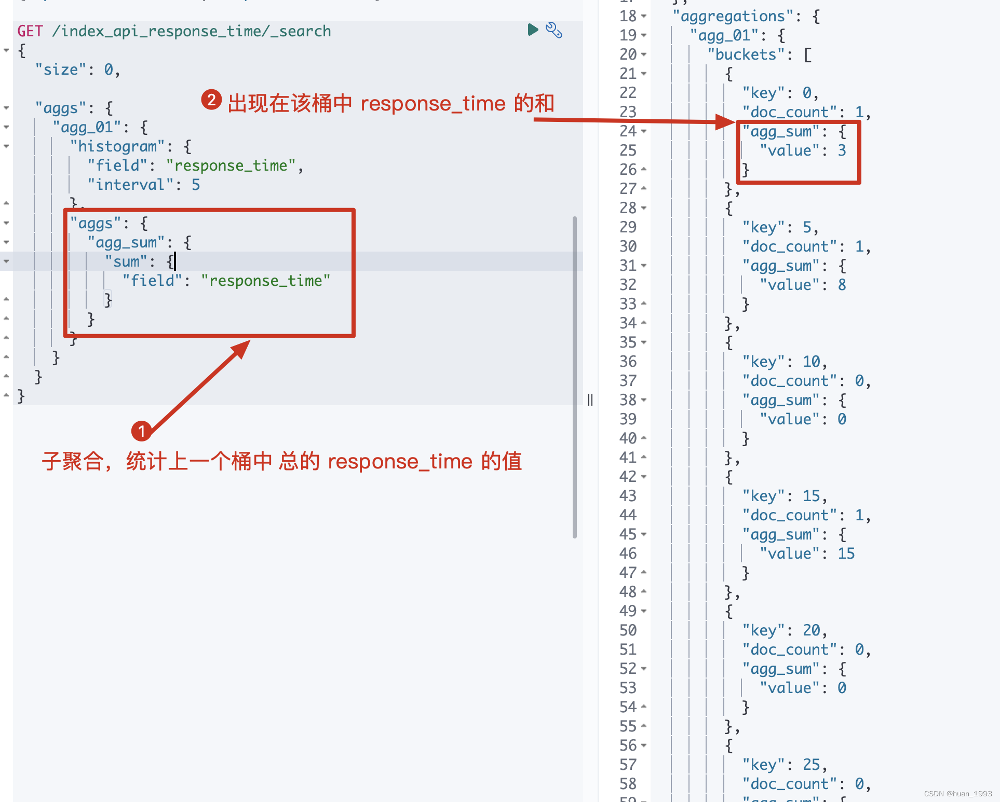
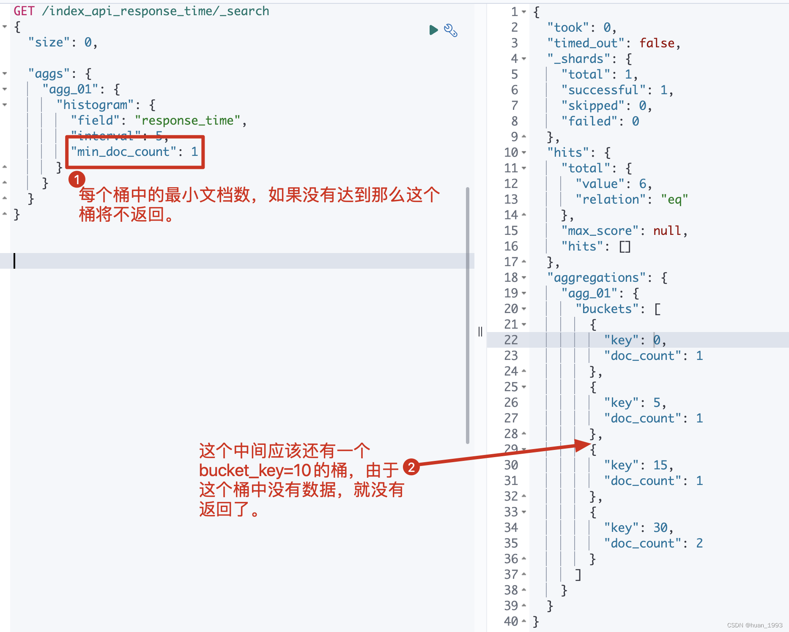
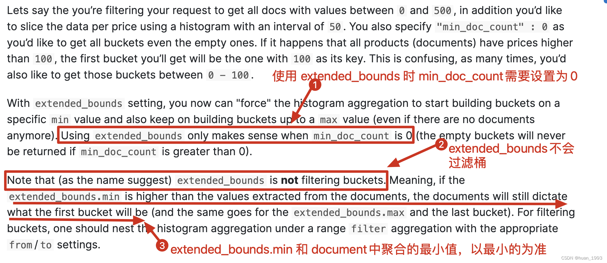
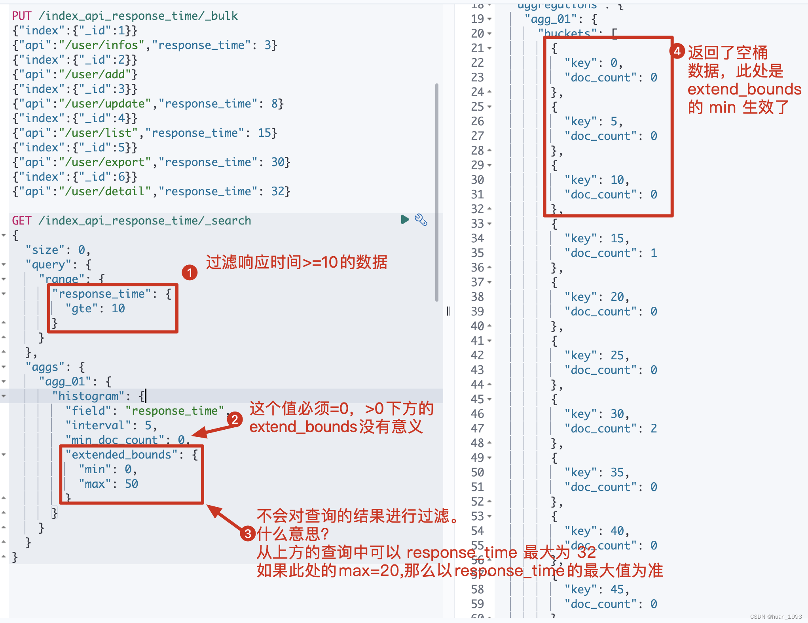
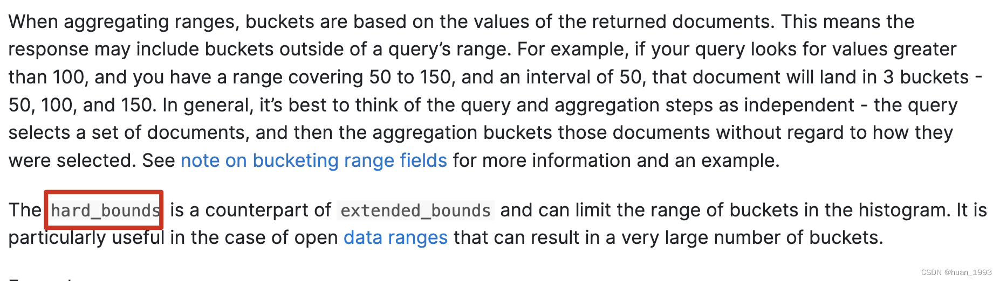
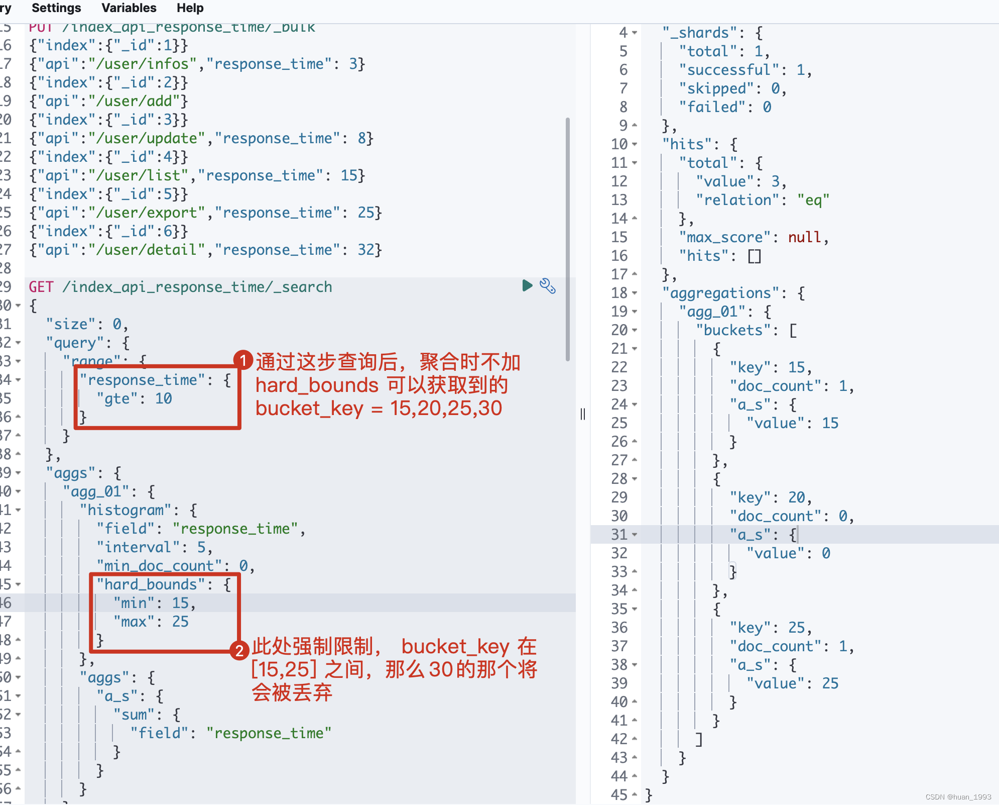
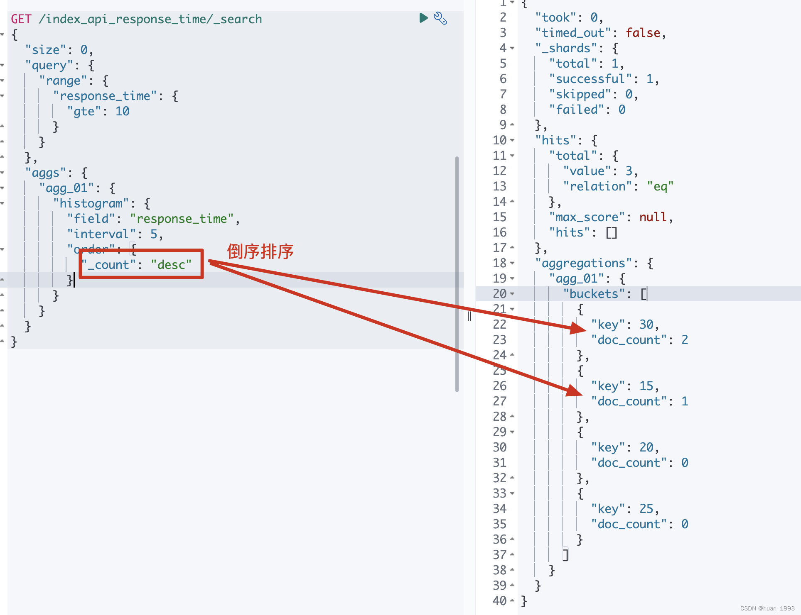
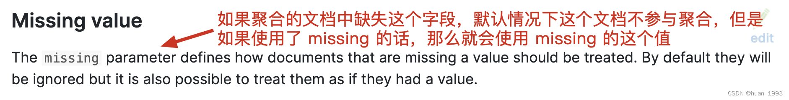
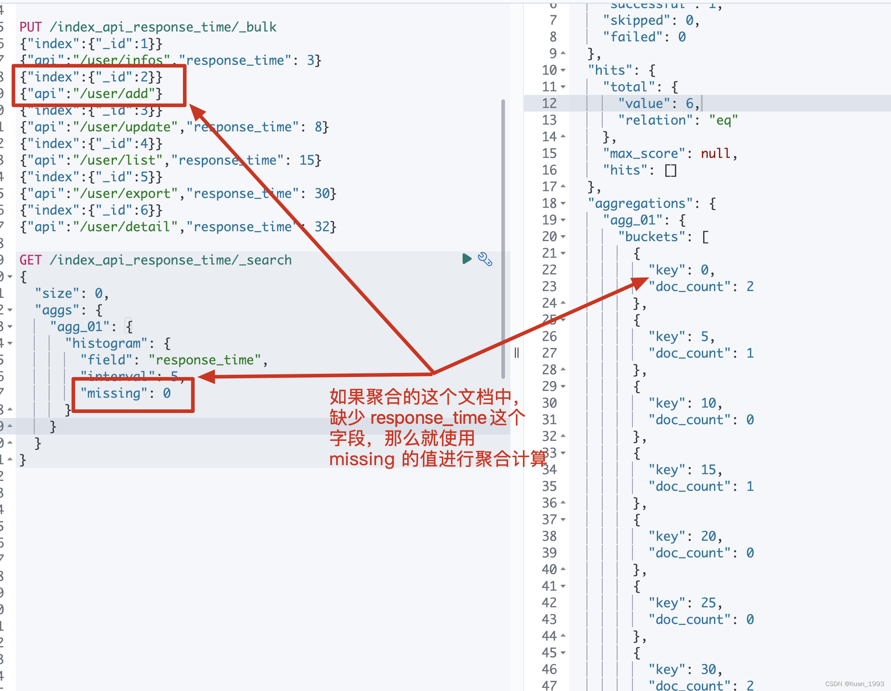

# Es-直方图聚合-histogram 

# 1.简介

直方图聚合是一种基于多桶值聚合，可从文档中提取的数值或数值范围值来进行聚合。它可以对参与聚合的值来动态的生成固定大小的桶。

# 2.bucket_key如何计算

假设我们有一个值是**32**，并且桶的大小是**5**，那么32四舍五入后变成30，因此文档将落入与键30关联的存储桶中。下面的算式可以精确的确定每个文档的归属桶

**bucket_key = Math.floor((value - offset) / interval) * interval + offset**

offset：的值默认是从0开始。并且offset的值必须在[0, interval)之间。且需要是一个正数。
value：值的参与计算的值，比如某个文档中的价格字段等。

# 3.有一组数据，如何确定是落入到那个桶中

存在的数据： [3, 8, 15]
offset = 0
interval = 5

那么可能会分成如下几个桶 [0,5) [5,10) [10, 15) [15,+∞)

数字3落入的桶 buket_key= Math.floor((3 - 0) / 5) * 5 + 0 = 0，即落入[0,5)这个桶中
数字8落入的桶 buket_key= Math.floor((8 - 0) / 5) * 5 + 0 = 5，即落入[5,10)这个桶中
数字15落入的桶 buket_key= Math.floor((15 - 0) / 5) * 5 + 0 = 15，即落入[15,+∞)这个桶中

# 4、准备数据

我们有一组api响应时间数据，根据这组数据进行histogram聚合统计

```
准备Mapping  ---> 此处的mapping比较简单，就3个字段id，api和response_time。

PUT /index_api_response_time
{
  "settings": {
    "number_of_shards": 1
  },
  "mappings": {
    "properties": {
      "id": {
        "type": "long"
      },
      "api": {
        "type": "keyword"
      },
      "response_time": {
        "type": "integer"
      }
    }
  }
}
```

```
此处先记录 id=2的数据，这个是没有response_time的，后期聚合时额外处理。


PUT /index_api_response_time/_bulk
{"index":{"_id":1}}
{"api":"/user/infos","response_time": 3}
{"index":{"_id":2}}
{"api":"/user/add"}
{"index":{"_id":3}}
{"api":"/user/update","response_time": 8}
{"index":{"_id":4}}
{"api":"/user/list","response_time": 15}
{"index":{"_id":5}}
{"api":"/user/export","response_time": 30}
{"index":{"_id":6}}
{"api":"/user/detail","response_time": 32}
```

# 5.histogram聚合操作

## 5.1根据response_time聚合，间隔为5

```
GET /index_api_response_time/_search
{
  "size": 0,
  "aggs": {
    "agg_01": {
      "histogram": {
        "field": "response_time",
        "interval": 5
      }
    }
  }
}
```

```java
@Test
@DisplayName("根据response_time聚合，间隔为5")
public void test01() throws IOException {
    SearchRequest request = SearchRequest.of(search ->
            search
                    .index("index_api_response_time")
                    .size(0)
                    .aggregations("agg_01", agg -> agg.histogram(histogram -> histogram.field("response_time")
                    .interval(5D))));
    System.out.println("request: " + request);
    SearchResponse<String> response = client.search(request, String.class);
    System.out.println("response: " + response);
}
```



## 5.2在5.1基础上聚合出每个桶总的响应时间

```
此处聚合一下是为了结合已有的数据，看看每个数据是否落入到了相应的桶中
```

```
GET /index_api_response_time/_search
{
  "size": 0,

  "aggs": {
    "agg_01": {
      "histogram": {
        "field": "response_time",
        "interval": 5
      },
      "aggs": {
        "agg_sum": {
          "sum": {
            "field": "response_time"
          }
        }
      }
    }
  }
}
```

```java
@Test
@DisplayName("在test01基础上聚合出每个桶总的响应时间")
public void test02() throws IOException {
    SearchRequest request = SearchRequest.of(search ->
            search
                    .index("index_api_response_time")
                    .size(0)
                    .aggregations("agg_01", agg ->
                            agg.histogram(histogram -> histogram.field("response_time").interval(5D))
                               .aggregations("agg_sum", aggSum -> aggSum.sum(sum -> sum.field("response_time")))
                    ));
    System.out.println("request: " + request);
    SearchResponse<String> response = client.search(request, String.class);
    System.out.println("response: " + response);
}
```



## 5.3每个桶中必须存在1个文档的结果才返回-min_doc_count

```
从5.1中的结果我们可以知道，不管桶中是否存在数据，我们都返回了，即返回了很多空桶。 简单理解就是返回的 桶中存在 doc_count=0 的数据，此处我们需要将这个数据不返回
```

```
GET /index_api_response_time/_search
{
  "size": 0,

  "aggs": {
    "agg_01": {
      "histogram": {
        "field": "response_time",
        "interval": 5,
        "min_doc_count": 1
      }
    }
  }
}
```

```java
@Test
@DisplayName("每个桶中必须存在1个文档的结果才返回-min_doc_count")
public void test03() throws IOException {
    SearchRequest request = SearchRequest.of(search ->
            search
                    .index("index_api_response_time")
                    .size(0)
                    .aggregations("agg_01", agg -> agg.histogram(
                            histogram -> histogram.field("response_time").interval(5D).minDocCount(1)
                            )
                    )
    );
    System.out.println("request: " + request);
    SearchResponse<String> response = client.search(request, String.class);
    System.out.println("response: " + response);
}
```



## 5.4 补充空桶数据-extended_bounds

```
这个是什么意思？假设我们通过 response_time >= 10 进行过滤，并且 interval=5 那么es默认情况下就不会返回 bucket_key =0,5,10的桶，那么如果我想返回那么该如何处理呢？可以通过 extended_bounds 来实现。

使用extended_bounds时，min_doc_count=0时才有意义。 extended_bounds不会过滤桶。
```



```
GET /index_api_response_time/_search
{
  "size": 0,
  "query": {
    "range": {
      "response_time": {
        "gte": 10
      }
    }
  }, 
  "aggs": {
    "agg_01": {
      "histogram": {
        "field": "response_time",
        "interval": 5,
        "min_doc_count": 0,
        "extended_bounds": {
          "min": 0,
          "max": 50
        }
      }
    }
  }
}
```

```java
@Test
@DisplayName("补充空桶数据-extended_bounds")
public void test04() throws IOException {
    SearchRequest request = SearchRequest.of(search ->
            search
                    .index("index_api_response_time")
                    .size(0)
                    .query(query-> query.range(range -> range.field("response_time").gte(JsonData.of(10))))
                    .aggregations("agg_01", agg -> agg.histogram(
                            histogram -> histogram.field("response_time").interval(5D).minDocCount(0)
                                    .extendedBounds(bounds -> bounds.min(1D).max(50D))
                            )
                    )
    );
    System.out.println("request: " + request);
    SearchResponse<String> response = client.search(request, String.class);
    System.out.println("response: " + response);
}
```



## 5.5 只展示min-max之间的桶-hard_bounds



```
此处数据

PUT /index_api_response_time/_bulk
{"index":{"_id":1}}
{"api":"/user/infos","response_time": 3}
{"index":{"_id":2}}
{"api":"/user/add"}
{"index":{"_id":3}}
{"api":"/user/update","response_time": 8}
{"index":{"_id":4}}
{"api":"/user/list","response_time": 15}
{"index":{"_id":5}}
{"api":"/user/export","response_time": 25}
{"index":{"_id":6}}
{"api":"/user/detail","response_time": 32}
```

```
GET /index_api_response_time/_search
{
  "size": 0,
  "query": {
    "range": {
      "response_time": {
        "gte": 10
      }
    }
  }, 
  "aggs": {
    "agg_01": {
      "histogram": {
        "field": "response_time",
        "interval": 5,
        "min_doc_count": 0,
        "hard_bounds": {
          "min": 15,
          "max": 25
        }
      },
      "aggs": {
        "a_s": {
          "sum": {
            "field": "response_time"
          }
        }
      }
    }
  }
}
```

```java
@Test
@DisplayName("只展示min-max之间的桶-hard_bounds")
public void test05() throws IOException {
    SearchRequest request = SearchRequest.of(search ->
            search
                    .index("index_api_response_time")
                    .size(0)
                    .query(query-> query.range(range -> range.field("response_time").gte(JsonData.of(10))))
                    .aggregations("agg_01", agg ->
                            agg.histogram(
                                histogram -> histogram.field("response_time").interval(5D).minDocCount(0)
                                        .hardBounds(bounds -> bounds.min(1D).max(50D))
                            )
                               .aggregations("a_s", sumAgg -> sumAgg.sum(sum -> sum.field("response_time")))
                    )
    );
    System.out.println("request: " + request);
    SearchResponse<String> response = client.search(request, String.class);
    System.out.println("response: " + response);
}
```



## 5.6 排序-order

```
GET /index_api_response_time/_search
{
  "size": 0,
  "query": {
    "range": {
      "response_time": {
        "gte": 10
      }
    }
  }, 
  "aggs": {
    "agg_01": {
      "histogram": {
        "field": "response_time",
        "interval": 5,
        "order": {
          "_count": "desc"
        }
      }
    }
  }
}
```

```java
@Test
@DisplayName("排序order")
public void test06() throws IOException {
    SearchRequest request = SearchRequest.of(search ->
            search
                    .index("index_api_response_time")
                    .size(0)
                    .query(query-> query.range(range -> range.field("response_time").gte(JsonData.of(10))))
                    .aggregations("agg_01", agg ->
                            agg.histogram(
                                histogram -> histogram.field("response_time").interval(5D)
                                        .order(NamedValue.of("_count", SortOrder.Desc))
                            )
                    )
    );
    System.out.println("request: " + request);
    SearchResponse<String> response = client.search(request, String.class);
    System.out.println("response: " + response);
}
```



## 5.7 文档中缺失聚合字段时如何处理-missing



```
GET /index_api_response_time/_search
{
  "size": 0,
  "aggs": {
    "agg_01": {
      "histogram": {
        "field": "response_time",
        "interval": 5,
        "missing": 0
      }
    }
  }
}
```

```java
@Test
@DisplayName("文档中缺失聚合字段时如何处理-missing")
public void test07() throws IOException {
    SearchRequest request = SearchRequest.of(search ->
            search
                    .index("index_api_response_time")
                    .size(0)
                    .query(query-> query.range(range -> range.field("response_time").gte(JsonData.of(10))))
                    .aggregations("agg_01", agg ->
                            agg.histogram(
                                histogram -> histogram.field("response_time").interval(5D) .missing(0D)
                            )
                    )
    );
    System.out.println("request: " + request);
    SearchResponse<String> response = client.search(request, String.class);
    System.out.println("response: " + response);
}
```



# 6、参考文档

https://www.elastic.co/guide/en/elasticsearch/reference/current/search-aggregations-bucket-histogram-aggregation.html