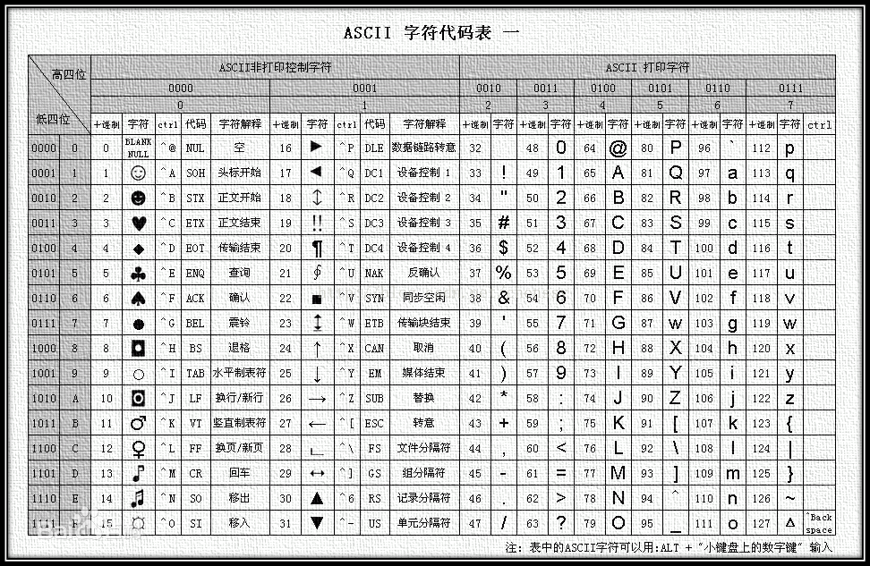
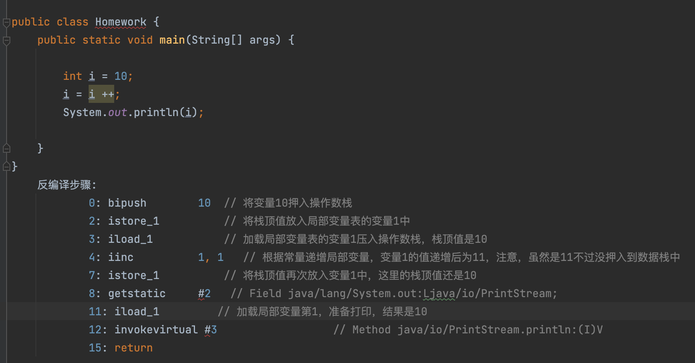
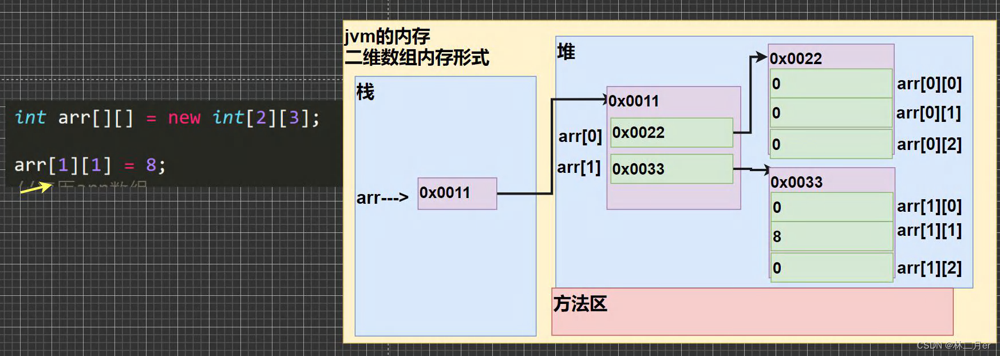

# 1 Java概述

## 1.1Java语言特点

- 完全面向对象：Java语言支持封装、继承、多态，面向对象编程，让程序更好达到**高内聚，低耦合**的标准。
- 支持分布式：Java语言支持Internet应用的开发，在基本的Java应用编程接口中有一个网络应用编程接口（java net），它提供了用于网络应用编程的类库，包括URL、URLConnection、Socket、ServerSocket等。Java的RMI（远程方法激活）机制也是开发分布式应用的重要手段。
- 健壮性：Java的强类型机制、异常处理 等是Java程序健壮性的重要保证。对指针的丢弃是Java的明智选择。
- 安全：Java通常被用在网络环境中，为此，Java提供了一个安全机制以防恶意代码的攻击。如：安全防范机制（类ClassLoader），如分配不同的名字空间以防替代本地的同名类、字节代码检查。
- 跨平台性：Java程序（后缀为java的文件）在Java平台上被编译为体系结构中立的字节码格式（后缀为class的文件），然后可以在实现这个Java平台的任何系统中运行。

总结：简单性、面向对象、分布式、健壮性、安全性、体系结构中立、可移植性、解释型、高性能、多线程、动态性


## 1.2Java跨平台原理

Java的跨平台：指的是一处编写到处运行。

Java如何实现的跨平台，借助JVM实现，不同的平台只要有JVM就可以运行Java程序。

JVM：Java Virtual Machine --- Java虚拟机

JRE：Java Runtime Environment --- Java运行环境=JVM+核心类库

JDK: Java Development Kit--- Java开发工具集=JRE+开发小工具


## 1.3配置JDK

**1.JDK配置**

正常下载安装即可，安装时要注意取消勾选JRE，否则容易重复安装。

右键我的电脑->属性->高级系统设置->环境变量->系统变量

->新建：变量名JAVA_HOME ,变量值为JDK的安装目录，比如：C:\Program Files\Java\jdk1.8.0_202，然后保存

->双击打开编辑Path变量：新建内容为%JAVA_HOME%\bin，然后保存

->确定，确定，再确定。

->重新打开CMD命令行，在使用java -version 和javac命令验证结果


**2.JDK为什么配置环境变量**

为了在全局中进行使用。path（环境变量）是dos以前的内部命令，windows继续沿用至今。用作运行某个命令的时候，本地查找不到某个命令或文件，会到这个声明的目录中去查找。


**3.JDK每个目录的作用**

| bin目录     | 包含一些用于开发Java程序的工具，例如：编译工具(javac.exe)、运行工具 (java.exe) 、打包工具 (jar.exe)等。 |
| ----------- | ------------------------------------------------------------ |
| db目录      | 纯Java开发的数据可 Derby，是一个开源的100%Java开发的关系数据库。 |
| include目录 | C语言的头文件，用于支持Java程序设计。                        |
| jre目录     | Java运行时环境的根目录。                                     |
| jre\bin目录 | 包含Java平台所使用工具和类库的可执行文件和DLL文件。          |
| jre\lib目录 | Java运行时环境所使用的核心类库。                             |
| lib目录     | 包含开发Java程序所使用的类库文件。                           |
| src.zip     | 归档的Java源代码                                             |

 **bin目录部分说明（基本工具）:**

| javac.exe        | 基本工具 - Java语言编译器， 将Java源代码转换成字节码         |
| ---------------- | ------------------------------------------------------------ |
| java.exe         | 基本工具 - Java应用程序启动器，直接从类文件执行Java应用程序字节代码 |
| javadoc.exe      | 基本工具 - Java API 文档生成器,从源码注释中提取文档          |
| apt.exe          | 基本工具 - java 注释处理器                                   |
| appletviewer.exe | 基本工具 - java applet 小程序浏览器，一种执行HTML文件上的Java小程序的Java浏览器 |
| jar.exe          | 基本工具 - java文件压缩打包工具                              |
| jdb.exe          | 基本工具 - Java 调试器，debugger，查错工具                   |
| javah.exe        | 基本工具 - C 头文件和stub生成器，用于写本地化方法，例如生产JNI样式的头文件。产生可以调用Java过程的C过程，或建立能被Java程序调用的C过程的头文件 |
| javap.exe        | 基本工具 - class文件反编译工具，显示编译类文件中的可访问功能和数据，同时显示字节代码含义 |


## 1.4Java开发步骤

开发Java程序的步骤：3步

1.编写：创建文件编写源代码，保存为后缀为.java的文件，即Java源文件。

2.编译：使用javac命令编译源文件，产生后缀为.class的字节码文件

3.运行：使用java命令运行字节码文件，产生结果


## 1.5程序说明

- Java程序的结构：

```java
类{     
  方法{         
    语句;     
  }
}  
```

注意：类{}是一个可执行程序的最小单元。⚠️

- Java程序的入口：

Java程序执行需要有个起始点或入口，即main方法

```java
public static void main(String[] args){  
}
```

- 常见问题：

（1）源文件名是否必须与类名一致？public呢？

如果这个类不是public，那么源文件名可以和类名不一致。但是不便于代码维护。 如果这个类是public，那么要求源文件名必须与类名一致。否则编译报错。 我们建议大家，不管是否是public，都与源文件名保持一致，而且一个源文件尽量只写一个类，目的是为了好维护。 

（2）一个源文件中是否可以有多个类？public呢？

一个源文件中可以有多个类，编译后会生成多个.class字节码文件。 但是一个源文件只能有一个public的类。 

（3）main方法必须在public的类中吗？

不是。 但是后面写代码时，基本上main方法（主方法）习惯上都在public类中。


## 1.6代码注释

Java中有单行注释、多行注释和文档注释

- 单行注释以 //开头，以换行结束，格式如下：

```java
//  注释内容 
```

- 多行注释以 /*开头，以*/结束，格式如下：

```java
/* 注释内容     注释内容 */ 
```

- 文档注释以/**开头，以*/结束

```java
/** 注释内容     

   @author  可指定 java java程序的作者     

   @version 可指定源文件的版本

*/ 
```

文档注释可以被JDK提供的javadoc工具解析生成一套网页形式的说明文档，操作入下：

```java
javadoc -d mydoc -author -version Hello.java
```


## 1.7关键字

**关键字**：被java语言赋予了特殊含义的字符串（单词），特点是都是小写字母。

| **关键字**   | **含义**                                                     |
| ------------ | ------------------------------------------------------------ |
| abstract     | 表明类或者成员方法具有抽象属性                               |
| assert       | 断言，用来进行程序调试                                       |
| boolean      | 基本数据类型之一，声明布尔类型的关键字                       |
| break        | 提前跳出一个块                                               |
| byte         | 基本数据类型之一，字节类型                                   |
| case         | 用在switch语句之中，表示其中的一个分支                       |
| catch        | 用在异常处理中，用来捕捉异常                                 |
| char         | 基本数据类型之一，字符类型                                   |
| class        | 声明一个类                                                   |
| const        | 保留关键字，没有具体含义                                     |
| continue     | 回到一个块的开始处                                           |
| default      | 默认，例如，用在switch语句中，表明一个默认的分支。Java8 中也作用于声明接口函数的默认实现 |
| do           | 用在do-while循环结构中                                       |
| double       | 基本数据类型之一，双精度浮点数类型                           |
| else         | 用在条件语句中，表明当条件不成立时的分支                     |
| enum         | 枚举                                                         |
| extends      | 表明一个类型是另一个类型的子类型。对于类，可以是另一个类或者抽象类；对于接口，可以是另一个接口 |
| final        | 用来说明最终属性，表明一个类不能派生出子类，或者成员方法不能被覆盖，或者成员域的值不能被改变，用来定义常量 |
| finally      | 用于处理异常情况，用来声明一个基本肯定会被执行到的语句块     |
| float        | 基本数据类型之一，单精度浮点数类型                           |
| for          | 一种循环结构的引导词                                         |
| goto         | 保留关键字，没有具体含义                                     |
| if           | 条件语句的引导词                                             |
| implements   | 表明一个类实现了给定的接口                                   |
| import       | 表明要访问指定的类或包                                       |
| instanceof   | 用来测试一个对象是否是指定类型的实例对象                     |
| int          | 基本数据类型之一，整数类型                                   |
| interface    | 接口                                                         |
| long         | 基本数据类型之一，长整数类型                                 |
| native       | 用来声明一个方法是由与计算机相关的语言（如C/C++/FORTRAN语言）实现的 |
| new          | 用来创建新实例对象                                           |
| package      | 包                                                           |
| private      | 一种访问控制方式：私用模式                                   |
| protected    | 一种访问控制方式：保护模式                                   |
| public       | 一种访问控制方式：共用模式                                   |
| return       | 从成员方法中返回数据                                         |
| short        | 基本数据类型之一,短整数类型                                  |
| static       | 表明具有静态属性                                             |
| strictfp     | 用来声明FP_strict（单精度或双精度浮点数）表达式遵循[IEEE 754](https://baike.baidu.com/item/IEEE 754)算术规范 |
| super        | 表明当前对象的父类型的引用或者父类型的构造方法               |
| switch       | 分支语句结构的引导词                                         |
| synchronized | 表明一段代码需要同步执行                                     |
| this         | 指向当前实例对象的引用                                       |
| throw        | 抛出一个异常                                                 |
| throws       | 声明在当前定义的成员方法中所有需要抛出的异常                 |
| transient    | 声明不用序列化的成员域                                       |
| try          | 尝试一个可能抛出异常的程序块                                 |
| void         | 声明当前成员方法没有返回值                                   |
| volatile     | 表明两个或者多个变量必须同步地发生变化                       |
| while        | 用在循环结构中                                               |

**关键字一共50个，其中const和goto是保留字。**

**true,false,null看起来像关键字，但从技术角度，它们是特殊的布尔值和空值。**


## 1.8 标识符

**1.标识符概念**

标识符即给类、变量、方法、包等命名的字符序列，称为标识符。

简单的说，凡是程序员自己命名的部分都可以称为标识符。


**2.命名规则（必须遵守）**

（1）组成：英文大小写字母，数字，下划线_，美元符号$

（2）数字不能开头

（3）严格区分大小写

（4）不能使用Java的关键字（包含保留字）和特殊值


**3.命名规范（遭受鄙视）**

（1）见名知意

（2）类名、接口名等：每个单词的首字母都大写（大驼峰法则），形式：XxxYyyZzz，

例如：HelloWorld，String，System等

（3）变量、方法名等：从第二个单词开始首字母大写（小驼峰法则），其余字母小写，形式：xxxYyyZzz，

例如：age,name,bookName,main

（4）包名等：每一个单词都小写，单词之间使用点.分割，形式：xxx.yyy.zzz，

例如：java.lang

（5）常量名等：每一个单词都大写，单词之间使用下划线_分割，形式：XXX_YYY_ZZZ，

例如：MAX_VALUE,PI


## 1.9常量

**1.常量概念：**

在程序执行的过程中，其值不可以发生改变的量。


**2.常量的分类**：

 (1)自定义常量：通过final关键字定义（后面在面向对象部分讲解）

 (2)字面值、字面量（literal）：

| **字面量分类** | **举例**            |
| -------------- | ------------------- |
| 字符串字面量   | "HelloWorld"        |
| 整数字面量     | 12，-23             |
| 浮点字面量     | 12.34               |
| 字符字面量     | 'a'，'A'，'0'，'好' |
| 布尔字面量     | true，false         |
| 空值字面量     | null                |


## 1.10变量

**1.概念: **

在程序执行过程中，其值在某个范围内可以改变的量。可操作的存储空间，是程序中最基本的存储单元。


**2.变量的使用注意事项**

- 先声明后使用 。（如果没有声明，会报“找不到符号”错误)
- 在使用之前必须初始化。 (如果没有初始化，会报“未初始化”错误)
- 变量有作用域。 (作用域为变量直接所属的{}范围内，如果超过作用域，也会报“找不到符号”错误)
- 在同一个作用域中不能重名。(同一个{}，不能同时声明两个同名变量)


## 1.11进制转换

**1.任意进制转十进制**

- 系数：就是每一个位上的数值。
- 基数：x进制的基数就是x。
- 权：对每一个位上的数据，从右到左，并且从0开始编号，对应的编号就是该数据的权。

任意进制转十进制：**系数\*基数^权次幂之和。**


**2.十进制转任意进制：**

**十进制数除以基数取余，直到商为0，余数反转。**

十进制转二进制：十进制整数6除以基数2，倒序取余数，结果为二进制数110 


**3.快速转换方法：**

**(1).二进制转十进制：**

8421码：从右边开始依次是2的0次，2的1次，2的2次。。。。


**(2).二进制数据转八进制数据**

从右边开始，3位二进制对应1位八进制


**(3).二进制数据转十六进制数据**

从右边开始，4位二进制对应1位十六进制


## 1.12存储单元

- 位（bit）：是数据存储的最小单位，也就是一个二进制位。其中8 bit 就称为1个字节(Byte)。
- 字节（Byte）：是计算机信息技术用于计量存储容量的一种计量单位，1字节等于8bit。
- **转换关系：**
  - 8 bit = 1 Byte（B）
  - 1024 Byte （B）= 1 KB
  - 1024 KB = 1 MB
  - 1024 MB = 1 GB
  - 1024 GB = 1 TB


# 2 数据类型的存储转换

## 2.1计算机存储数据原理

**1.整数存储**

计算机底层存储整数并不是把整数转换为二进制直接存储，而是以二进制的补码形式进行存储。要了解补码还要知道原码和反码：

**正整数**的原码、反码和补码都一样，称为三码合一。

**负整数**的反码和补码表示为：

- **原码**：把十进制转为二进制，然后最高位设置为符号位，1表示负数，0表示正数。
- **反码**：负整数的反码在其原码的基础上，符号位不变，其余位取反（0变1,1变0）
- **补码**：负整数的补码为其反码基础上+1

```java
例如：用1个字节的二进制表示一个数
25 ==> 原码  0001 1001 ==> 反码  0001 1001 -->补码  0001 1001
-25 ==>原码  1001 1001 ==> 反码  1110 0110 ==>补码  1110 0111
```

一个字节可以存储的整数范围分为两种情况：

- 无符号：不考虑正负数  （一个字节=8个bit，最大能表示256个数）

```java
0000 0000 ~ 1111 1111 ==> 0~255
```

- 有符号：-128~127

```java
0000 0000 ~ 0111 1111 ==> 0~127
1000 0001 ~ 1111 1111 ==> -127 ~ -1 （补码形式存储）
1000 0000  ==> -128     特殊值，最高位既是符号位，又是数值位
```

- 实际中计算机负数的表达方式就是它补数的绝对值转的补码。

计算机没有减法逻辑，我们费了那么大的劲搞了一套补码的规则就是为了用加法来替代减法，但为了实现这么套规则，却跨不过一个坎，就是把负数计算成补码仍然是需要减法逻辑的。为了解决这个问题，最开始的那些技术大佬们就想出了这么个办法。


**2.小数存储**

- 先把整数部分转换成二进制
- 再把小数部分转换成二进制（用2乘以小数部分，每次将结果整数取出，然后用剩余的小数部分继续乘2，直到小数部分为0，或者达到要求的精度。接着，将取出的整数按顺序排列，先取的整数作为二进制小数的高位有效位，后取的整数作为低位有效位。）
- 然后二者相加，再写成科学记数法
- 然后先写符号位，正数为0，负数为1
- 再把指数加上偏移量，转化成二进制源码（float偏移127，double偏移量1023）。之所以有偏移量，是为了计算指数的正负之分。小于偏移量多少就是负多少。
- 然后再写尾数部分


- 也可根据上图尾数得知float和double各自的小数精度是多少。分别是2的23次幂和2的52次幂
- 关于float和double的运算误差问题

对于单精度数据来说，尾数只能表示23bit的精度。正因为这种存储方式，当小数部分转换为二进制时，（用2乘以小数部分，每次将结果整数取出，然后用剩余的小数部分继续乘2，直到小数部分为0，或者达到要求的精度。接着，将取出的整数按顺序排列，先取的整数作为二进制小数的高位有效位，后取的整数作为低位有效位。）某些情况下会遇到循环或者很长的排列，只能按照要求截取一定的位数，所以会产生误差。

- 举例，IEEE存储的float小数补码再转回十进制
- - 先把指数二进制转回去，根据127偏移量的差得出指数大小，进而得到小数的科学计数法，再转换为普通二进制小数。

- 二进制小数的整数部分转换为十进制
- 二进制小数的小数部分转换为十进制主要是乘以2的负次方，从小数点后开始，依次乘以2的负一次方，2的负二次方，2的负三次方等，即乘二分之一，四分之一，八分之一等。例如二进制数0.101转换为十进制。就是0.5+0+0.125=0.625
- 最后根据符号位得出小数的正负


**3.字符存储**

- 码点/码位：每个字符对应的十进制数字叫做码点（码位），如ASCII字符码点是0-127，A对应的码点就是65。
- 字符集：标准中的所有字符及对应码点的集合叫做字符集，如下图的ASCII字符集 。
- 编码：由字符到计算机能够存储的内容之间的映射叫做编码，如在ASCII中A的编码就是01000001。当前编码结果参考ASCII码的编码方案。
- 编码格式：Unicode标准支持3种编码格式，UTF32 / UTF16 / UTF8，除此之外还有GBK、Big5等



- 乱码的原因：编码表ASCII中只有128个字符，能表示的太少了，所以不同地区人们制定了不同的编码，如中国的GB232、包含了中日韩文字的GBK。但是问题紧接着产生了，由于字符集不统一，内存里同一个二进制补码表示的却不是同一个字符。


- 如何解决乱码：1991年，Unicode字符集发布，Unicode(统一码、万国码、单一码)是计算机科学领域里的一项业界标准，包括字符集、编码方案等。Unicode 是为了解决传统的字符编码方案的局限而产生的，它为每种语言中的每个字符设定了统一并且唯一的二进制编码，以满足跨语言、跨平台进行文本转换、处理的要求。Java中使用的字符集Unicode编码集。unicode使用2个字节存储一个字符。
- 注意：字符集只是字符及字符对应码点的集合，不代表字符一定会以对应码点被存储在计算机里。字符编码才是真正定义了从字符到计算机储存内容的映射。


**4.Unicode编码标准**

Unicode的前128个字符编码和ASCII是一致的，即向后兼容ASCII，对于使用ASCII编码的程序可以直接使用Unicode规范。在Unicode中，对于每一个字符编码的值，叫做code point，即码位或码点。

|   平面编号   | 码点范围(十六进制) |  名称简写  |                           名称                            |
| :----------: | :----------------: | :--------: | :-------------------------------------------------------: |
|   Plane 0    |     0000–FFFF      |    BMP     |         基础多语言平面(Basic Multilingual Plane)          |
|   Plane 1    |    10000–1FFFF     |    SMP     |     补充多语言平面(Supplementary Multilingual Plane)      |
|   Plane 2    |    20000–2FFFF     |    SIP     |     补充表意语言平面(Supplementary Ideographic Plane)     |
|   Plane 3    |    30000–3FFFF     |    TIP     |       第三表意语言平面(Tertiary Ideographic Plane)        |
| Planes 4–13  |    40000–DFFFF     | - (未分配) |                        - (未分配)                         |
|   Plane 14   |    E0000–EFFFF     |    SSP     |   补充特殊用途平面(Supplementary Special-purpose Plane)   |
| Planes 15–16 |    F0000–10FFFF    |  SPUA-A/B  | 补充私有使用区平面(Supplementary Private Use Area planes) |

- UTF-8

变长编码格式，是直接兼容ASCII的编码格式，对于能在1字节内保存的，直接保存为1字节。否则进行类似UTF16高低位代理的方式，最高位使用4字节。好处是既可以根据字符分配存储的字节，也能让计算机辨别各字符在内存里的长度，解决分割不明问题。


- UTF-16

对于基础多语言平面（即码点0-65535）的字符，将码点值直接转换为2个字节长度的二进制数字，不够的话在前面补0。


对于其他17个平台 （即码点>=65536）的字符  


对于大于65535的字符，用两个连续的char来表示。


重要事情说三遍


因为UTF-16存字母会占用多一个字节，所以Java9进行了优化，char[]换成了byte[]，并增加了字符集Latin


- UTF-32

是一种定长编码格式，使用32位(4字节)表示Unicode中的一个码位。由于Unicode的码位实际只用了21位，所以多余部分补0。


## 2.2JAVA基本数据类型

**1.四类八种基本数据类型：**


**2.赋值注意事项**

- Java中的默认类型：字面量整数类型是int、字面量小数类型是double。所以定义float必须加F，表示这是个float类型的小数。
- 常量整数值都是int类型，占用4个字节空间。
- 小数常量值，无论多少，不加F，就是double类型。

程序运行期间byte、short、char、boolean实际都是占用4个字节内存空间， 但在逻辑上： byte只有低8位有效空间。 short只有低16位有效空间。 所以，可以直接把一个byte范围内的整数常量值直接赋给byte类型变量。不过要注意，若是byte范围内的int变量则不可以。short同理。byte b=10; 赋值给int，只要在int范围即可。 赋值给long，在int范围内的，可以加也可以不用加L，会自动升级为long，如果数字超过int范围，必须加L。


## 2.3基本数据类型转换

**1.隐式转换**

基本数据类型按照取值范围从小到大的关系，如图所示：


(1).当把存储范围小的值赋值给了存储范围大的变量时，自动提升

```java
int i = 'A';//char自动升级为int
double d = 10;//int自动升级为double
```

(2).混合运算时，会按照其中最大的类型运算，不然double接收其他类型的运算结果容易出错

```java
int i = 1;
byte b = 1;
double d = 1.0;
double sum = i + b + d;//混合运算，升级为double
```

(3).当byte,short,char数据类型进行算术运算时，按照int类型处理，结果必须用int接收！

```java
byte b1 = 1;
byte b2 = 2;
byte b3 = b1 + b2;//编译报错，b1 + b2自动升级为int
char c1 = '0';
char c2 = 'A';
System.out.println(c1 + c2);//113 
```


**2.强制类型转换**

(1).当把存储范围大的值（常量值、变量的值、表达式计算的结果值）赋值给了存储范围小的变量时，需要强制类型转换，提示：有风险，可能会损失精度或溢出

```java
int i = (int)3.14;//强制类型转换，损失精度

double d = 1.2;
int num = (int)d;//损失精度

int i = 200;
byte b = (byte)i;//溢出
```

(2).当某个值想要提升数据类型时，也可以使用强制类型转换，提示：这个情况的强制类型转换是没有风险的。

```java
int i = 1;
int j = 2;
double shang = (double)i/j;
```

(3).强转溢出的原因

超出取值范围后，补码的位数不够用了。如int可以存32个bit，byte只有8个，所以这里的481的补码为0000000000000000000000111100001，八个位的byte最多存八个，其中第一个还是符号位，所以只能存储11100001这最后八个字符。而这八个字符是31的二进制补码，所以这里的b打印出来是-31。

```java
int a = 481;
byte b = (byte) a;
System.out.println(b);
```


**3.特殊的数据类型转换**

任意数据类型的数据与String类型进行“+”运算时，结果一定是String类型

```java
System.out.println("" + 1 + 2);//12
```


# 3 运算符与标点符号

## 3.1算数运算符

- 一元(单目)运算符++ or --

自增自减运算符单独使用时，前置和后置效果相同

自增自减运算符组合使用时，前置和后置效果不同

```java
int x = 10;
int y = x++; //如果是前置++，这里赋给y的就是11，但是这里是后置，所以还没自增就赋值了
// 后置++，先赋值再自增
// 前置++，先自增再赋值
System.out.println(x); //11
System.out.println(y); //10
```


**关于++的赋值注意事项**

```java
int m = 10;
m = m++;  // 先取出m的值，临时存储下来10，然后m自加为11，然后再把临时存储的10赋给m。要是++m则11
System.out.println(m);  // 10
```

关于i++和++i的反编译（多次易错点！！！！！看到 m = m++ 或者 m *= m++ 一定要注意！！！ ）




## 3.2赋值运算符

- 扩展运算符+=（面试点）

扩展赋值运算符在将最后的结果赋值给左边的变量前，都做了一步强制类型转换

```java
byte b = 10;
b = b + 5;  // 涉及到隐式转换，结果是int，赋值时报错
b += 5;     // 自动进行强制转换，将结果int转换成byte，不报错
```


## 3.3逻辑运算符

| **逻辑运算符** | **符号解释** | **符号特点**                | 逻辑                 |
| -------------- | ------------ | --------------------------- | -------------------- |
| &              | 与，并且     | 有false则false              | true & true 才为真   |
| ｜             | 或，或者     | 有true则true                | false \| false才为假 |
| ^              | 异或         | 两边不同就是true            | false ^ true为真     |
| !              | 非           | 取反                        | !true 为false        |
| &&             | 双与，短路与 | 左边为false，则右边就不执行 |                      |
| \|\|           | 双或，短路或 | 左边为true，则右边就不执行  |                      |


## 3.4三元运算符

```java
int x = 1, y = 3, z = 5;
int max = x > y ? x : y;
max = max > z ? max : z;
System.out.println(max);
```


## 3.5位运算符

按照二进制位进行运算的运算符，左右两边都是整数。运算效率极高！

当int型位移超过32时，等于没位移，long是64。

当位移负数时，取当前位移对象最大位数的补数的绝对值。如int a=8，a << -31 等同于 a<<1

| 位运算符 | 符号解释                                                     |
| -------- | ------------------------------------------------------------ |
| &        | 按位与，当两位相同时为1时才返回1 ，否则返回0。               |
| ｜       | 按位或，当两位相同时为0时才返回0 ，否则返回1                 |
| ~        | 按位非，将操作数的每个位（包括符号位）全部取反               |
| ^        | 按位异或。当两位相同时返回0，不同时返回1                     |
| <<       | 左移运算符 （一个数左移n位，等于这个数乘2的n次方），右边补0 ，负数记得取补码 |
| >>       | 右移运算符 (一个数左移n位，等于这个数乘2的-n次方，取整），左边补0，不移符号位！ 左边最高位原来是1全补1，是0全补0，负数记得取补码 |
| >>>      | 无符号右移运算符 （左边最高位只补0，结果一定是正数）         |


## 3.6运算符优先级


提示说明：

- 表达式不要太复杂
- 先算的使用()
- 大体的排序：算术 > 位 > 比较 > 逻辑 > 三元 > 赋值


# 4 程序结构

## 4.1Scanner的使用

基础用法：

```java
import java.util.Scanner; // 导入Scanner包

public class Homework {
    public static void main(String[] args) {
        // 1.创建键盘扫描器，用变量input接收
        Scanner input = new Scanner(System.in);//System.in默认代表键盘输入
        // 2.提示信息1
        System.out.print("请输入整数1：");
        // 3.接收数据1。  input.nextInt()阻塞方法，等待从键盘接收数据
        int num1 = input.nextInt();
        // 4.提示信息2
        System.out.print("请输入整数2：");
        // 5.接收数据2。
        int num2 = input.nextInt();
        // 6.运算
        int result = num1 + num2;
        System.out.println("运算结果为 " + result);
    }
}
```

用法进阶：

```java
int i = input.nextInt(); // 接收一个整数
long l = input.nextLong(); // 接收long类型整数
float f = input.nextFloat(); // 接收float小数
boolean b = input.nextBoolean(); //接收布尔
char c = input.next().charAt(0); //本质是接收一行字符串
/*
next()方法：
    遇到空格等空白符，就认为输入结束
nextLine()方法：
    遇到回车换行，就认为输入结束
如果你在键盘输入过程中，遇到java.util.InputMismatchException，
说明你输入的数据类型与接收数据的变量的类型不匹配
*/
String line1 = input.nextLine(); // 遇到回车键就结束,所以不要随便在它之前使用其他接收数据的方法
```


## 4.2顺序结构


## 4.3分支结构

第一种

```java
if(关系表达式)｛
        语句体;
 ｝
```

第二种

```java
if(关系表达式) {
        语句体1;
}else {
        语句体2;
}
```


## 4.4选择结构

使用注意事项：

- 小括号内必须是byte、short、char、int、String、枚举之一
- case后的常量不可重复
- break用于跳出switch，若没执行break语句则执行下一个case，最后分支的break可以省略，反正都要结束
- default分支不是必须的，而且位置也不必须在最后
- 一定要注意！必须加break，否则会击穿语句，全部执行！

```java
int num = 3;
switch(num){
    case 1:
        System.out.println("1");
        break;
    case 2:
        System.out.println("2");
        break;
    case 3:
        System.out.println("3");
        break;
    default:
        System.out.println("无匹配项");
        break;
}
```


# 5 循环语句

## 5.1for循环

循环语句可以在满足循环条件的情况下，反复执行某一段代码，这段被重复执行的代码被称为循环体语句，当反复执行这个循环体时，需要通过修改循环变量使得循环判断条件为false，从而结束循环，否则循环将一直执行下去，形成死循环。


注意！如果在for循环的小括号内声明的变量，其作用域仅仅是整个for循环。


## 5.2while循环


## 5.3do...while循环

特点：至少要执行一次

注意：**do{}内声明的变量，在whild()内都无法使用。**


## 5.4循环的区别及选择


## 5.5循环关键字break

- **在switch中；用于跳出switch语句**
- **在循环语句中，用于跳出循环体**


## 5.6循环关键字continue

- **在循环语句中，跳出本次循环，继续下一次循环**


## 5.7嵌套循环


# 6 数组

## 6.1数组的概述

**1.数组的概念**

- 数组可以存放多个同一类型的数据。数组也是一种数据类型，是引用类型。 即：数(数据)组(一组)就是一组数据。
- **数组(array)，就是多个相同类型的数据按一定顺序排列的集合，并使用一个名字命名，然后用编号区分这些数据。**
- 数组就是一个数据容器。


**2.数组的特点**

- **数组的长度一旦确定就不能修改（重要）**
- 存储的元素为相同的数据类型，**可以是基本数据类型或引用数据类型**
- 有索引，创建数组时会在内存中开辟一整块连续的空间。
- 存取元素的速度快，因为可以通过[下标]，直接定位到任意一个元素。


## 6.2数组声明与初始化

**1.声明方法**

```java
// 元素的数据类型[] 数组的名称; 推荐
int[] ages;
String[] names;
// 元素的数据类型  数组名[] 不推荐
int array2[];
```


**2.静态初始化**

```java
//数据类型[] 数组名 = new 数据类型[]{元素1,元素2,元素3...};
int[] array1 = new int[]{1,2,3};
//数据类型[] 数组名;
int[] = array2;
array2 = new int[]{1,2,3};
//数据类型[] 数组名 = {元素1,元素2,元素3...};//必须在一个语句中完成，不能分开两个语句写
int[] array3 = {1,2,3};
```


**3.动态初始化**

```java
//数据类型[] 数组名字 = new 数据类型[长度];
int[] array1 = new int[3];
//数据类型[] 数组名字;
int[] array2; 
array2 = new int[3];
```


## 6.3数组内存和算法

**1.数组默认值**


**2.Java虚拟机的内存划分**


**3.数组内存图分享**


**4.数组冒泡排序法**

```java
 public static void myBubblesort(int[] array){
        for (int i = 0; i < array.length; i++) {
            for (int j = 0; j < array.length-1; j++) {
                if(array[j] > array[j+1]){
                    int tmp = 0;
                    tmp = array[j];
                    array[j] = array[j+1];
                    array[j+1] = tmp;
                }
            }
        }
 }
```


**5.数组二分查找法**

```java
  public class BinarySearch {  


      /** 
       * 二分查找 时间复杂度O(log2n);空间复杂度O(1) 
       * 
       * @param arr     被查找的数组 
       * @param left 
       * @param right 
       * @param findVal 
       * @return 返回元素的索引 
       */  
      public static int binarySearch(int[] arr, int left, int right, int findVal) {  

          if (left > right) {//递归退出条件，找不到，返回-1  
              return -1;  
          }  

          int midIndex = (left + right) / 2;  

          if (findVal < arr[midIndex]) {//向左递归查找  
              return binarySearch(arr, left, midIndex, findVal);  
          } else if (findVal > arr[midIndex]) {//向右递归查找  
              return binarySearch(arr, midIndex, right, findVal);  
          } else {  
              return midIndex;  
          }  
      }  

      public static void main(String[] args){  

          //注意：需要对已排序的数组进行二分查找  
          int[] data = {-49, -30, -16, 9, 21, 21, 23, 30, 30};  
          int i = binarySearch(data, 0, data.length, 21);  
          System.out.println(i);  
      }  
  }  
```


## 6.4算法复杂度

**1.基本概述**

- 算法（Algorithm）是指解题方案的准确而完整的描述，算法代表着用系统的方法描述解决问题的策略 机制。也就是说，能够对一定规范的输入，在有限时间内获得所要求的输出。
- 算法复杂度是指算法在编写成可执行程序后，运行时所需要的资源，资源包括时间资源和内存资源，因 此算法复杂度分为时间复杂度和空间复杂度。
- 时间复杂度是指执行算法所需要的计算工作量。
- 空间复杂度是指执行这个算法所需要的内存空间。
- 算法的优劣：通常用算法的时间复杂度和空间复杂度来衡量。


**2.算法时间复杂度**


**3.算法空间复杂度**

空间复杂度是对一个算法在运行过程中临时占用存储空间大小的一个量度，同样反映的是一个趋势。

空间复杂度比较常用的有： O(1)、 O(n)、 O(n²)

举例：

O(1) 如果算法执行所需要的临时空间不随着某个变量n的大小而变化，即此算法空间复杂度为一个常量


O(n) 下面这段代码的空间复杂度为O(n),随着输入量n的增大，使用的内存空间同比增加


## 6.5数组的反转等方法

**1.数组的反转**


**2.数组的扩容**


**3.数组元素的插入**


**4.数组元素的删除**


**5.自然选择排序**


## 6.6数组工具类

**1.常用方法**


## 6.7二维数组

**1.二维数组概念**

二维数组：本质上就是元素为一维数组的一个数组。


**2.二维数组声明**

```java
//推荐  元素的数据类型[][] 二维数组的名称;
String[][] array1 = new String[1][2];
//不推荐 元素的数据类型  二维数组名[][];
String array2[][]  = new String[1][2];
```


**3.二维数组初始化**

静态初始化(规则二维表)

```java
//1.声明并同时静态初始化
int[][] array1 = new int[][]{
        {1, 2, 3}, {4, 5, 6}
};
//2.声明并同时静态初始化的简化写法
int[][] array2 = {
        {1, 2, 3}, {4, 5, 6}
};
```

动态初始化(不规则二维表)

```java
//1.创建规则二维表
int[][] array1 = new int[2][2];
//2.创建不规则二维表
int[][] array2 = new int[2][];
//3.注意：此时一维数组未开辟堆内存空间,输出array2[0]为null
array2[0] = new int[]{1, 2, 3};
array2[1] = new int[]{4, 5, 6};
```


**4.二维数组的遍历**

```java
int[][] array = new int[][]{{1, 2, 3, 4}, {5, 6}, {6, 7, 8, 9, 0}};

for (int i = 0; i < array.length; i++) {
    for (int j = 0; j < array[i].length; j++) {
        System.out.print(array[i][j] + "\t");
    }
    System.out.print("\n");
}
```


**5.二维数组内存分析**




**6.二维数组空指针异常**

二维数组的一维数组是引用数组类型，未初始化时其默认值为null，这时访问其一维数组的数据相当于null[0]，所以会报空指针异常错误！

**在null基础上访问任何东西，都会报空指针异常！**


# 相关面试题⚠️

## 1.关于i++和++i的区别

在编译过程中，i++底层编译中，会先把变量i押入**操作数栈**，再进行+1，但加一后的值未押入栈中就开始赋值了，**这时候栈顶的值是没有变化的**，这时再把栈顶的值放入到**局部变量表**中时，赋的还是之前的值。

但是++i底层编译中，当把变量i押入操作数栈之后，会先对i进行+1，再把i押入操作数栈，**这时栈顶的值是+1之后的值**，这时再把栈顶的值放入到**局部变量表**中时，赋的是+1后的值。


## 2.浮点型运算为什么会可能丢失精度

单精度和双精度浮点的小数部分的存储机制，是先转换为二进制x2取整，再根据偏移量存储，取不完时float的精度最多到23bit，double的精度最多到52bit，所以就会产生误差。


## 3.基本数据类型的种类、字节大小和互相转换

关于类型和大小：

byte 1、shot 2、int 4、long 8、float 4、double 8、char 2、boolean 1

关于转换

byte => [shot 、char] => int => long  => float  => double （注意boolean不参与转换）


## 4.如何理解时间复杂度和空间复杂度

时间复杂度描述算法运行时间，与算法运行次数成正比，一般为O(1)、O(n)、O(logn)、O(n²)

空间复杂度指算法在执行过程中所需要的存储空间大小，被创建次数最多的变量，他被创建了多少次，这么算法的空间复杂度就是多少。空间复杂度分为常数、线性、非线形三种


## 5.手写冒泡排序算法

```java
 public static void myBubblesort(int[] array){
        for (int i = 0; i < array.length; i++) {
            for (int j = 0; j < array.length-1; j++) {
                if(array[j] > array[j+1]){
                    int tmp = 0;
                    tmp = array[j];
                    array[j] = array[j+1];
                    array[j+1] = tmp;
                }
            }
        }
 }
```


## 6.手写折半查找算法

```java
  public class BinarySearch {  


      /** 
       * 二分查找 时间复杂度O(log2n);空间复杂度O(1) 
       * 
       * @param arr     被查找的数组 
       * @param left 
       * @param right 
       * @param findVal 
       * @return 返回元素的索引 
       */  
      public static int binarySearch(int[] arr, int left, int right, int findVal) {  

          if (left > right) {//递归退出条件，找不到，返回-1  
              return -1;  
          }  

          int midIndex = (left + right) / 2;  

          if (findVal < arr[midIndex]) {//向左递归查找  
              return binarySearch(arr, left, midIndex, findVal);  
          } else if (findVal > arr[midIndex]) {//向右递归查找  
              return binarySearch(arr, midIndex, right, findVal);  
          } else {  
              return midIndex;  
          }  
      }  

      public static void main(String[] args){  

          //注意：需要对已排序的数组进行二分查找  
          int[] data = {-49, -30, -16, 9, 21, 21, 23, 30, 30};  
          int i = binarySearch(data, 0, data.length, 21);  
          System.out.println(i);  
      }  
  }  
```

