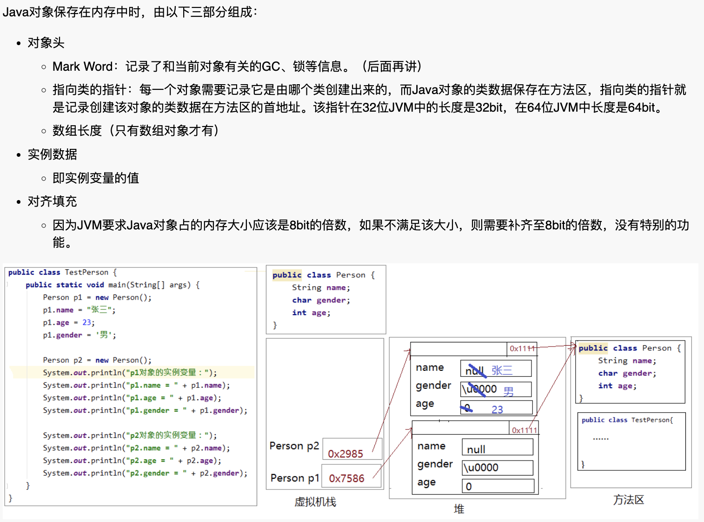
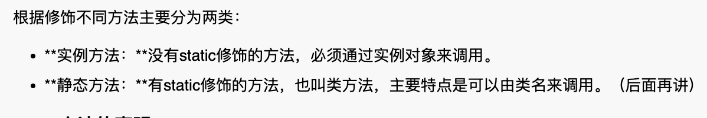
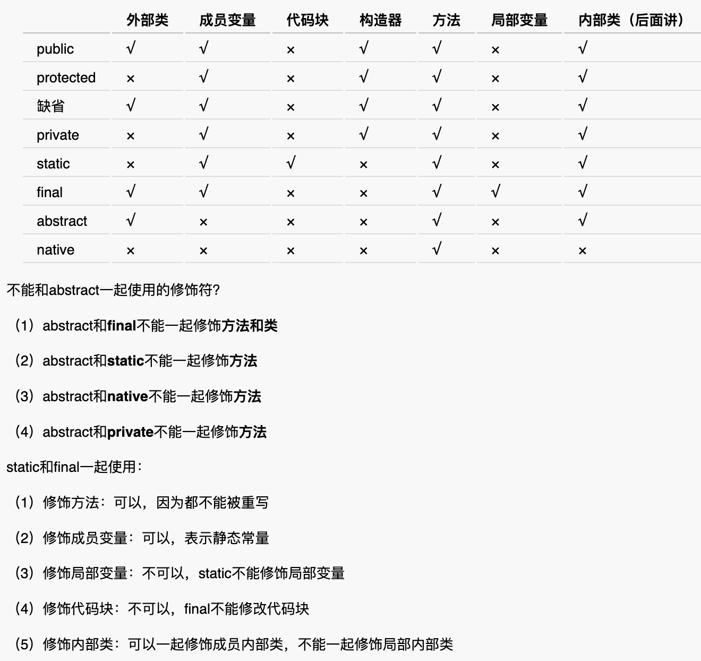

# 11 面向对象初级

## 1.1类和对象的概述

**1.对象的概念**

万物皆对象。环顾周围，你会发现很多对象，比如桌子，椅子，同学，老师，顾客，收银员等。


**2.对象的特征**

对象的属性：姓名，年龄，体重，员工编号，部门等对象的静态特征 对象的行为：购买商品，收款，打印账单等对象的动态特征或行为特征或者功能


**3.类和对象的关系**

- 类是对一类事物的描述，是抽象的。
- 对象是一类事物的实例，是具体的。
- 类是对象的模板，对象是类的实体。
- 通过类创建对象，这个过程叫类的实例化。


**4.类的定义**


**5.如何根据类创建对象**


**6.对象在内存中的存储原理**


## 1.2包的概述

**1.包的作用**

- 可以避免类重名：有了包之后，类的全名称就变为：包.类名
- 分类组织管理众多的类


- 可以控制某些类型或成员的可见范围。如果某个类型或者成员的权限修饰缺省的话，那么就仅限于本包使用


**2.包的声明**


通常用公司的域名倒置方式来写，比如com.atguigu.www


**3.跨包使用类**

- 需要先导包。比如java.util.Scanner;
- 注意：使用java.lang包下的类，不需要import语句，就直接可以使用简名称。因为他是核心类，其内部的对象可直接使用。比如Math.abs();
- import语句必须在package下面，class的上面


## 1.3成员变量

**1.变量的分类**


**2.成员变量的声明**


**3.实例变量的特点和默认值**


**4.实例对象**


**5.实例变量内存分析**




**6.实例变量与局部变量的区别**


## 1.4方法

**1.方法的概念**

方法也叫函数，是一个独立功能的定义，是一个类中最基本的功能单元。

把一个功能封装为方法的目的是，可以实现代码重用，从而简少代码量。


**2.方法的分类**


static可通过类名调用，无需创建对象。


**3.方法的声明**



注意，如果返回值是int，接收类型是double时，会自动转换。

方法不能嵌套定义！！！⚠️


**4.方法调用注意事项**

- 调用方法时，实参的个数、类型、顺序必须要与形参列表一一对应
- 调用方法时，如果方法有返回值，可以用与返回值类型相同的变量接受或直接处理返回值结果，如果方法的返回值类型是void，不需要也不能接收和处理返回值结果
- 方法调用表达式的结果可以不接收和处理，方法调用表达式直接加;成为一个独立的语句，这种情况，返回值丢失。


**5.本类内的实例变量访问**

在实例方法中还可以使用当前对象的其他成员。在Java中当前对象用this表示。

- this：在实例方法中，表示调用该方法的对象
- 如果没有歧义，完全可以省略this。


**6.方法调用内存分析**

方法调用时，会在栈内存中开辟内存空间，主要用来存储方法中的局部变量等数据。（方法入栈）

开辟的空间中包含this、方法内的局部变量。this中存放着调用它的对象的地址。（栈中操作）

方法执行完，将方法的返回值返回到调用处（栈中操作）

当方法执行完毕后，会立即释放为其所开辟的内存空间。（方法出栈）


**7.方法参数的传递机制**

- 方法参数是基本数据类型时，形参不会影响实参。
- 方法参数是引用数据类型时，传的是地址，可能会影响实参。
- 特殊情况：方法参数为引用数据类型的String或包装类类型。（String、Integer）


**8.方法重载Overload**

同一个类中（本类声明的或继承自父类的）的方法，方法名相同，参数列表不同的情况，这就叫方法重载。

（原理：方法调用时实参必须和参数列表一致，所以可根据参数列表区分使用哪个方法）

注意，当传递的实参没有完全符合的参数列表时：

- 根据参数类型会自动提示寻找合适的方法使用，但是可能会因为返回值类型原因报错
- 当存在两个以上匹配程度一样的最优匹配方法时会报错。（违背了原理）


**9.方法的可变参数**

我们定义一个方法时，此时某个形参的类型可以确定，但是形参的个数不确定，那么我们可以使用可变参数。


注意：

- 一个方法最多只能有一个可变参数
- 如果一个方法包含可变参数，那么可变参数必须是形参列表的最后一个
- 可变参数不传或者传一个都可以 ，不传时也会根据可变参数创建数组，不过长度为0
- 本质上是个数组， test(int…a)和test(int[] a) 一样的，同时定义会报错，不过前者更灵活一些，支持传递数组和多个 参数。


**10.命令行参数**

早期的时候，启动虚拟机通过这种方式在命令行传参数，所以也叫命令行参数。


## 1.5递归Recursion

**1.递归概念**

- 递归就是方法自己调用自己
- 递归还分为直接递归和间接递归
- 递归一定要像已知的方向递归，否则就形成了无穷递归，变成了死循环
- 

**2.递归举例**

```java
public int test(int i) {
    if (i == 1) {
        return 1;
    }
    return test(i - 1) * i;
}
```


## 1.6对象数组

**1.概念**

- 数组是用来存储一组数据的容器，一组基本数据类型的数据可以用数组装，那么一组对象也可以使用数组来装。
- 即数组的元素可以是基本数据类型，也可以是引用数据类型。当元素是引用数据类型时，我们称为对象数组。

注意：对象数组，首先要创建数组对象本身，即确定数组的长度，然后再创建每一个元素对象，如果不创建，数组的元素的默认值就是null，所以很容易出现空指针异常NullPointerException。


**2.创建并遍历排序**


**3.内存分析**


## 1.7封装encapsulation

**1.封装的概念**

隐藏对象内部的复杂性，只对外公开简单的接口。便于外界调用，从而提高系统的可扩展性、可维护性。

通俗的讲，把该隐藏的隐藏起来，该暴露的暴露出来。这就是封装性的设计思想。

比如：日常开发中，会将成员变量私有化，然后提供get和set方法进行访问。

注意：可以使用IDEA快捷键快速编写get和set方法。（command + n）


**2.权限修饰符**


注意：外部类只可以使用public和缺省，不然定义类就没意义了。


## 1.8继承inherit

**1.继承的概念**

继承描述的是事物之间的所属关系，这种关系是：is-a的关系。多个类可以称为子类，也叫派生类；

多个类抽取出来的这个类称为父类、超类（superclass）或者基类。


**2.继承的好处和弊端**

- 提高代码的复用性、扩展性

- 类与类之间产生了关系，是学习多态的前提。

弊端：增加了类与类之间的耦合度。


**3.继承的格式**


**4.继承的特点**

- 子类继承了父类的所有成员变量和方法，但是不能访问父类的私有成员变量。（子类内存中有，却不能使用），只可以通过继承父类的公共方法来访问私有成员变量。

- Java只支持单继承，一个类只支持一个父类，不过Java也支持多层继承，一个类可以有父类的同时也可以有子类。

- 所有java类除了java.lang.object之外，都直接或间接的继承java.lang.object类。

注意：可以使用IDEA快捷键快速查看继承关系。（command + u）


**5.继承的内存分析**

创建对象时，实际上会存储一份父类的成员变量到自己的内存空间中。


**6.方法重写Override**

概念：方法名相同，参数列表相同叫方法重写。


**7.方法重写条件**

- 必须保证父子类之间重写方法的名称、参数列表也完全相同。
- 子类方法的返回值类型必须【小于等于】父类方法的返回值类型（小于其实就是是它的子类，例如：Cat< Animal）。（注意：如果返回值类型是基本数据类型和void，那么必须是相同）
- 子类方法的权限必须【大于等于】父类方法的权限修饰符。
- 子类声明的异常类型不能比父类的大（异常讲）


**8.不属于方法重写的情况**

- 父类的静态方法不能被子类重写（子类只继承成员变量）
- 父类的私有方法不能被子类重写（因为父类的方法太小了，系统直接不认为他是被重写的）
- 父类的final修饰的方法子类不能重写


## 1.9多态Polymorphism

**1.多态的形式**

父类类型的变量可以接收子类类型的对象


**2.多态的表现**

编译时类型与运行时类型不一致，编译时看左边的“父类”，运行时看右边的“子类”。

因此，使用多态时，无发调用子类的特有方法，需要强制转型。（第5条有详细原因和解决方案）


**3.多态的好处**

- 提高程序的扩展性（便于调用重写的方法） 
- 降低类与类之间的耦合度（降低类与类之间的关系链）


**4.多态应用(只可以调用子类中父类的重写方法)**

- 声明父类类型变量，变量赋值子类对象
- 数组元素类型是父类类型，元素存储的是子类对象
- 返回值类型是父类类型，实际可以返回任意子类对象


**5.向上转型向下转型**


注意：同一父类的不同子类对象之间，不可互相转换！强制转换会报错，通过编译后运行时会报类型转换错误。

解决方案：使用instanceof判断对象的运行时类型，然后再进行强转。例：if(cat instanceof animal )


## 1.10虚方法

**1.概念**

在Java中虚方法是指在编译阶段和类加载阶段都不能确定方法的调用入口地址，在运行阶段才能确定的方法，即可能被重写的方法。非虚方法有final、static修饰的方法。


**2.不可重写的部分**

多态的成员变量不可以被重写，只有方法可以被重写，调用时，打印子类重写的成员变量还是父类原来的。关于多态中的成员变量，编译运行都看左边。

没有对应的方法时，会在编译时找左边父类最匹配的方法，运行时找这个方法对应的重写方法，如果没有就继续执行这个未被重写的方法。


**3.执行原则**

（编译看左边，执行看右边）

- 静态分派：先看这个对象的编译时类型，在这个对象的编译时类型中找到最匹配的方法, 最匹配的是指，实参的编译时类型与形参的类型最匹配
- 动态绑定：再看这个对象的运行时类型，如果这个对象的运行时类重写了刚刚找到的那个最匹配的方法，那么执行重写的，否则仍然执行刚才编译时类型中的那个方法


# 2 面向对象中级

## 2.1实例初始化

**1.构造器的作用**

new对象，并在new对象的时候为实例变量赋值。


**2.构造器的语法格式**


**3.构造器使用注意事项**

- 构造器名必须与它所在的类名必须相同。
- 它没有返回值，所以不需要返回值类型，甚至不需要void
- 如果你不提供构造器，系统会给出无参数构造器，并且该构造器的修饰符默认与类的修饰符相同
- 如果你提供了构造器，系统将不再提供无参数构造器，除非你自己定义。
- 构造器是可以重载的，既可以定义参数，也可以不定义参数。
- 构造器的修饰符只能是权限修饰符，不能被其他任何修饰。


**4.this调用本类其他构造器**

注意：必须在构造器的第一行，因此，它和super不能直接同时存在


**5.super调用父类其他构造器**

注意：必须在构造器的第一行，因此，它和this不能同时存在。

  使用子类构造器创建对象时，一定会调用父类构造器，初始化父类数据。


## 2.2非静态代码块

**1.作用**

和构造器一样，也是用于实例变量的初始化等操作，所以也称为构造代码块。

如果多个重载的构造器有公共代码，并且这些代码都是先于构造器其他代码执行的，那么可以将这部分代码抽取到非静态代码块中，减少冗余代码。


**2.执行特点**

调用任何一个构造器（即new对象的时候）都会执行，并且一定优先于构造器执行。

所有非静态代码块中代码都是在new对象时自动执行，并且一定是先于构造器的代码执行。因此可以将多个构造器中共同执行的代码写到非静态代码块里。


## 2.3实例初始化过程

当通过构造器new对象时，代码底层会执行一个实例初始化方法inte{}，任何一个构造器都会依次执行此方法，我们将其称之为实例初始化方法。


## 2.4关键字和Object类

**1.关键字this**

- this.成员变量：表示当前对象的某个成员变量，而不是局部变量
- this.成员方法：表示当前对象的某个成员方法，完全可以省略this.
- this()或this(实参列表)：调用另一个构造器协助当前对象的实例化，只能在构造器首行，只会找本类的构造器，找不到就报错


**2.关键字super**

- super.成员变量：表示当前对象的某个成员变量，该成员变量在父类中声明的
- super.成员方法：表示当前对象的某个成员方法，该成员方法在父类中声明的
- super()或super(实参列表)：调用父类的构造器协助当前对象的实例化，只能在构造器首行，只会找直接父类的对应构造器，找不到就报错

很重要！子类的构造函数中会默认调用父类的空参构造器——super()，用来储存父类的数据。并不是真正的创建了一个父类对象。所以super和this不同，super只是关键字，并非指向当前对象的父类地址，因为并未创建父类对象。


**3.子类成员变量声明原则**


**4.成员变量重名问题**

- 如果实例变量与局部变量重名，可以在实例变量前面加this.进行区别
- 如果子类实例变量和父类实例变量重名，并且父类的该实例变量在子类仍然可见，在子类中要访问父类声明的实例变量需要在父类实例变量前加super.，否则默认访问的是子类自己声明的实例变量
- 如果父子类实例变量没有重名，只要权限修饰符允许，在子类中完全可以直接访问父类中声明的实例变量，也可以用this.实例访问，也可以用super.实例变量访问


**5.子类成员变量查找调用**

- 如果没有使用this和super，从局部开始查找
- 如果有this从自己成员变量里面找，没有再去父类里找
- 如果有super，直接去父类里面找，如果直接父类没有，就去父类的父类中找


**6.子类成员方法查找调用**

- 如果子类没有重写父类的方法，只要权限修饰符允许，在子类中完全可以直接调用父类的方法；
- 如果子类重写了父类的方法，在子类中需要通过super.才能调用父类被重写的方法，否则默认调用的子类重写的方法


## 2.5关键字和Object类

1.native关键字

本地方法栈，只能修饰方法，方法体通常是c/c++编写的，我们可以正常调用或重写，只是看不到方法体。

2.final关键字

- 修饰的变量是常量
- 修饰的方法不能被重写
- 修饰的类不能被继承（最终类、太监类）

3.Object根父类

所有的类都直接或间接继承自Object类，除了java.lang.Object，因为是他本身

- hashCode()

返回对象的哈希值，对象内存地址转换而来的十进制整数int，建议重写，返回和对象属性相关的值。

- getClass()

final，不可重写，返回对象的运行时类型，obj.getClass().getName()：获取对象的运行时的类名称

- toString()

返回对象的字符串形式String，object类的此方法默认返回值为：运行时类型名称+@+hasCode值的十六进制（直接打印对象就是打印对象的toSting方法）。建议子类都重写此方法，返回对象的属性信息，直接打印对象时就是对象属性信息。

- equals()

返回boolean，建议重写，重写后可用来比较属性值。未重写的底层是（this == 实参）

- finalize()

​    用于最终清理内存的方法，System.gc() 通知虚拟机来回收垃圾，通常用于释放c/c++占用的内存。


## 2.6标准JavaBean

JavaBean是 Java语言编写类的一种标准规范。标准的 JavaBean —般需遵循以下规范：

- 类必须是具体的和公共的，
- 并且具有无参数的构造方法，
- 成员变量私有化，并提供用来操作成员变量的set 和get 方法。
- 实现 java.io.Serializable 接口


## 2.7静态static

**1.静态变量格式(也叫类变量)**


**2.静态变量特点**


**3.静态变量内存分析**

静态变量存储在方法区里，所有对象共用。


**4.静态类变量和非静态实例变量、局部变量**


**5.静态方法的语法格式**


**6.静态方法的特点**

- 静态方法在本类的任意方法、代码块、构造器中都可以直接被调用。
- 只要权限修饰符允许，静态方法在其他类中可以通过“类名.静态方法“的方式调用。也可以通过”对象.静态方法“的方式调用（但是更推荐使用类名.静态方法的方式）。
- 静态方法可以被子类继承，但不能被子类重写。
- 静态方法的调用都只看编译时类型。


**7.静态代码块**

- 作用：

如果想要为静态变量初始化，可以直接在静态变量的声明后面直接赋值，也可以使用静态代码块。静态代码块内的代码会在类加载时执行。

- 特点：

每一个类的静态代码块只会执行一次（因为创建对象时类只会加载一次）。静态代码块的执行优先于非静态代码块和构造器 。

- 与非静态代码块的区别：

静态代码块在类初始化时执行，只执行一次

非静态代码块在实例初始化时执行，每次new对象都会执行


**8.类的初始化三要素**

（1）类的初始化就是为静态变量初始化值。实际上，类初始化的过程时在调用一个clinit()方法，而这个方法是编译器自动生成的。编译器会将如下两部分的所有代码，按照书写顺序合并到类初始化clinit()方法体中。


（2）每个类初始化只会进行一次，如果子类初始化时，发现父类没有初始化，那么会先初始化父类。

（3）类的初始化一定优先于实例初始化。


**9.类初始化和实例初始化特征**

- 类初始化代码只执行一次，并且优先于实例初始化
- 父类优先于子类初始化


**10.静态和非静态的区别**


**11.静态导入**


## 2.8抽象类

**1.概念**

抽象：即不具体、或无法具体。

父类在声明有些方法时，就只有方法签名，没有方法体，我们把没有方法体的方法称为抽象方法。Java语法规定，包含抽象方法的类必须是抽象类。


**2.语法格式()**

- 抽象方法 ： 没有方法体的方法。
- 抽象类：被abstract所修饰的类。


**3.特点**

- 抽象类有构造器，但是不能创建对象，是供子类创建对象时，初始化父类成员变量使用的。

- 抽象类中，不一定包含抽象方法，但是有抽象方法的类必定是抽象类。
- 抽象类的子类，必须重写抽象父类中所有的抽象方法，除非子类也是抽象类，再由后代来写。


## 2.9修饰符冲突




## 2.10接口

**1.概述**

接口就是规范，定义的一组则体现了现实世界中“如果你/要... 则必须能 ... ”的思想。继承是一个 "is a"的关系，而接口实现则是 "has a"的关系。接口很重要的作用就是解耦合。接口和类同级，也是引用型。


**2.语法格式**


**3.接口成员**

- 静态常量，默认自带自带修饰符public static final（如：int num = 10）
- 抽象方法，默认自带修饰符public abstract（如：void dance()）必须重写！
- 静态方法，默认自带修饰符public（如：static void dance()），JDK8以上，取代工具类
- 默认方法、缺省方法、扩展方法 ，默认自带修饰符public（如：default void dance()），JDK8以上，子类可选择重写或不重写
- 私有方法，是为静态和缺省方法服务的。 （如：private void dance()），JDK9以上，


## 2.11接口的实现

**1.语法格式**


**2.实现注意事项**

- 如果接口的实现类是非抽象类，那么必须重写接口中所有抽象方法。
- 默认方法可以选择保留，也可以重写。
- 接口中的静态方法不能被继承也不能被重写。


**3.接口的访问**

- 访问接口的抽象方法，必须被实现类重写才能访问，
- 访问接口的默认方法，可以选择是否重写，但必须通过实现类对象来访问
- 访问接口的静态方法，只能使用"接口名.静态成员"来访问
- 访问接口的静态常量，推荐通过"接口名.静态常量"来访问


**4.接口的多态形式**

接口类型的变量可以指向实现类对象，因此可以实现多态形式。通过接口类型的变量调用方法，最终执行的是你new的实现类对象实现的方法体，但是编译时还是要看左边的类型。

时刻牢记编译看左边！这时候即使类实现了接口又继承了父类，若是父类的多态形式仍无法调用子类从接口实现的抽象方法！可以说这个子类既属于父类的类型，又属于接口的类型。


**5.接口的多实现和多继承**

一个类能继承一个父类，同时实现多个接口。

一个接口可以继承多个接口。

接口中，有多个抽象方法时，实现类必须重写所有抽象方法。如果抽象方法有重名的，只需要重写一次。


**6.冲突原则**

默认方法冲突问题 ：

- 优先使用父类的方法，亲爹优先原则。
- 调用的两个接口存在同一个方法时，会有接口冲突，必须重写，左右为难

非要调用接口中的方法，可自己重写方法，方法内再调用他，使用 接口名.super.方法名

常量冲突问题：

- 当子类继承父类又实现父接口，而父类中存在与父接口常量同名的成员变量，并且该成员变量名在子类中仍然可见。会编译报错！
- 当子类同时继承多个父接口，而多个父接口存在相同同名常量。会编译报错！

处于以上两种情况存时， 在子类中想要引用父类或父接口的同名的常量或成员变量，就会有冲突问题，编译报错。

**7.接口特点**

- 接口没有构造器，不能创建对象
- 接口的成员是确定的，根据JDK版本做出调整
- 接口支持多继承，多实现
- 接口的实现必须重写接口的所有抽象方法，除非实现类也是抽象类
- 接口的静态方法不能被继承、被重写，只能通过接口名访问


**8.接口的内部接口**

接口的内部还可以定义接口，使用时需要 implements Out.In，然后实现它的抽象方法。

```java
public interface Out {
    interface In {
        void test();
    }
}

class Test implements Out.In{
    @Override
    void test(){
        System.out.println("继承了内部接口");
    }
}
```


**9.经典接口介绍与使用**

- java.lang.Comparable（自然排序）：

Java给所有引用数据类型的大小比较，指定了一个标准接口，就是java.lang.Comparable接口：


实现comparable接口里的compareTo方法：

```java
public int compareTo(Object o) {
    Student s = (Student) o;
    int i = this.age - s.age;//比较年龄
    i = i == 0 ? this.score - s.score : i;//年龄相同，再比较分数
    i = i == 0 ? this.name.compareTo(s.name) : i;//分数也相同，比较姓名，这里用了String自己实现的compareTo方法来比较姓名的大小
    return i;
}
```

借助实现的compareTo方法进行冒泡排序：

```java
//创建数组，存储5个学生对象
Student[] stus = new Student[6];
stus[0] = s1;
stus[1] = s2;
stus[2] = s3;
stus[3] = s4;
stus[4] = s5;
stus[5] = s6;
//冒泡排序
for (int i = 0; i < stus.length - 1; i++) {
    for (int j = 0; j < stus.length - 1 - i; j++) {
        //比较元素大小，并交换位置
        if (stus[j].compareTo(stus[j + 1]) > 0) {
            Student temp = stus[j];
            stus[j] = stus[j + 1];
            stus[j + 1] = temp;
        }
    }
}
```

根据接口特性再次修改，只要实现了compare接口的类都可以使用：


- java.util.Comparator（定制排序）：

实现对象的定制排序，实现类重写compare方法，然后创建实现类对象，进行使用。


```java
class Kit implements Comparator {

    @Override
    public int compare(Object o1, Object o2) {
        Student s1 = (Student) o1;
        Student s2 = (Student) o2;
        int i = s1.getNumber() - s2.getNumber();
        i = i == 0 ? s1.getAge() - s2.getAge() : i;
        i = i == 0 ? s1.getName().compareTo(s2.getName()) : i; //这里的难点是String类继承comparable后实现了compareTo()方法，所以String的实例化对象（即字符串类型的变量和常量）可使用他。
        return i;
    }
}

```

定义一个工具类方法，可对任何数组进行排序。写个可以传入数组和与之对应的比较类实现对象即可：

```java
class Arr{
    public static void sort(Object[] array, Comparator Kit) {
        for (int i = 0; i < array.length - 1; i++) {
            for (int j = 0; j < array.length - 1 - i; j++) {
                if (Kit.compare(array[j], array[j + 1]) < 0) {
                    Object temp = array[j];
                    array[j] = array[j + 1];
                    array[j + 1] = temp;
                }
            }
        }
    }
}
```

java.lang.Cloneable（克隆接口，接口内没任何方法，我们称之为标记接口）：

重写Object中的clone()方法

```java
class Student implements Cloneable{
  @Override
  public Object clone() throws CloneNotSupportedException {
      return super.clone(); //访问权限建议改成公共的，然后再调用父类方法
  }
}
```

使用Object接收其返回值（克隆的新对象）

```java
Student stu = new Student("tom", 19, 99);
Object obj = stu.clone();
```


# 3 面向对象高级

## 3.1内部类

**1.成员内部类（分静态内部类和非静态内部类）**

定义在一个类的成员变量位置的类叫成员内部类

**静态内部类：**

- 和其他类一样，它只是定义在外部类中的另一个完整的类结构：
  - 可以继承自己的想要继承的父类，实现自己想要实现的父接口们，和外部类的父类和父接口无关
  - 可以在静态内部类中声明属性、方法、构造器等结构，包括静态成员
  - 可以使用abstract修饰，因此它也可以被其他类继承
  - 可以使用final修饰，表示不能被继承
  - 编译后有自己的独立的字节码文件，只不过在内部类名前面冠以外部类名和$符号。
- 和外部类不同的是，它可以允许四种权限修饰符：public，protected，缺省，private。外部类只允许public或缺省的

- 在静态内部类中不能使用外部类的非静态成员
- 在外部类的外面不需要通过外部类的对象就可以创建静态内部类的对象New对象方式 Inner.Son son = new Inner.Son();

- 如果在内部类中有变量与外部类的静态成员变量同名，可以使用“外部类名."进行区别

**非静态内部类：**

- 和其他类一样，它只是定义在外部类中的另一个完整的类结构：
  - 可以继承自己的想要继承的父类，实现自己想要实现的父接口们，和外部类的父类和父接口无关
  - 可以在非静态内部类中声明属性、方法、构造器等结构，但是不允许声明静态成员，但是可以继承父类的静态成员，而且可以声明静态常量。
  - 可以使用abstract修饰，因此它也可以被其他类继承
  - 可以使用final修饰，表示不能被继承
  - 编译后有自己的独立的字节码文件，只不过在内部类名前面冠以外部类名和$符号。
- 和外部类不同的是，它可以允许四种权限修饰符：public，protected，缺省，private。外部类只允许public或缺省的
- 还可以在非静态内部类中使用外部类的所有成员，哪怕是私有的
- 在外部类的静态成员中不可以使用非静态内部类，就如同静态方法中不能访问本类的非静态成员变量和非静态方法一样
- 在外部类的外面必须通过外部类的对象才能创建非静态内部类的对象，因此在非静态内部类的方法中有两个this对象，一个是外部类的this对象，一个是内部类的this对象

**New对象方式 ：**

```java
Inner.Son son = new Inner().new Son();
```


**2.局部内部类（普通的局部内部类和匿名内部类）**

**局部内部类：**

- 和外部类一样，它只是定义在外部类的某个方法中的另一个完整的类结构：
  - 可以继承自己的想要继承的父类，实现自己想要实现的父接口们，和外部类的父类和父接口无关
  - 可以在局部内部类中声明属性、方法、构造器等，但不包括静态成员，除非是从父类继承的或静态常量
  - 可以使用abstract修饰，因此它也可以被同一个方法的在它后面的其他内部类继承
  - 可以使用final修饰，表示不能被继承
  - 编译后有自己的独立的字节码文件，只不过在内部类名前面冠以外部类名和$符号、编号。这里有编号是因为同一个外部类中，不同的方法中存在相同名称的局部内部类
- 和成员内部类不同的是，它前面不能有权限修饰符等
- 局部内部类如同局部变量一样，有作用域
- 局部内部类中是否能访问外部类的静态还是非静态的成员，取决于所在的方法
- 局部内部类中还可以使用所在方法的局部常量，即用final声明的局部变量。JDK1.8之后，如果某个局部变量在局部内部类中被使用了，自动加final，也必须是final修饰的 。局部类所在的方法中的局部变量是final，存储在方法区的常量池里，所以局部类才可以调用他，不然局部变量存储在栈里，方法执行过后就被销毁了。

**创建局部内部类对象方式 ：**


**匿名内部类：**

当一个对象调用一次就不再使用可以使用匿名对象，当一个类调用一次就不再使用可以使用匿名内部类。

匿名内部类是一种特殊的局部内部类，只不过没有名称而已。所有局部内部类的限制都适用于匿名内部类。例如：

- 在匿名内部类中是否可以使用外部类的非静态成员变量，看所在方法是否静态
- 在匿名内部类中如果需要访问当前方法的局部变量，该局部变量需要加final

当一个 类只使用一次不再使用时，可以使用匿名内部类，多用于实现接口。

语法格式：new 父类或接口(【实参列表】){ 重写方法…}.方法名();

```java
public class Main {
    public static void main(String[] args) {
        Danceable danceable = new Danceable() {
            @Override
            public void dance() {
                System.out.println("跳舞...");
            }
        };
    }
}
interface Danceable {
    void dance();
}
```


## 3.2单例模式

设计模式：经验的总结，大量业务开发实践中，针对某些需求，总结的一套开发经验。比如程序运行时，希望内存中只存在一个对象的实例（或考虑用于共享数据，或考虑实例多了浪费空间），针对这样的需求如何做到呢？经长期实践总结，有以下方式可以轻松做到，你记住了这种设计模式也就可以轻松完成这个需求，不需要再从头思考各种细节问题来完成。

饿汉式：构造器私有化，提供公共的静态方法，再用常量存储一个用户在方法中返回他，类加载时，会只new一次。（存在线程安全问题，多线程可能创建多个对象出来）⚠️

```java
//title :单例模式：饿汉式
public class Student {
    //静态变量--一个类只有一份静态变量值，随着类的加载而加载，只执行一次静变量的直接显示赋值。
    private static final Student instance = new Student();
    //私有构造器
    private Student() {
    }

    //公共的静态方法
    public static Student getInstance() {
        return instance;
    }
}
```

懒汉式：构造器私有化，提供公共的静态变量，默认值为null，再写公共的静态方法判断静态变量值，然后不为null就创建。⚠️

```java
/** 
 * @author atguigu
 * 
 * 懒汉式（延迟加载） 
 */  
public class Singleton2 {  
  
    /** 
     * 私有构造 
     */  
    private Singleton2() {  
        System.out.println("构造函数Singleton2");  
    }  
  
    /** 
     * 初始值为null 
     */  
    private static Singleton2 single = null;  
  
    /** 
     * 静态工厂方法 
     * @return 单例对象 
     */  
    public static Singleton2 getInstance() {  
        if(single == null){  
            System.out.println("getInstance");  
            single = new Singleton2();  
        }  
        return single;  
    }  
  
    public static void main(String[] args){  
  
        System.out.println("初始化");  
        Singleton2 instance = Singleton2.getInstance();  
    }  
}  
```


## 3.3注解

**1.概念**

给程序看的一种标记，需要对应的程序来识别相应的注解并做出对应的处理逻辑。


**2.三个基本注解**

**@Override**

用于检测被修饰的方法为有效的重写方法，如果不是，则报编译错误!

只能标记在方法上。

它会被编译器程序读取。

**@Deprecated**

用于表示被标记的数据已经过时，不建议使用。

可以用于修饰 属性、方法、构造、类、包、局部变量、参数。

它会被编译器程序读取。

**@SuppressWarnings**

抑制编译警告。需要在括号内填写抑制的内容。

可以用于修饰类、属性、方法、构造、局部变量、参数

它会被编译器程序读取。

**自定义注解**

```java
public @interface TestZhuJie{
    // 自定义注解
}
```

四种注解使用方法

```java
public class Main {
    @TestZhuJie
    public static void main(String[] args) {
        @SuppressWarnings("all")
        Danceable danceable = new Danceable() {
            @Override
            public void dance() {
                System.out.println("跳舞...");
            }
        };
    }
}
@Deprecated
interface Danceable {
    void dance();
}
```


**3.JUnit测试单元**

单元测试框架导入步骤：

```java
* 1.引入jar包
* >在项目下创建文件夹lib
* >复制jar包到lib目录下
* >右键点击jar包，add as library ->选择添加到要使用junit的模块
*
* 2.使用Junit测试
* 创建测试类，创建测试方法，在方法上加注解@Test，运行测试方法。
* 3.使用注意实现
* 测试类必须是public的具体的类
* 测试方法必须是public的,不能有返回值，不能有参数
* 不要是junit测试Scanner
* 不要使用Junit测试多线程程序，不支持
```

或者直接在设置内倒入这两个插件。

注意事项：不要使用JUnit测试Scanner和多线程代码，不支持。

使用方法：直接创建无返回值的测试方法，在测试方法内部调用其他方法进行测试。


## 3.4异常

**1.概念**

**Java用不同的类来表示不同的异常类型**，当发生某种异常时，JVM会创建该异常类型的对象（其中包含了异常详细信息），并且抛出来，然后程序员可以catch到这个异常对象，并根据需要进行相应处理

**Throwable体系：**

- Error:严重错误Error，无法通过处理的错误，只能事先避免，好比绝症。
  - 例如： StackOverflowError、OutOfMemoryError。
- Exception:表示异常，其它因编程错误或偶然的外在因素导致的一般性问题，程序员可以通过相应预防处理措施，使程序发生异常后还可以继续运行。好比感冒、阑尾炎。
  - 例如：空指针访问、试图读取不存在的文件、网络连接中断、数组角标越界

**异常常用方法：**

- public void printStackTrace():打印异常的详细信息
- public String getMessage():获取发生异常的原因。


**2.异常体系**

异常的根类是java.lang.Throwable，Java提供的所有异常类均继承自此类，其下有两个子类：java.lang.Error与java.lang.Exception。

平常所说的异常指java.lang.Exception。（Exception又分为checkedException 受检异常和uncheckedException非受检异常，前者必须处理才能运行，后者可处理可不处理）

**编译期异常（受检异常）checkedException**通常不是代码逻辑的问题，往往是程序之外的问题。必须处理，否则编译无法通过，无法运行。

**运行期异常（非受检异常）uncheckedException**通常是代码逻辑不够严谨导致的，应该通过改进代码来避免发生。遇到异常时，若不处理异常JVM会终止。


**3.异常抛出机制**

程序发生异常后，JVM会在异常发生出自动创建一个对应的异常类型的对象，并向方法的调用处逐层向上抛出。如果在此抛出过程中都未处理，最终会抛给JVM。JVM会把异常对象中包含的异常信息及异常的堆栈追踪信息打印输出到控制台，并终止。

**异常的抛出方式有两种：**

 ①JVM自动创建对应的异常类型对象并抛出

 ②使用关键字throw手动抛出异常

使用关键字throw手动抛出异常时，会终止JVM虚拟机的运行。

```java
public static void sort(int a){
    if(a<0){
        throw new RuntimeException("抛出异常");
    }
}
```


**4.异常的处理机制**

针对运行时异常，要尽量通过修正代码的严谨度，避免异常发生。

如果无法避免，如何处理？可以通过try...catch语句捕获 异常。在异常对象抛给JVM之前可以捕获异常对象，那么就不会导致JVM终止。

**try...catch…finally的捕捉异常语法格式：**

```java
	try{

	  //可能发生异常的代码

	}catch(要捕获的异常类型 变量){

	  //捕获异常后的处理逻辑

	}finally{

	  //最后执行的语句

	}
```

**针对受检异常，必须处理才能运行，处理方式2种：**

1. try..catch捕获异常---真正的处理异常
2. 通过throws关键字在方法上声明异常类型。让调用者来处理。相当于甩锅行为

**throws：用在方法上，表明此方法可能会产生的异常类型。**

如果在某方法内通过抛出了必须要处理的编译期异常，有两种选择：要么在当前方法进行捕获处理，要么通过throws在当前方法上进行声明，让方法的调用者去处理。

第一种处理方式：捕获异常的条件可先写小的再写大的，比如先捕获空指针和下标越界，最后捕获Exception：

```java
    public static int getNum(int[] arr, int index) {
        int num = 0;
        try {//可能发生异常的代码
            System.out.println("---------");
            num = arr[index];
            System.out.println("=========");
          //捕获脚标越界异常或空指针异常
        } catch (ArrayIndexOutOfBoundsException|NullPointerException e) {         
            System.out.println("捕获了脚标越界异常...或空指针异常。。。");
//            System.out.println("异常信息："+e.getMessage());
//            e.printStackTrace();//打印异常对象的堆栈追踪信息
        }catch (Exception e){//捕获其他异常
            System.out.println("捕获了其他异常...");
        }
        return num;
    }
```

第二种处理方式：在方法上使用throws xxxxxException声明此方法可能发生的异常类型，谁调用谁处理，甩锅行为。要是都不处理就一直继续往上声明throws xxxxxException，最后到main方法，由虚拟机处理。一般情况下，抛出的异常最后还是需要靠try…catch来处理：

```java
public class Demo2 {
    public static void main(String[] args) {
        System.out.println("start");
        try {
            readFile();
        } catch (FileNotFoundException e) {
            e.printStackTrace();
        }
        System.out.println("end");
    }
    //在方法上声明此方法可能发生的异常类型
    public static void readFile() throws FileNotFoundException {
        //这里会有受检异常发生，必须处理，否则无法编译通过，更不能运行
//        try {
            FileInputStream fis = new FileInputStream("D:/123.txt");
//        } catch (FileNotFoundException e) {
//            e.printStackTrace();
//        }
    }
}
```

try捕获到异常会直接到catch中去，最后执行finally中的语句。

**注意：finally不管有没有异常最终都会执行的代码，通常用于释放资源。finally里的语句会覆盖之前的return。**


**5.自定义异常**

保持一个合理的异常体系是很重要的，一般自定义一个异常比如UserException作为“根异常”，然后在此基础上再派生出不同的异常类型，自定义的“根异常”需要从一个合适的现有异常中派生出来，通常建议派生自java.lang.RuntimeException。

自定义的“根异常”通常提供多个构造方法，直接调用父类的即可：

```java
//用户异常的根类
public class UserException extends RuntimeException {
    public UserException() {
    }

    public UserException(String message) {
        super(message);
    }

    public UserException(String message, Throwable cause) {
        super(message, cause);
    }

    public UserException(Throwable cause) {
        super(cause);
    }

    public UserException(String message, Throwable cause, boolean enableSuppression, boolean writableStackTrace) {
        super(message, cause, enableSuppression, writableStackTrace);
    }
}
```

派生出的异常，提供简单两个构造方法，够用即可：

```java
//用户已存在异常
public class UserExistsException extends UserException {
    public UserExistsException() {
    }

    public UserExistsException(String message) {
        super(message);
    }
}
```

使用自己定义的异常

```java
public class Demo {
    //模拟已经注册成功的用户
    private static String[] names = {"tom", "jack", "rose"};

    //注册用户的方法
    public void registUser(String name) {
        if (checkUserName(name)) {
            //手动抛出异常
            throw new UserExistsException(name + "用户名已注册");
        } else {
            System.out.println(name + "注册成功！");
        }
    }

    //判断用户是否已注册
    public boolean checkUserName(String name) {
        for (int i = 0; i < names.length; i++) {
            if (name.equals(names[i])) {
                return true;//表示用户名已注册
            }
        }

        return false;//表示用户名未注册，可以使用
    }
    
    @Test
    public void test() {
        registUser("rose");
    }
    
}
```


**6.异常总结**

异常中的五个关键字


**使用注意事项：**

- 编译期异常必须处理，要么捕获处理，要么声明在方法上，让调用者处理。
- 运行时异常被抛出可以不处理。即不捕获也不声明抛出。
- try语句范围要尽量小的包围在可能出现异常的一行或几行代码上，不要把大量无异常的代码一起包起来，虽然这样很省事。
- catch语句捕获的异常类型要尽量小，尽量精准，好针对性的做处理。（异常主要功能是日志输出）
- 如果finally有return语句,永远返回finally中的结果,但要避免该情况.
- 如果父类方法抛出了多个异常,子类重写父类方法时不能抛出更大异常,可以抛出和父类相同的异常或者是父类异常的子类或者不抛出异常。
- 父类方法没有抛出异常，子类重写父类该方法时也不可抛出异常。


## 3.5核心常用类String

**1.String类**

Java中的String是一个引用数据类型，表示字符串，String也是一个类，位于java.lang包下。Java程序中所有的字符串字面量（如"abc"）都可以被看作是此类的实例。


**2.特点**

- Java字符串的一个重要特点就是字符串不可变，内容不同的字符串一定不是同一个String对象。（底层char数组是private final修饰的，地址不可改变，内部元素理论上可以改变，但是未提供改变方法，所以也不能修改）

- 字符串字面量也是一个String类的实例，存储在字符串常量池中，相同的字符串字面量表示的对象在内存中只有一份。
- 字符串String类型本身是final声明的，不能继承String，因此不能去重写他的方法。


**3.字符串的构造方法**

- public String() ：初始化新创建的 String对象，以使其表示空字符序列。即new String();
- String(String original)： 初始化一个新创建的 String 对象，使其表示一个与参数相同的字符序列；换句话说，新创建的字符串是该参数字符串的副本。
- public String(char[] value) ：通过当前参数中的字符数组来构造新的String。
- public String(char[] value,int offset, int count) ：通过字符数组的一部分来构造新的String。
- public String(byte[] bytes) ：通过使用平台的默认字符集解码当前参数中的字节数组来构造新的String。
- public String(byte[] bytes,String charsetName) ：通过使用指定的字符集解码当前参数中的字节数组来构造新的String。


**4.String方法**

**系列1：常用**

（1）boolean isEmpty()：字符串是否为空

（2）int length()：返回字符串的长度

（3）String concat(xx)：拼接，等价于+

（4）boolean equals(Object obj)：比较字符串是否相等，区分大小写

（5）boolean equalsIgnoreCase(Object obj)：比较字符串是否相等，不区分大小写

（6）int compareTo(String other)：比较字符串大小，区分大小写，按照Unicode编码值比较大小

（7）int compareToIgnoreCase(String other)：比较字符串大小，不区分大小写

（8）String toLowerCase()：将字符串中大写字母转为小写

（9）String toUpperCase()：将字符串中小写字母转为大写

（10）String trim()：去掉字符串前后空白符

**系列2：查找**

（11）boolean contains(xx)：是否包含xx

（12）int indexOf(xx)：从前往后找，即如果有返回第一次出现的下标，要是没有返回-1，可传第二个开始查找位置参数

（13）int lastIndexOf(xx)：从后往前找当前字符串中xx，即如果有返回最后一次出现的下标，要是没有返回-1

**系列3：字符串截取**

（14）String substring(int beginIndex) ：返回一个新的字符串，它是此字符串的从beginIndex开始截取到最后的一个子字符串。

（15）String substring(int beginIndex, int endIndex) ：返回一个新字符串，它是此字符串从beginIndex开始截取到endIndex(不包含)的一个子字符串。

**系列4：和字符相关**

（16）char charAt(index)：返回[index]位置的字符

（17）char[] toCharArray()： 将此字符串转换为一个新的字符数组返回，直接打印char数组，会把里面的字符输出出来

（18）String(char[] value)：返回指定数组中表示该字符序列的 String。

（19）String(char[] value, int offset, int count)：返回指定数组中表示该字符序列的 String。

（20）static String copyValueOf(char[] data)： 返回指定数组中表示该字符序列的 String

（21）static String copyValueOf(char[] data, int offset, int count)：返回指定数组中表示该字符序列的 String

（22）static String valueOf(char[] data, int offset, int count) ： 返回指定数组中表示该字符序列的 String

（23）static String valueOf(char[] data) ：返回指定数组中表示该字符序列的 String

**系列5：编码与解码**

（24）byte[] getBytes()：编码，把字符串变为字节数组，按照平台默认的字符编码进行编码

byte[] getBytes(字符编码方式)：按照指定的编码方式进行编码

（25）new String(byte[] ) 或 new String(byte[], int, int)：解码，按照平台默认的字符编码进行解码

new String(byte[]，字符编码方式 ) 或 new String(byte[], int, int，字符编码方式)：解码，按照指定的编码方式进行解码

**系列6：开头与结尾**

（26）boolean startsWith(xx)：是否以xx开头

（27）boolean endsWith(xx)：是否以xx结尾

**系列7：正则匹配**

（28）boolean matches(正则表达式)：判断当前字符串是否匹配某个正则表达式

**系列8：替换**

（29）String replace(xx,xx)：替换所有匹配部分，不支持正则

（30）String replaceFirst(正则，value)：替换第一个匹配部分

（31）String repalceAll(正则， value)：替换所有匹配部分

**系列9：拆分**

（32）String[] split(正则)：按照某种规则进行拆分，拆分（返回）成字符串数组 。切割字符用｜。


## 3.6正则表达式

**正则表达式是代表某种规则的字符串**

```java
//boolean matches(正则表达式)：判断当前字符串是否匹配某个正则表达式
String regex="[0-9]+";//这是正则表达式，表示1个以上的数字
String regex="\\d{3,5}";//这是正则表达式，表示3个数字
System.out.println(s.matches(regex));
String phone = "13145678900";
String regex="1[2-9]\\d{9}";//正则表达式验证手机号
System.out.println(phone.matches(regex));
```

**字符类**

[abc]：a、b 或 c（简单类）

[^abc]：任何字符，除了 a、b 或 c（否定）

[a-zA-Z]：a 到 z 或 A 到 Z，两头的字母包括在内（范围）

**预定义字符类**

.：任何字符（与行结束符可能匹配也可能不匹配）

\d：数字：[0-9]

\D：非数字： [^0-9]

\s：空白字符：[ \t\n\x0B\f\r]

\S：非空白字符：[^\s]

\w：单词字符：[a-zA-Z_0-9]

\W：非单词字符：[^\w]

**POSIX 字符类（仅 US-ASCII）**

\p{Lower} 小写字母字符：[a-z]

\p{Upper} 大写字母字符：[A-Z]

\p{ASCII} 所有 ASCII：[\x00-\x7F]

\p{Alpha} 字母字符：[\p{Lower}\p{Upper}]

\p{Digit} 十进制数字：[0-9]

\p{Alnum} 字母数字字符：[\p{Alpha}\p{Digit}]

\p{Punct} 标点符号：!"#$%&'()*+,-./:;<=>?@[]^_`{|}~

\p{Blank} 空格或制表符：[ \t]

**边界匹配器**

^：行的开头

$：行的结尾

**Greedy 数量词**

*X?：X，一次或一次也没有

*X**：X，零次或多次 X+：X，一次或多次**

X{n}：X，恰好 n 次

X{n,}：X，至少 n 次

X{n,m}：X，至少 n 次，但是不超过 m 次

**Logical 运算符**

XY：X 后跟 Y

X|Y：X 或 Y

(X)：X，作为捕获组

**特殊构造（非捕获）**

(?:X) X，作为非捕获组

(?=X) X，通过零宽度的正 lookahead

(?!X) X，通过零宽度的负 lookahead

(?<=X) X，通过零宽度的正 lookbehind

(?<!X) X，通过零宽度的负 lookbehind

(?>X) X，作为独立的非捕获组


## 3.7字符串内存情况

**1.内存分析**

字符串中，一旦使用了+号，并且两边不都是常量，一定new了新的String，存储于堆中！常量自动拼接。

任何见到的字符串字面量，哪怕是new String(“abc”)，这里的“abc”也会存储于常量池中。⚠️


```java
public void test() {
    String s = "hello";//存储在字符串常量池
    String s1 = "hello";//存储在字符串常量池
    System.out.println(s == s1);//true
    System.out.println(s.equals(s1));//true

    String s2 = new String("hello");//在堆中创建新的字符串对象
    String s3 = new String("hello");//在堆中创建新的字符串对象

    System.out.println(s1 == s2);//false
    System.out.println(s2 == s3);//false
}
```

结论：

- 常量+常量：结果是常量池
- 常量与变量 或 变量与变量：结果是堆
- intern方法有jvm版本的区别，这里不再深入分析，jdk8中执行原理是如果字符串常量池有内容相同的字符串则直接返回，否则把堆中创建的字符串引用放入字符串常量池，返回此引用，总之所有版本都是通过字符串常量池返回的内容。


**2.面试题**

字符串的length和数组的length有什么不同？

```java
字符串的是length()方法，数组的是length属性
```


## 3.8StringBuilder&StringBuffer

**1.概念**

String类在频繁修改字符串时，会导致频繁创建String对象，性能降低。所以Java提供了可变长字符串类，如果要频繁修改字符串可以使用它们（append方法修改）

- StringBuilder线程不安全相对效率高
- StringBuffer线程安全相对效率低


**2.链式编程**

因为append有返回值，所以可以实现链式编程

```java
//创建对象
StringBuilder sb = new StringBuilder("hello");
System.out.println(sb);
//修改字符串值,相当于拼接字符串。
StringBuilder sb1 = sb.append("world");
System.out.println(sb == sb1); //true，这点很重要
sb.append("java").append("abc").append(123);//链式编程
```


**3.互相转换方法**

```java
StringBuilder sb = new StringBuilder(s);//把String对象转换为StringBuilder对象
XXXXXXX //使用其特有方法或者频繁修改字符串之后
String s = sb.toString();//把StringBuilder对象转换为String对象
```


**4.区别**

String底层的value数组是private final的，内容理论上可以修改，但是内容并且未提供修方法。

StringBuilder底层数组是默认缺省的，直接调用父类String构造器，创建长度为十六的初始化数组。


**5.常用API**

**常用的API，StringBuilder、StringBuffer的API是完全一致的**

（1）StringBuffer append(xx)：拼接，追加 、

（2）StringBuffer insert(int index, xx)：在[index]位置插入xx

（3）StringBuffer delete(int start, int end)：删除[start,end)之间字符

StringBuffer deleteCharAt(int index)：删除[index]位置字符

（4）void setCharAt(int index, xx)：替换[index]位置字符

（5）StringBuffer reverse()：反转

（6）void setLength(int newLength) ：设置当前字符序列长度为newLength

（7）StringBuffer replace(int start, int end, String str)：替换[start,end)范围的字符序列为str

（8）int indexOf(String str)：在当前字符序列中查询str的第一次出现下标

int indexOf(String str, int fromIndex)：在当前字符序列[fromIndex,最后]中查询str的第一次出现下标

int lastIndexOf(String str)：在当前字符序列中查询str的最后一次出现下标

int lastIndexOf(String str, int fromIndex)：在当前字符序列[fromIndex,最后]中查询str的最后一次出现下标

（9）String substring(int start)：截取当前字符序列[start,最后]

（10）String substring(int start, int end)：截取当前字符序列[start,end)

（11）String toString()：返回此序列中数据的字符串表示形式


**6.append底层实现。**

第一步

```java
@Override
public StringBuilder append(String str) {
    super.append(str);
    return this;
}
```

第二步

```java
public AbstractStringBuilder append(String str) {
    if (str == null)
        return appendNull();
    int len = str.length();
    ensureCapacityInternal(count + len);
    str.getChars(0, len, value, count);
    count += len;
    return this;
}
```

第三步

```java
private void ensureCapacityInternal(int minimumCapacity) {
    // overflow-conscious code
    if (minimumCapacity - value.length > 0) {
        value = Arrays.copyOf(value,
                newCapacity(minimumCapacity));
    }
}
```

第四步

```java
private int newCapacity(int minCapacity) {
    // overflow-conscious code
    int newCapacity = (value.length << 1) + 2;
    if (newCapacity - minCapacity < 0) {
        newCapacity = minCapacity;
    }
    return (newCapacity <= 0 || MAX_ARRAY_SIZE - newCapacity < 0)
        ? hugeCapacity(minCapacity)
        : newCapacity;
}
```


## 3.9数学相关类

**1.Math类**

```java
//public static final double PI：返回圆周率
        System.out.println(Math.PI);
//`public static double abs(double a) ` ：返回 double 值的绝对值。
        System.out.println(Math.abs(-5));
//`public static double ceil(double a)` ：返回大于等于参数的最小的整数。
        System.out.println(Math.ceil(12.34));
//`public static double floor(double a) ` ：返回小于等于参数最大的整数。
        System.out.println(Math.floor(34.56));
//`public static long round(double a)` ：返回最接近参数的 long。(相当于四舍五入方法)
        System.out.println(Math.round(-3.55));
//* public static double pow(double a,double b)：返回a的b幂次方法
        System.out.println(Math.pow(2, 3));
//* public static double sqrt(double a)：返回a的平方根
        System.out.println(Math.sqrt(10));
//* public static double random()：返回[0,1)的随机值
        System.out.println(Math.random());
//* public static double max(double x, double y)：返回x,y中的最大值
        System.out.println(Math.max(11, 4));
//* public static double min(double x, double y)：返回x,y中的最小值
        System.out.println(Math.min(11, 4));
```

求指定范围的随机数

```java
public static int getRandom(int min,int max){
    return (int)(Math.random() * (max - min +1)) + min;
}
```


**2.java.util.Random**

根据种子创建一个伪随机数生成器，使用空参构造器时，系统会根据纳秒自动生成一个传进去 。

```java
Random r = new Random();
System.out.println("随机整数：" + r.nextInt()); //int范围
System.out.println("随机小数：" + r.nextDouble()); //double范围
System.out.println("随机布尔值：" + r.nextBoolean());
System.out.println(r.nextInt(10)); //随机生成[0,10)
```


**3.BigInteger**

其取值范围比long更大

```java
//        long x = 1234544562346134512345134515315312345123421L;//long类型也有数值范围
//创建对象
BigInteger b1 = new BigInteger("1234567890987654321");
BigInteger b2 = new BigInteger("1234567890987654321123456789");
//运算
System.out.println(b1.add(b2));//和
System.out.println(b1.subtract(b2));//差
System.out.println(b1.multiply(b2));//乘积
System.out.println(b1.divide(b2));//商
System.out.println(b1.remainder(b2));//余数
```


**4.BigDecimal**

可以解决小数运算的精度丢失问题

```java
//创建对象
BigDecimal b1 = new BigDecimal("12345445623.46134512345134515315312345123421");
BigDecimal b2 = new BigDecimal("1234.90580921348218408102380123801923801023");
//运算
BigDecimal add = b1.add(b2);//加法
System.out.println(add);
System.out.println(b1.subtract(b2));//减法
System.out.println(b1.multiply(b2));//乘法
System.out.println(b1.divide(b2,4,BigDecimal.ROUND_DOWN));//除法
System.out.println(b1.remainder(b2));//求余数
```


## 3.10日期时间API

**1.java.util.Date**

new Date()：当前系统时间

long getTime()：返回该日期时间对象距离1970-1-1 0.0.0 0毫秒之间的毫秒值（时间戳）

new Date(long 毫秒)：把该毫秒值（时间戳）换算成日期时间对象

```java
        //创建Date对象
        Date date = new Date();
//        System.out.println(date);
        //获取日期时间信息
//        int year = date.getYear();//从1900开始计数
//        System.out.println("year = " + year);
//        int month = date.getMonth();//从0开始计数，0表示1月份
//        System.out.println("month = " + month);
//        int date1 = date.getDate();
//        System.out.println("date1 = " + date1);
//        int hours = date.getHours();
//        System.out.println("hours = " + hours);
//        int minutes = date.getMinutes();
//        System.out.println("minutes = " + minutes);
//        int seconds = date.getSeconds();
//        System.out.println("seconds = " + seconds);
        //获取毫秒值:从1970.1.1 8:0:0 到现在的毫秒值（时间戳）
        long time = date.getTime();
        System.out.println("time = " + time);//1663294670650  1663294710536
        //Date有参构造器，里面可以填时间戳
        Date date1 = new Date(0);
        System.out.println(date1);
```


**2.java.util.Calendar**

Calendar类是一个抽象类，通过getInstance()方法创建return回一个对象

```java
//创建此类的实例
Calendar c = Calendar.getInstance();
//获取日期时间信息，内部存储了静态常量Year=1，实际上年月日等对应等常量为1、2、3...因为get()的参数是int
int year = c.get(Calendar.YEAR);
System.out.println("year = " + year);
int month = c.get(Calendar.MONTH);
System.out.println("month = " + month);
System.out.println(c.get(Calendar.DAY_OF_MONTH));//当月第几天
System.out.println(c.get(Calendar.HOUR));//今天第几点
System.out.println(c.get(Calendar.MINUTE));//第几分
System.out.println(c.get(Calendar.SECOND));//第几秒
```


**3.java.text.SimpleDateFormat**

SimpleDateFormat用于日期时间的格式化。把日期转换为指定格式字符串或者把指定格式字符串转换为对象


```java
//用法1
public void test(){
    //创建SimpleDateFormat格式化类对象，指定一种格式
    SimpleDateFormat time = new SimpleDateFormat("yyyy-MM-dd HH:mm:ss");
    //格式化：把Date转换为指定格式的String
    String s = time.format(new Date());
    System.out.println(s);//2022-09-16 21:29:20
}
//用法2
public void test2() throws ParseException {
    //创建SimpleDateFormat对象,指定一种格式
    SimpleDateFormat sdf = new SimpleDateFormat("yyyy年MM月dd日 HH时mm分ss秒");
    //解析：把指定格式的字符串转换为Date对象
    Date date = sdf.parse("2022年09月16日 10时40分10秒");
    System.out.println(date);//Fri Sep 16 10:40:10 CST 2022
}
```


## 3.11JDK8后日期类

**1.LocalDate和LocalDateTime**

获取当前系统的日期对象

| 方法                                                         | 描述                                                         |
| ------------------------------------------------------------ | ------------------------------------------------------------ |
| now() / now(ZoneId zone)                                     | 静态方法，根据当前时间创建对象/指定时区的对象                |
| of()                                                         | 静态方法，根据指定日期/时间创建对象                          |
| getDayOfMonth()/getDayOfYear()                               | 获得月份天数(1-31) /获得年份天数(1-366)                      |
| getDayOfWeek()                                               | 获得星期几(返回一个 DayOfWeek 枚举值)                        |
| getMonth()                                                   | 获得月份, 返回一个 Month 枚举值                              |
| getMonthValue() / getYear()                                  | 获得月份(1-12) /获得年份                                     |
| getHours()/getMinute()/getSecond()                           | 获得当前对象对应的小时、分钟、秒                             |
| withDayOfMonth()/withDayOfYear()/withMonth()/withYear()      | 将月份天数、年份天数、月份、年份修改为指定的值并返回新的对象 |
| with(TemporalAdjuster t)                                     | 将当前日期时间设置为校对器指定的日期时间                     |
| plusDays(), plusWeeks(), plusMonths(), plusYears(),plusHours() | 向当前对象添加几天、几周、几个月、几年、几小时               |
| minusMonths() / minusWeeks()/minusDays()/minusYears()/minusHours() | 从当前对象减去几月、几周、几天、几年、几小时                 |
| plus(TemporalAmount t)/minus(TemporalAmount t)               | 添加或减少一个 Duration 或 Period                            |
| isBefore()/isAfter()                                         | 比较两个 LocalDate                                           |
| isLeapYear()                                                 | 判断是否是闰年（在LocalDate类中声明）                        |
| format(DateTimeFormatter t)                                  | 格式化本地日期、时间，返回一个字符串                         |
| parse(Charsequence text)                                     | 将指定格式的字符串解析为日期、时间                           |

LocalDateTime使用方法：

```java
        //创建LocalDateTime对象
        LocalDateTime now = LocalDateTime.now();//获取当前日期时间对象
//        System.out.println(now);
        int hour = now.getHour();
        System.out.println("hour = " + hour);
        int minute = now.getMinute();
        System.out.println("minute = " + minute);
        int second = now.getSecond();
        System.out.println("second = " + second);
```

LocalDate使用方法：

```java
//创建LocalDate对象
LocalDate now = LocalDate.now();//获取当前系统日期对象
System.out.println(now);  // 打印年月日2022-09-16
int year = now.getYear();
System.out.println("year = " + year);//年
Month month = now.getMonth();
int monthValue = month.getValue();
System.out.println("monthValue = " + monthValue);//月
int monthValue1 = now.getMonthValue();

```


**2.ZonedDateTime**

```java
        //获取包含时区信息的日期时间对象
        ZonedDateTime now0 = ZonedDateTime.now();
        System.out.println(now0);

        LocalDateTime now = LocalDateTime.now();//获取当前系统的日期时间对象，时区当前系统所在时区
        System.out.println("now- = " + now);
//        LocalDateTime now1 = LocalDateTime.now(ZoneId.of("Asia/Shanghai"));//获取当前系统的日期时间对象，时区当前系统所在时区
        LocalDateTime now1 = LocalDateTime.now(ZoneId.of("+8"));//获取当前系统的日期时间对象，时区当前系统所在时区
        System.out.println("now1 = " + now1);
        LocalDateTime now2 = LocalDateTime.now(ZoneId.of("America/Chicago"));
        System.out.println("now2 = " + now2);
        LocalDateTime now3 = LocalDateTime.now(ZoneId.of("+0"));//0时区格林尼治
        System.out.println("now3 = " + now3);
        LocalDateTime now4 = LocalDateTime.now(ZoneId.of("GMT"));//计算机标准时间
        System.out.println("now4 = " + now4);
        LocalDateTime now5 = LocalDateTime.now(ZoneId.of("UTC"));//自然时间
        System.out.println("now5 = " + now5);
```


**3.Period和Duration**

日期时间间隔类：Period:用于计算两个“日期”间隔，Duration:用于计算两个“时间”间隔。

```java
//日期间隔类Period
public void test(){
    LocalDate now = LocalDate.now();
    LocalDate birthday = LocalDate.of(1999, 9, 9);
    //创建Period对象
    Period period = Period.between(birthday, now);
    //获取日期间隔信息
    int years = period.getYears();
    System.out.println("years = " + years);
    int months = period.getMonths();
    System.out.println("months = " + months);
    int days = period.getDays();
    System.out.println("days = " + days);
    //总间隔的月份
    long totalMonths = period.toTotalMonths();
    System.out.println("totalMonths = " + totalMonths);

}
//时间间隔类Duration
public void test2(){
    //创建两个LocalDateTime对象
    LocalDateTime now = LocalDateTime.now();
    LocalDateTime birthday = LocalDateTime.of(1999, 9, 9, 10, 10, 10);
    //创建时间间隔对象
    Duration duration = Duration.between(birthday, now);
    //获取总间隔天数
    long days = duration.toDays();
    System.out.println("days = " + days);
    System.out.println(duration.toHours());
    System.out.println(duration.toMinutes());
}
```


**4.DateTimeFormatter**

日期时间格式化，将字符串转换为日期对象，该类提供了三种格式化方法：

预定义的标准格式。如：DateTimeFormatter.ISO_DATE_TIME; ISO_DATE

本地化相关的格式。如：DateTimeFormatter.ofLocalizedDate(FormatStyle.MEDIUM)

自定义的格式。如：DateTimeFormatter.ofPattern(“yyyy-MM-dd hh:mm:ss”)

```java
//预定义的标准格式。
DateTimeFormatter dtf = DateTimeFormatter.ISO_DATE_TIME;
//本地化相关的格式。
DateTimeFormatter dtf2 = DateTimeFormatter.ofLocalizedDate(FormatStyle.FULL);
//自定义格式
DateTimeFormatter dtf3 = DateTimeFormatter.ofPattern("yyyy-MM-dd HH:mm:ss");
//格式化日期时间对象
LocalDateTime now = LocalDateTime.now();
String s = dtf.format(now);//格式化操作方式一
System.out.println(s);//2022-09-16 11:45:05
String s1 = now.format(dtf);//格式化操作方式二
System.out.println(s1);//2022-09-16 11:45:05

//解析操作：把指定格式的字符串转换日期对象
LocalDateTime dateTime = LocalDateTime.parse("2022-09-16 11:45:05",dtf);
System.out.println("dateTime = " + dateTime);
```


## 3.12系统相关类

**1.java.lang.System**

- static long currentTimeMillis() ：返回当前系统时间距离1970-1-1 0:0:0的毫秒值（时间戳）
- static void exit(int status) ：终止虚拟机，status=0是正常终止，非0异常终止
- static void gc() ：运行垃圾回收器。
- static String getProperty(String key)：获取系统属性
- arraycopy(原属组,开始复制下标,结果数组,开始粘贴下标)。复制数组，还可以修改自身！


**2.java.lang.Runtime**

每个 Java 应用程序都有一个 Runtime类实例，使应用程序能够与其运行的环境相连接。可以通过 getRuntime方法获取当前运行时。 应用程序不能建自己的 Runtime 类实例。这个类是单例模式的类，任何人无法实例化。

gc()和exit()底层都是调用runtime的方法。

```java
//public static Runtime getRuntime()： 返回与当前 Java 应用程序相关的运行时对象。
        Runtime runtime = Runtime.getRuntime();
//public long totalMemory()：返回 Java 虚拟机中的内存总量。此方法返回的值可能随时间的推移而变化，这取决于主机环境。
        long totalMemory = runtime.totalMemory();
        System.out.println("totalMemory = " + totalMemory);
//public long freeMemory()：回 Java 虚拟机中的空闲内存量。调用 gc 方法可能导致 freeMemory 返回值的增加。
        long freeMemory = runtime.freeMemory();
        System.out.println("freeMemory = " + freeMemory);
//public long maxMemory():   返回 Java 虚拟机试图使用的最大内存量。
        long maxMemory = runtime.maxMemory();
        System.out.println("maxMemory = " + maxMemory);
```


**3.java.util.Arrays**

- static int binarySearch(int[] a, int key) ：要求数组有序，在数组中查找key是否存在，如果存在返回第一次找到的下标，不存在返回负数
- static int[] copyOf(int[] original, int newLength) ：根据original原数组复制一个长度为newLength的新数组，并返回新数组
- static int[] copyOfRange(int[] original, int from, int to) ：复制original原数组的[from,to)构成新数组，并返回新数组
- static boolean equals(int[] a, int[] a2) ：比较两个数组的长度、元素是否完全相同
- static void fill(int[] a, int val) ：用val填充整个a数组
- static void fill(int[] a, int fromIndex, int toIndex, int val)：将a数组[fromIndex,toIndex)部分填充为val
- static void sort(int[] a) ：将a数组按照从小到大进行排序
- static void sort(int[] a, int fromIndex, int toIndex) ：将a数组的[fromIndex, toIndex)部分按照升序排列
- static String toString(int[] a) ：把a数组的元素，拼接为一个字符串，形式为：[元素1，元素2，元素3。。。]


## 3.13包装类

**1.概念**

包装类就是把基本数据类型包装成对应的引用数据类型。

| 序号 | 基本数据类型 | 包装类（java.lang包） |
| ---- | ------------ | --------------------- |
| 1    | byte         | Byte                  |
| 2    | short        | Short                 |
| 3    | int          | Integer               |
| 4    | long         | Long                  |
| 5    | float        | Float                 |
| 6    | double       | Double                |
| 7    | char         | Character             |
| 8    | boolean      | Boolean               |
| 9    | void         | Void                  |


**2.装箱拆箱**

自动装箱：把基本数据类型转为包装类对象。

自动拆箱：把包装类对象拆为基本数据类型。

包装类涉及到运算：先自动拆箱进行运算，然后将结果装箱返回

注意事项：包装类只支持和自己对应的类型之间才能实现自动装箱与拆箱。

**双等号判断全等时会自动拆箱为基本数据类型，再转换为两边数值范围大的一方的数据类型之后，才进行比较。**

```java
int a = 10;
Integer b = a;//自动装箱，基本数据类型a赋值给了Integer b
int c = b;//自动拆箱，Integer b赋值给了基本数据类型c
boolean boo = true;
Boolean bb =boo;//自动装箱
boo = bb;//自动拆箱

Integer i = 1;
i = i + 5;//等号右边：将i对象转成基本数值(自动拆箱) i.intValue() + 5,加法运算完成后，再次装箱，把基本数值转成对象。

//注意：只能与自己对应的类型之间才能实现自动装箱与拆箱。比如以下是错误的，1是int类型，必须用1.0
Double d = 1;//
```


**3.常用API**

```java
//字符串转整数、小数、布尔的方法
int a = Integer.parseInt("整数的字符串");
double d = Double.parseDouble("小数的字符串");
boolean b = Boolean.parseBoolean("true或false");
int a = Integer.valueOf("整数的字符串");
double d = Double.valueOf("小数的字符串");
boolean b = Boolean.valueOf("true或false");

//数据类型的最大最小值
Integer.MAX_VALUE和Integer.MIN_VALUE
Long.MAX_VALUE和Long.MIN_VALUE
Double.MAX_VALUE和Double.MIN_VALUE

//字符转大小写
Character.toUpperCase('x');
Character.toLowerCase('X');

//整数转进制
Integer.toBinaryString(int i)
Integer.toHexString(int i)
Integer.toOctalString(int i)
```


**4.包装类的缓存问题**

包装类的数据在缓存数值范围内时，直接从内存中取出对象，超过范围会创建新的对象。前提是没有new⚠️

```java
Integer n = new Integer(1); //直接在堆里new了一个，没从缓存里取，只要new就会创建新对象
Integer n = 1;  //-128到127之间会直接从缓存里取
```

原理：在类加载的时候回创建一个对象数组，分别存储了-128到127的256个数组，若创建对象时数值在这些范围内就会直接使用，在范围外就会创建新对象。⚠️

创建内存数组

```java
cache = new Integer[(high - low) + 1];
int j = low;
for(int k = 0; k < cache.length; k++)
    cache[k] = new Integer(j++);
//内部类创建对象数组的代码片段
```

```java
public static Integer valueOf(int i) {
    if (i >= IntegerCache.low && i <= IntegerCache.high)
        return IntegerCache.cache[i + (-IntegerCache.low)];
    return new Integer(i);
}
// 其中IntegerCache是创建缓存的内部类，high和low分别为常量127和128，范围内的直接返回数组的元素，超出了范围直接new一个有惨构造返回
```

| 包装类    | 缓存对象    |
| --------- | ----------- |
| Byte      | -128~127    |
| Short     | -128~127    |
| Integer   | -128~127    |
| Long      | -128~127    |
| Float     | 没有        |
| Double    | 没有        |
| Character | 0~127       |
| Boolean   | true和false |


**5.面试题**

### 


## 3.14枚举Enum

**1.概念**

一个类只有固定的几个对象，而且不能随意创建对象


**2.定义**

针对不同版本的定义方式：

```java
//JDK5之前
public class Season{
    private String seasonName;

    public static final Season SPRING=new Season("春");
    public static final Season SUMMER=new Season("夏");
    public static final Season AUTUMN=new Season("秋");
    public static final Season WINTER=new Season("冬");

    private Season(String name){
        this.seasonName = name;
    }
}
//JDK5之后
enum Season{
    Season("春"),SUMMER("夏"),AUTUMN("秋"),WINTER("冬");
    private String seasonName;
    Season(String seasonName) {
        this.seasonName = seasonName;
    }
}
```

极简定义方法：

```java
//极简模式
enum Season{
    Season,SUMMER,AUTUMN,WINTER
}
```


**3.要求和特点**

- 枚举类的常量对象列表必须在枚举类的首行，因为是常量，所以建议大写。
- 如果常量对象列表后面没有其他代码，那么“；”可以省略，否则不可以省略“；”。
- 编译器给枚举类默认提供private的无参构造
- 如果需要也可以定义有参构造，默认也是private修饰，常量对象名后面加(实参列表)调用有参构造器。
- 枚举类默认继承自java.lang.Enum类，不能再继承其他的类型；枚举类默认是final修饰的也不能被继承。
- JDK1.5之后switch，提供支持枚举类型，case后面可以写枚举常量名。
- 枚举类型如有其它属性，建议这些属性也声明为final的，因为常量对象在逻辑意义上应该不可变。


**4.枚举型常用方法**

- String toString(): 默认返回的是常量名（对象名），可以继续手动重写该方法！
- String name():返回的是常量名（对象名）
- int ordinal():返回常量的次序号，默认从0开始
- 枚举类型[] values():返回该枚举类的所有的常量对象，返回类型是当前枚举的数组类型，是一个静态方法
- 枚举类型 valueOf(String name)：静态方法，根据枚举常量对象名称获取枚举对象
