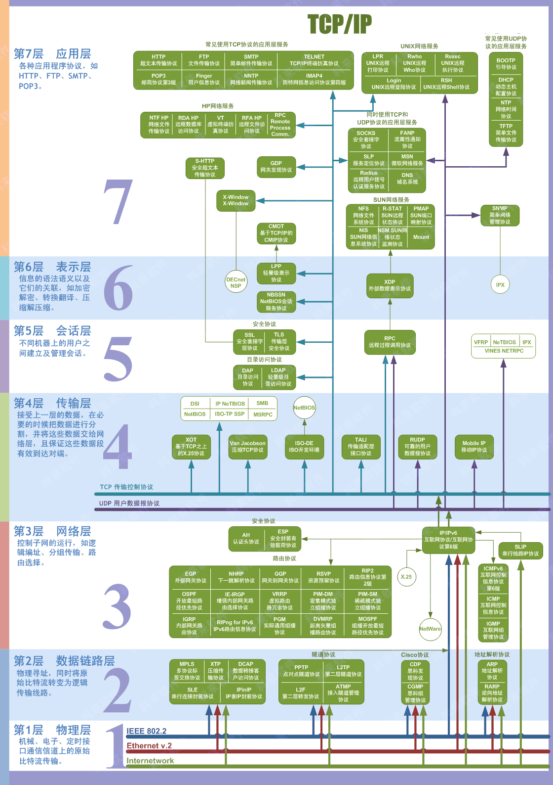
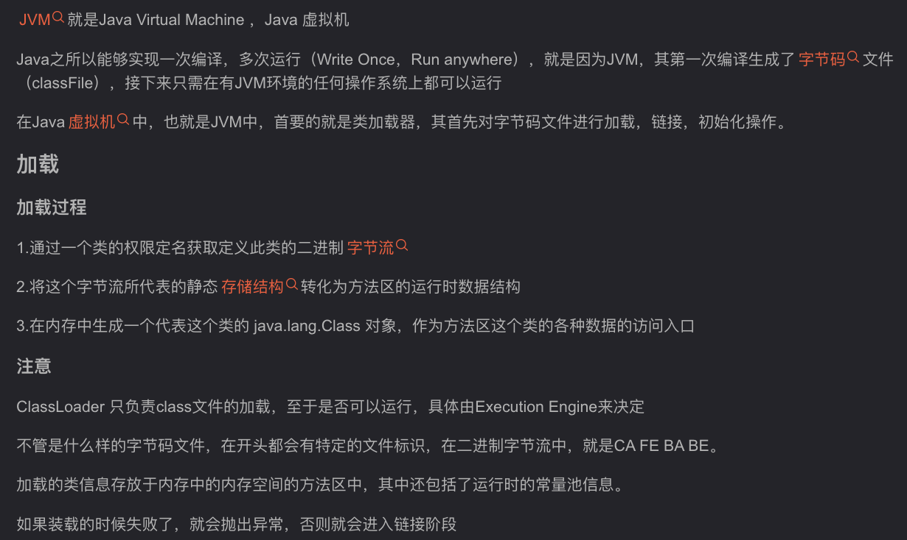
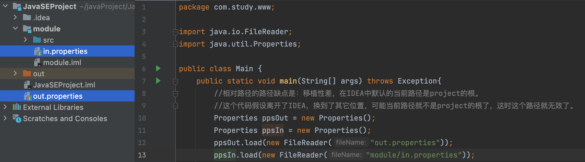

# 1 集合

## 1.1集合

**1.概念**

集合是java中提供的一种容器，可以用来存储多个对象数据。数组也是容器。


**2.特点（对比数组）**

数组的长度固定，集合长度可变。

数组中提供的属性和方法较少，集合提供了增删改查等更丰富的API。

数组存储数据的特点单一，即有序的，可重复的。集合有很多种类型，分别有不同的存储特点。

数组中可以存储基本数据类型值，也可以存储对象，而集合中只能存储对象（基本数据类型使用包装类存储）


**3.集合结构**

集合主要分为两大系列：Collection和Map，Collection 表示一组对象，Map表示一组映射关系或键值对。

Collection前两层都是接口，下面的才是实现类。


## 1.2Collection集合

**1.常用方法**

由于collection是接口，只能通过多态形式创建对象。

```java
Collection c = new ArrayList();
c.add("hello"); //添加元素，返回布尔
c.add("java");
c.add("word");
c.add(2);

Collection c2 = new ArrayList();
c2.add("study");
c2.add("java"); 
c.addAll(c2); //将集合c2的元素全部添加到c里
c.remove("java"); //删除集合c中的"java"元素，根据equals删除
c.removeAll(c2);//删除c中和c2元素相同的所有元素，包括自身重复的
c.clear(); //清空c集合，变为[]
boolean b1 = c.isEmpty(); //判断集合是否为空
boolean b2 = c.contains("word"); //判断集合c是否包含"word"，返回布尔
boolean b3 = c.containsAll(c2); //判断集合c是否包含集合c2所有元素，返回布尔
int size = c.size();//获取集合所有元素c的元素个数
c.retainAll(c2);  //只保留和c2相同的元素，交集
Object[] array = c.toArray();  // 把c转化为数组
```


**2.Iterator迭代器**

Collection集合可以通过itetator()方法获得一个迭代器对象。

- public Iterator iterator(): 获取集合对应的迭代器，用来遍历集合中的元素的。

- 迭代：即Collection集合元素的通用获取方式。在取元素之前先要判断集合中有没有元素，如果有，就把这个元素取出来，继续在判断，如果还有就再取出出来。一直把集合中的所有元素全部取出。这种取出方式专业术语称为迭代。


**3.迭代器接口**

- public E next():返回迭代的下一个元素。
- public boolean hasNext():如果仍有元素可以迭代，则返回 true。
- public void remove():通过迭代器删除元素


**4.迭代器使用方法**

```java
Collection c = new ArrayList();
c.add(11);
c.add(22);
c.add(33);
c.add(44);
//获取集合对应的迭代器，集合的iterator()方法返回Iterator接口的实现类对象
Iterator it = c.iterator();
//        Object obj = it.next();  //取出元素，取完没有元素，继续取会报异常
System.out.println(it);
while (it.hasNext()){   //先判断有没有下一个元素，返回布尔
    Object obj = it.next();  //取出元素，取完没有会报异常
    System.out.println(obj);
}
```


**5.迭代器实现原理**

在调用Iterator的next方法之前，迭代器的索引位于第一个元素之前，指向第一个元素，当第一次调用迭代器的next方法时，返回第一个元素，然后迭代器的索引会向后移动一位，指向第二个元素，当再次调用next方法时，返回第二个元素，然后迭代器的索引会再向后移动一位，指向第三个元素，依此类推，直到hasNext方法返回false，表示到达了集合的末尾，终止对元素的遍历。


**6.增强for**

遍历对象和数组，快捷键：fori生成for循环，iter生成生成遍历数组，itar生成加强for

```java
  //foreach循环格式：
  for(元素类型 变量 : Collection集合或数组){
  	//循环体
  }
```

两种遍历方式

```java
Collection c = new ArrayList();
c.add(11);
c.add(22);
c.add(33);
c.add(44);
//使用增强for遍历集合，只可以遍历Collection集合，底层是迭代器
for(Object a : c){
    System.out.println(a);
}
//使用增强for遍历数组，拿不到索引
int[] arr = {3,5,6,87};
for(int a : arr){//a代表数组中的每个元素,arr是循环的数组
    System.out.println(a);
}
```


**7.java.lang.Iterable接口**

Iterator原码分析:实现了Iterable接口的类都可以使用迭代器遍历,也就可以使用增强for进行遍历。

首先，迭代器接口Iterator有hasNext、next、remove抽象方法。

```java
public interface Iterator
    boolean hasNext();
    E next();
    default void remove() {
        throw new UnsupportedOperationException("remove");
    }
}
```

第一步：Iterable接口有Iterator iterator()抽象方法，返回迭代器实现类对象，是迭代器的根源。

```java
public interface Iterable{
    Iterator<T> iterator();
}
```

第二步：Collection接口继承了Iterable接口

```java
public interface Collection extends Iterable 
```

第三步：List接口继承了Collection接口

```java
public interface List extends Collection
```

第四步：ArrayList类继承了List接口，由于他不是抽象类，必须实现iterator抽象方法，在实现的方法中，他return了一个Iterable迭代器接口的实现类Itr的对象，这个类也是他的私有内部类，继承了迭代器接口后重写了其三个方法。然后使用迭代器类的多态形式接收这个实现类对象，然后就可以调用他的那些方法了。

```java
public Iterator iterator() {
    return new Itr();
}
```

继承Iterable接口并实现抽象方法iterator()：

```java
public class MyList implements Iterable {
    @Override
    public Iterator iterator() {
        return null;
    }
}
```

实现后即可以使用加强for

```java
MyList myList = new MyList();
Iterator it = myList.iterator();

for(Object obj:myList){//MyList类实现了Iterable接口，所以可以使用增强for遍历

}
```


**8.modCount与fail-fast机制** 

**快速失败机制：**

- 当迭代器在遍历集合时，使用迭代器之外的方法修改集合，可能会导致最终数据不准确甚至更大的影响。迭代器不允许做出此操作，会立即抛出并发修改异常，阻止此操作。这就是迭代器的快速失败机制。

快速失败机制不会得到保证:

- 所有Collection集合都有一个属性modCount用于记录集合的修改次数，当通过集合创建了迭代器后，会记录此时的modCount值，并且迭代器遍历集合时每次取出元素都会验证modCount值是否修改过，如果修改过表示集合被修改了，即抛出并发修改异常。

**实现底层原理：**

- 在ArrayList等集合类中都有一个modCount变量。它用来记录集合的结构被修改的次数。
- 当我们给集合添加和删除操作时，会导致modCount++。
- 然后当我们用Iterator迭代器遍历集合时，创建集合迭代器的对象时，用一个变量记录当前集合的modCount。例如：int expectedModCount = modCount;，并且在迭代器每次next()迭代元素时，都要检查 expectedModCount != modCount，如果不相等了，那么说明你调用了Iterator迭代器以外的Collection的add,remove等方法，修改了集合的结构，使得modCount++，值变了，就会抛出ConcurrentModificationException。

**因此得出结论：**

迭代器创建后就不能在它遍历集合之前修改集合，否则遍历时就会报错！！！

forEach循环集合时也不可以删除集合内的元素，因为底层也是用的迭代器写的。

```java
while (it.hasNext()){   //先判断有没有下一个元素，返回布尔
  Object obj = it.next();  //取出元素，取完没有会报异常
  if(obj.equals(11)){
    //  c.remove(obj); //使用集合的方法删除元素会有ConcurrentModificationException异常，不可并发操作,
    it.remove();//这个不会触发异常
  }
}
```

**源码解析：**

首先，创建构造器实现类对象时会存一份集合修改次数，expectedModCount = modCount，放到实例变量里

```java
int expectedModCount = modCount;
```

Itr的成员变量cursor(默认值0)不等于底层数组的元素个数size时返回ture，迭代器得以执行

```java
int expectedModCount = modCount;

public boolean hasNext() {
    return cursor != size;
}
```

然后，调用next方法，获取下一个元素，在此过程中会调用checkForComodifaiction方法核查集合有没有被修改，若被修改了直接抛异常，若没修改就返回底层数组内对应的元素，并把下标给lastRet，便于删除

```java
public E next() {
    checkForComodification();
    int i = cursor;
    if (i >= size)
        throw new NoSuchElementException();
    Object[] elementData = ArrayList.this.elementData;
    if (i >= elementData.length)
        throw new ConcurrentModificationException();
    cursor = i + 1;
    return (E) elementData[lastRet = i];
}
```

判断集合修改次数的函数

```java
final void checkForComodification() {
    if (modCount != expectedModCount)
        throw new ConcurrentModificationException();
}
```

删除的方法源码实际上也是借助next中存储的底层数组下标来确定删除对象的，lastRest，底层调用的还是ArrayList的remove方法。

```java
public void remove() {
    if (lastRet < 0)
        throw new IllegalStateException();
    checkForComodification();

    try {
        ArrayList.this.remove(lastRet);
        cursor = lastRet;
        lastRet = -1;
        expectedModCount = modCount;
    } catch (IndexOutOfBoundsException ex) {
        throw new ConcurrentModificationException();
    }
}
```

**分析源码后得出结论：**快速失败机制对删除倒数第二个无效的原因，因为删除集合的倒数第二个元素会导致集合的元素数量size减少，进而影响了hasNext中return的结果，导致迭代还没完成就返回了false，所以根本不会执行next，没给其抛出异常的机会。


## 1.3List集合

**1.特点**

- 元素有序，可重复
- 都可以通过索引访问元素
- List很多特有方法，都和索引相关


**2.List接口常用方法**

```java
list.add(3,"112233"); //插入
list.get(2); //获取索引为2的元素
list.subList(0,2);//截取0到2的元素，包前不包后
list.indexOf("112233"); //获取第一次出现的索引位置，返回int
list.lastIndexOf("112233"); //获取第一次出现的索引位置，返回int
list.remove(2);//删除某个位置上的元素，返回被删除的元素
list.set(1,"ss");//修改指定索引位置元素，返回被修改的元素
```


**3.三种遍历List集合的方法**

```java
//遍历方式1迭代器
Iterator it = list.iterator();
while (it.hasNext()){
    System.out.println(it.next());
}
//遍历方式2加强for
for (Object o : list) {
    System.out.println(o);
}
//遍历方式3for循环
for (int i = 0; i < list.size(); i++) {
     Object o = list.get(i);
    System.out.println(o);
}
```


## 1.4ArrayList实现类

java.util.ArrayList实现类是List接口的典型实现类

**1.特点**

- 底层数据结构：数组
- 效率：（通过索引）查询快，增删慢
- 线程不安全的
- 对比Vector实现类：底层结构也是数组，是线程安全的，不推荐使用，效率低。


**2.数据结构**

数据结构就是研究数据的逻辑结构和物理结构以及它们之间相互关系，并对这种结构定义相应的运算，而且确保经过这些运算后所得到的新结构仍然是原来的结构类型。

主要分为逻辑结构和物理结构:

- 逻辑结构：描述元素之间的关联关系
- 物理结构：存储结构，有一定关系的元素数据如何存储


**3.ArrayList源码分析**

两个构造器

```java
//使用空参构造器创建集合
ArrayList list = new ArrayList();//初始容量是多少？0
//使用有参构造器创建集合
ArrayList list2 = new ArrayList(5);//指定初始容量，即底层数组的长度
```

首先，调用add函数

```java
public boolean add(E e) {
    ensureCapacityInternal(size + 1);  // Increments modCount!!
    elementData[size++] = e;
    return true;
}
```

第一步，确定容器的容量，由上个方法得知，参数是原来元素个数+1

```java
private void ensureCapacityInternal(int minCapacity) {
    ensureExplicitCapacity(calculateCapacity(elementData, minCapacity));
}
```

第二步，确认扩容容量，参数是计算扩容大小的函数

```java
private static int calculateCapacity(Object[] elementData, int minCapacity) {
    if (elementData == DEFAULTCAPACITY_EMPTY_ELEMENTDATA) {
        return Math.max(DEFAULT_CAPACITY, minCapacity);
    } //如果初始数组为空，返回10的长度，不为空就返回size+1后的长度
    return minCapacity;
}
```

```java
private void ensureExplicitCapacity(int minCapacity) {
    modCount++;

    // overflow-conscious code
    if (minCapacity - elementData.length > 0)
        grow(minCapacity); //如果size+1后比原数组长度大，则放不下了，走grow扩容
}
```

第三步，容量不足时，返回新数组完成扩容，扩容1.5倍

```java
private void grow(int minCapacity) {
    // overflow-conscious code
    int oldCapacity = elementData.length;
    int newCapacity = oldCapacity + (oldCapacity >> 1);  //新长度=旧长度的1.5倍
    if (newCapacity - minCapacity < 0) //新长度没有10大的情况（比如新长度为0）
        newCapacity = minCapacity;//把10给新长度
    if (newCapacity - MAX_ARRAY_SIZE > 0)
        newCapacity = hugeCapacity(minCapacity);
    // minCapacity is usually close to size, so this is a win:
    elementData = Arrays.copyOf(elementData, newCapacity);  //复制新数组，长度为原来的1.5倍或者是10，并赋给elementData
}
```

第四步，完成赋值

```java
public boolean add(E e) {
    ensureCapacityInternal(size + 1);  // Increments modCount!!
    elementData[size++] = e;
    return true;
}
```

得出结论，首次使用add时底层数组长度为10，第二次第三次则分别底层数组长度为2、3。当超过10就会再走grow扩容1.5倍，为15。添加元素这么麻烦，所以ArrayList的增删查改效率低。⚠️


**4.asList方法**

Arrays工具类的asList方法得到List集合特点：不可变集合。查看源码 :

```java
List list = Arrays.asList("hello","java","word");//创建不可修改的集合
```

这个ArrayList并不是java.util下的ArrayList，而是Array类的一个静态私有的内部类，并且还不能添加元素！

```java
private static class ArrayList extends AbstractList
```

不能使用add添加元素的原因是他的add继承的父类AbstraList的add方法，添加直接抛异常，删除也是

```java
public void add(int index, E element) {
    throw new UnsupportedOperationException();
}
public E remove(int index) {
  throw new UnsupportedOperationException();
}
```


**5.泛型初体验**

给集合添加泛型时，泛型把运行时可能存在的类型转换风险，提前到编译期解决，简化了代码

泛型关于集合和迭代器的配合使用

```java
//泛型，表示此集合只能存储String类型的元素
List<String> list = new ArrayList<String>();
list.add("hello");
//遍历输出每个元素字符串的长度
Iterator it = list.iterator();
while (it.hasNext()) {  
    System.out.println(it.next().length());//泛型可以使用String类的特有length()方法，无需强转
}
```

泛型关于增强for的配合使用

```java
//创建List集合，添加Student对象,泛型表示此集合只能存储Student类型的元素
List<Student> list = new ArrayList<Student>();
//添加元素
list.add(new Student("张三", 18));
//foreach循环遍历
for (Student obj : list) { //使用了Student的泛型后，直接用Student来定义，不再需要使用Object才能接收
    System.out.println(obj.getName()); //不需要强转，直接使用方法
}
```


## 1.5LinkedList实现类

**1.特点**

增删快，查询慢、首尾元素的操作效率及高。（双向链表的）


**2.底层结构**

双向链表


**3.常用API**

```java
LinkedList link = new LinkedList(); //创建链式集合
link.addFirst("first"); //添加第一个元素
link.addLast("last"); //添加最后一个元素
link.getFirst();    //获取第一个元素
link.getLast(); //获取最后一个元素
link.removeFirst(); //删除第一个元素
link.removeLast();  //删除最后一个元素
```


**4.add源码分析**

首先，要先了解链表的节点是如何存储的，链表节点的类是Node

```java
private static class Node {
    E item;  // item代表节点本身数据
    Node next;  // next指向下一个节点
    Node prev;  // prev指向上一个节点

    Node(Node prev, E element, Node next) {
        this.item = element;
        this.next = next;
        this.prev = prev;
    }
}
```

第一步，调用add方法，方法内再调用linkLast方法创建Node对象，即链表节点

```java
public boolean add(E e) {
    linkLast(e);
    return true;
}
```

第二步，创建一个Node链表节点对象，并让自己的next和prev、上个节点的next指向对应的节点

```java
void linkLast(E e) {
    final Node l = last;
    final Node newNode = new Node<>(l, e, null); //创建链表节点
    last = newNode;  //将last指向自己，自己将是下一个节点的prev
    if (l == null) //如果prev为null，则自己为第一个节点，让first指向自己
        first = newNode;
    else    //如果不是，上一个节点的next则指向自己
        l.next = newNode;
    size++;  //元素个数+1
    modCount++;  //修改次数+1
}
```


**5.remove源码分析**

第一步，循环每个节点，查找要删除的值

```java
public boolean remove(Object o) {
    if (o == null) {  //如果删除的是null
        for (Node x = first; x != null; x = x.next) { //从first开始向后循环
            if (x.item == null) { //如果当前循环的节点值为null
                unlink(x);      //就执行unlink方法删除这个节点
                return true;    //然后返回个布尔
            }
        }
    } else {
        for (Node x = first; x != null; x = x.next) { //从first开始向后循环
            if (o.equals(x.item)) {  //使用equals判断当前循环节点的值
                unlink(x); //如果返回true就执行unlink方法删除这个节点
                return true; //然后返回个布尔
            }
        }
    }
    return false;  //若没有找到节点o对应的值，返回false
}
```

第二步，循环找到后删除这个值

```java
E unlink(Node x) {
    // assert x != null;
    final E element = x.item;  //先存储下当前节点
    final Node next = x.next;  //存储当前节点的下一个节点
    final Node prev = x.prev;  //存储当前节点的上一个节点

    if (prev == null) {  //如果自己为第一个节点
        first = next;     //那么自己的下一个节点就为第一个节点
    } else {
        prev.next = next; //否则就让上一个节点的next指向自己的下一个节点
        x.prev = null;  //断开自己的prev（指向上一个节点的引用）
    }

    if (next == null) {  //如果自己为最后一个节点
        last = prev;   //那么自己的上一个节点就为最后一个节点
    } else {
        next.prev = prev; //否则就让下一个节点的prev指向自己上一个节点
        x.next = null; //断开自己的next（指向下一个节点的引用）
    }

    x.item = null;  //让当前节点为null
    size--;      //元素个数-1
    modCount++;   //修改次数+1
    return element;  //返回被删除的节点
}
```


**6.队列数据结构**

是一种抽象的数据结构，数据存取特点为先进先出（FIFO），应用场景为消息队列，LinkedList中的队列方法：

- boolean offer(Object obj) : 入队
- Object poll() : 出队
- Object peek() : 检查


**7.栈数据结构**

是一种抽象的数据结构，数据存取特点为后进先出（LIFO），LinkedList中的栈方法：

- void push(E e) ：压栈
- E pop() ：弹栈

Stack实现类实现的也是栈结构，他是Vector的子类，所以它是使用数组实现的栈结构。


**8.ListIterator**

List 集合额外提供了一个 listIterator() 方法，该方法返回一个 ListIterator 对象， ListIterator 接口继承了 Iterator 接口，提供了专门操作 List 的方法：

- void add()：通过迭代器添加元素到对应集合
- void set(Object obj)：通过迭代器替换正迭代的元素
- void remove()：通过迭代器删除刚迭代的元素
- boolean hasPrevious()：如果以逆向遍历列表，往前是否还有元素。
- Object previous()：返回列表中的前一个元素。
- int previousIndex()：返回列表中的前一个元素的索引
- boolean hasNext()
- Object next()
- int nextIndex()

```java
@Test
public void test() {
    //创建List集合
    List list = new ArrayList<>();
    //添加元素
    list.add("tom");
    list.add("jack");
    list.add("rose");
    list.add("jerry");
    //创建迭代器，可以指定索引位置，然后从那个位置向前遍历
    ListIterator it = list.listIterator(list.size());
    while (it.hasPrevious()){//判断是否有上一个元素
        System.out.println(it.previous());
    }
}
```


## 1.6Set和HashSet

**1.特点**

Set接口是Collection的子接口，set接口没有提供额外的方法。但是比Collection接口更加严格了。

- Set 集合元素唯一(指equalsc相同)，通常无序。

- Set的常用实现类有：HashSet、TreeSet、LinkedHashSet。

```java
//创建Set集合
Set set = new HashSet<>();
//添加数据
set.add(11);
set.add(22);
set.add(11);
set.add(null);//可以添加null，但也不可以重复
set.add(null);
System.out.println(set); //打印结果为[null, 22, 11]
```


**2.HashSet**

HashSet 是 Set 接口的典型实现，大多数时候使用 Set 集合时都使用这个实现类。

java.util.HashSet底层的实现其实是一个java.util.HashMap支持，然后HashMap的底层物理实现是一个Hash表。

HashSet 按 Hash 算法来存储集合中的元素，是为了提高查找性能。


**3.HashSet判断依据**

- 1.先使用hasCode判断元素的哈希值相同（指地址）
- 2.再判断元素的equals比较相同（指地址）
- 使用HashSet时可重写存储对象的hasCode和equals来进行属性判断。


**4.Hash表结构**

哈希表由一个16位的数组和单向链表组成，数组代表其容量。存储规则

1. 先用hash值对16取余，得到0-15，获取到数组的索引位置。
2. 再用equals对链表每个元素进行判断，决定其是否能够加入该链表。
3. 效率方面，因为结合了数组和链表，比较平衡。


**5.重写hacCode**

为什么重写：为了提高性能

如何去重写：使元素的hashcode值与元素的内容相关，内容相同的元素，让他们的哈希值一定相同，内容不同的元素让他们的哈希值尽量不同。

IDEA 模板：

```java
class Student{
    private String name;
    private int age;
    private double score;

    @Override
    public boolean equals(Object o) {
        if (this == o) return true;
        if (o == null || getClass() != o.getClass()) return false;

        Student student = (Student) o;

        if (age != student.age) return false;
        if (Double.compare(student.score, score) != 0) return false;
        return name != null ? name.equals(student.name) : student.name == null;
    }

    @Override
    public int hashCode() {
        int result;
        long temp;
        result = name != null ? name.hashCode() : 0;
        result = 31 * result + age;
        temp = Double.doubleToLongBits(score);
        result = 31 * result + (int) (temp ^ (temp >>> 32));
        return result;
    }
}
```


**6.HashSet无序原因**

因为存储的时候是无序的，取出的时候是从数组0到15取，偶尔发生的有序现象是存储小于16的整数时，Integer重写了自己的hasCode，返回的哈希值等于自己本身。


## 1.7LinkedHashSet

**1.特点**

元素唯一、有序（存取顺序一致）


**2.底层结构**

是HashSet的子类，在哈希表的基础上又多维护一个链表。即在每个结点中增加两个属性before和after，保证迭代顺序，因此效率略低于HashSet。


**3.使用方法**

```java
//创建LinkedHashSet集合
LinkedHashSet set = new LinkedHashSet<>();
//添加元素
set.add(22);
set.add(33);
set.add(11);
set.add(44);
set.add(11);
//遍历结果为[22, 33, 11, 44]，有序且去重
System.out.println(set);
```


## 1.8TreeSet

**1.特点**

元素唯一、只可以存一类数据、无序（存取顺序一致），但是实现了排序（大小排序）

传哪个对象就默认使用该对象的Comparable接口实现方法。基本数据类型使用其包装类的。


**2.使用方法**

```java
//创建TreeSet集合
TreeSet set = new TreeSet<>();
//添加元素
set.add(11);
set.add(33);
set.add(69);
set.add(11);
set.add(87);
//打印结果为[11, 33, 69, 87]
System.out.println(set);
```


**3.底层结构**

底层结构：里面维护了一个TreeMap，都是基于红黑树实现的。

红黑树是一种相对平衡的二叉树，查询效率高于链表。（平衡二叉树追求绝对平衡，左右子树差值不能超过1）

二叉树的遍历方式有：

- 前序遍历：中-左-右
- 中序遍历：左-中-右
- 后序遍历：左-右-中

如下图，找一个数最多找四次。

存储过程中，大的放右边，小的放左边

**底层代码会让根节点自动平衡，减少左右子树差值，提升查找效率，查询效率高于链表。**


**4.关于TreeSet的Comparable**

TreeSet实现了元素的排序，即对存储元素进行比较大小，但是必须要求元素：

- 1.要求元素类型必须实现Comparable接口
- 2.或者创建TreeSet集合时通过构造器传入一个外部比较器Comparator实例化对象用于比较元素的大小
- 3.比较大小时，若两个对象各属性完全相同，则Comparable返回0，则认为是相同的元素，不会再添加。

构造函数里，若没有传入comparator会强制对其传入对象进行转型

```java
final int compare(Object k1, Object k2) {
    return comparator==null ? ((Comparable)k1).compareTo((K)k2)
        : comparator.compare((K)k1, (K)k2);
}
```

第一种，继承并实现Camparable接口：

```java
public class Student implements Comparable<Student> { //继承Comparable接口
    private String name;
    private int age;
    private int score;

    public Student(String name, int age, int score) {
        this.name = name;
        this.age = age;
        this.score = score;
    }

    @Override
    public int compareTo(Student o) {	//实现接口的compareTo方法
        int i = this.age - o.age;//比较年龄
        i = i == 0 ? this.score - o.score : i;//再比较分数
        i = i == 0 ? this.name.compareTo(o.name) : i;//再比较姓名
        return i;
    }
}
```

第二种，创建TreeSet集合时传入Comparator比较器（可使用匿名内部类实现）：

```java
//创建TreeSet集合，通过构造器传入一个Comparator比较器
TreeSet set = new TreeSet<>(new Comparator() {
    @Override
    public int compare(Student o1, Student o2) {
        int i = o2.getScore() - o1.getScore();//比较分数
        i = i == 0 ? o1.getAge() - o2.getAge() : i;//再比较年龄
        i = i == 0 ? o1.getName().compareTo(o2.getName()) : i;//再比较姓名
        return i;
    }
});
```

总结：在创建TreeSet集合时，如果不传递Comparator比较器，则默认使用自己的排序规则，即必须继承并实现Comparable接口，然后在存储过程中对每一个元素进行比较大小。若二者都不提供，则直接报错。⚠️


## 1.9Collection集合总结

**Collection接口:**

- List接口:元素有序，可重复，可以通过索引|访问元素
  - ArrayList实现类:
    - 底层结构:数组
    - 效率:查询快,增删慢
    - 线程不安全
  - LinkedList实现类:
    - 底层结构:双向链表
    - 效率:增删快,查询慢(操作首尾元素效率高)↓
  - Vector实现类:
    - 底层结构:数组
    - 线程安全，相对效率低，不推荐使用
- Set接口:元素唯一， 通常无序
  - HashSet实现类:
    - 特点:
      - 元素唯一， 无序
      - 底层结构:哈希表
      - 效率:综合效率高
    - 元素去重原理: (判断元素相同的依据)
      - 1.先比较元素的hashCode值，
      - 2 .再进行equals比较,如果都相同则认为是相同元素
- LinkedHashSet实现类:是HashSet的子类。
  - 特点:元素唯一,有序
  - 底层结构:哈希表基础上又维护一个链表，用于保证元素的迭代顺序效率:略低于HashSet
- TreeSet实现类:
  - 特点:元素唯--，无序,但是实现了排序
  - 底层结构:红黑树
  - 效率:查询效率高于链表
  - 元素的存取过程:
    - 存储过程:大的放右边，小的放左边
    - 遍历过程:中序遍历，即左-中-右
  - 排序原理:要求元素必须可以比较大小，那么就要求:
    - 1.元素类型必须实现Comparable接口
    - 2.或者创建TreeSet时传入-个Comparator比较器用于比较元素大小。


# 2 HashMap

## 2.1Map接口

**1.特点**

- Key是唯一，value可以重复
- 通过key可以找到对应的value


**2.实现类**

HashMap、LinkedHashMap、TreeMap、Hashtable、Properties


**3.常用API**

```java
Map map = new HashMap<>();
Map map2 = new HashMap<>();
//添加
map.put("小白","小黑");  //添加元素，第一次添加返回null，如果key重复，返回旧value。
map.putAll(map2); //添加另一个集合的所有元素,void
//删除
map.clear();//清空集合，void
map.remove("小白"); //通过key删除，返回值为对应的value，没有返回null
//查询
map.get("小白"); //根据key返回value，没有返回null
map.isEmpty();//集合是否包含元素，返回布尔
map.containsKey("小白"); //是否包含key，返回布尔
map.containsKey("小白"); //是否包含Value，返回布尔
//元视图
map.keySet(); //获取所有key，返回Set集合
map.values(); //获取所有value，返回Collection集合
map.entrySet(); //把集合内的entry对象放到一个set集合中

Set<String> strings = map.keySet();
Collection<String> values = map.values();
Set<Map.Entry<String, String>> entries = map.entrySet();
```


**4.Map集合遍历**

```java
//遍历方式一 增强for借助keySet和get
Set<Integer> keySet = map.keySet();
for (Integer key : keySet) {
    System.out.println(map.get(key));
}

//遍历方式二  通过entry获取key和value
Set<Map.Entry<Integer,String>> entrySet = map.entrySet();
for (Map.Entry entry : entrySet) { //Map.Entry代表了一种类型，他是Map里的一个接口
    System.out.println(entry.getKey()); //获取key
    System.out.println(entry.getValue()); //获取Value
}

//方式三  通过entrySet方法转换为Set集合，再使用set集合的迭代器，
Iterator<Map.Entry<Integer,String>> it = map.entrySet().iterator();

while (it.hasNext()){
  System.out.println(it.next());
}

//只遍历value
Collection<String> values = map.values();
for (String value : values) {
    System.out.println(value);
}

```


## 2.2HashMap

**1.特点**

- 元素是无序的、key是唯一的
- 底层为哈希表
- key和value都可以为null
- 线程不安全（对比Hashtable类：线程安全的，key和value都不能为null）


**2.元素唯一**

元素唯一的判定准则是key对象的hashCode和equals，可通过重写key对象的这两个方法修改判定规则。

HashMap重写去重规则：

```java
    @Test
    public void test() {

        //创建HashMap
        HashMap map = new HashMap<>();
        map.put(new Student("小白",18),001);
        map.put(new Student("小黑",19),002);
        map.put(new Student("小绿",20),003);
        map.put(new Student("小白",18),001);
        
        //遍历HashMap集合，重写两个方法后，发现key属性相同的已经去除
        Set keys = map.keySet();
        for (Student key : keys) {
            System.out.println(key + "=" + map.get(key));
        }
    }
}

class Student{
    private String name;
    private int age;
    private int score;

    public Student(String name, int age) {
        this.name = name;
        this.age = age;
    }

    @Override
    public boolean equals(Object o) {
        if (this == o) return true;
        if (o == null || getClass() != o.getClass()) return false;

        Student student = (Student) o;

        if (age != student.age) return false;
        if (score != student.score) return false;
        return name != null ? name.equals(student.name) : student.name == null;
    }

    @Override
    public int hashCode() {
        int result = name != null ? name.hashCode() : 0;
        result = 31 * result + age;
        result = 31 * result + score;
        return result;
    }

    @Override
    public String toString() {
        return "Student{" +
                "name='" + name + '\'' +
                ", age=" + age +
                ", score=" + score +
                '}';
    }
}

```


## 2.3LinkedHashMap

**1.特点**

- 元素唯一、有序
- 底层结构：哈希表基础上又维护一个链表，用于保证元素的迭代顺序


**2.声明格式**

```java
LinkedHashMap<Map.Entry<Integer, String>> map = new LinkedHashMap();

map.put(111, "tom");  
map.put(121, "jack");  
map.put(114140, "rose");  
map.put(1444419, "jerry");  

//遍历结果是有序的，111、121、114140、1444419
Set<Map.Entry<Integer, String>> entrySet = map.entrySet();
for (Map.Entry entry : entrySet) {
    System.out.println(entry.getKey() + "=" + entry.getValue());
}
```


## 2.4TreeMap

**1.特点**

- 元素唯一、无序，但实现了排序
- 底层结构：红黑树
- TreeMap的key必须可以比较大小。（必须实现Comparable接口或者传入Comparator实例）


**2.语法格式**

```java
TreeMap<Integer, String> map = new TreeMap<>();

map.put(111, "tom");
map.put(112, "tom");
map.put(13, "tom");
map.put(81, "tom");
map.put(66, "tom");

//遍历结果是有序的，13、66、81、111、112
Set<Integer, String> entries = map.entrySet();
for (Map.Entry entry : entries) {
    System.out.println(entry.getKey() + "=" + entry.getValue());
}
```


**3.TreeMap集合key的Comparator**

TreeMap同TreeSet一样，也实现了元素的排序，即对存储元素进行比较大小，但是必须要求Key元素：

- 1.要求Key元素类型必须实现Comparable接口
- 2.或者创建TreeMap集合时通过构造器传入一个外部比较器Comparator实例化对象用于比较元素的大小
- 3.比较大小时，若两个对象各属性完全相同，则Comparable返回0，则认为是相同的元素，不会再添加。

第一种，继承并实现Camparable接口

第二种，创建TreeMap集合时传入Comparator比较器（可使用匿名内部类实现）


## 2.5Properties

**1.特点**

Properties 类是 Hashtable 的子类，Properties 可保存在流中或从流中加载。属性列表中每个键及其对应值都是一个字符串。（即key和value都是String）


**2.特有方法**

```java
//创建Properties集合
Properties prop = new Properties();

//添加元素
prop.setProperty("name","tom"); 

//根据key获取value
prop.getProperty("name"); //返回key
```


**3.集合的嵌套使用**

```java
public class Main {

    @Test
    public void test() {
        HashMap<String, List<Student>> map = new HashMap<>();

        List<Student> list1 = new ArrayList<>();
        list1.add(new Student("西瓜", 11));
        list1.add(new Student("草莓", 11));
        list1.add(new Student("菠萝", 11));

        List<Student> list2 = new ArrayList<>();
        list2.add(new Student("小明", 11));
        list2.add(new Student("小黑", 11));
        list2.add(new Student("小白", 11));

        List<Student> list3 = new ArrayList<>();
        list3.add(new Student("刘备", 11));
        list3.add(new Student("关羽", 11));
        list3.add(new Student("张飞", 11));

        map.put("西瓜", list1);
        map.put("小明", list2);
        map.put("刘备", list3);

        Set keys = map.keySet();  //得到HashMap的key集合
        for (String key : keys) {  //遍历Key的set集合，拿value再遍历
            System.out.println(key); //打印key，即组长名
            List students = map.get(key); //获取key的value，即学生List
            for (Student student : students) {   //嵌套遍历每个班级List
                System.out.println("\t" + student);  //打印每个学生对象的toString
            }
        }


    }
}

class Student {
    private String name;
    private int age;

    public Student(String name, int age) {
        this.name = name;
        this.age = age;
    }
    @Override
    public String toString() {
        return "Student{" +
                "name='" + name + '\'' +
                ", age=" + age +
                '}';
    }
}
```


## 2.6Set和Map的关系

**1.底层**

- HashSet的底层实际是HashMap（只使用了HashMap的key就是HashSet）

```java
public HashSet() {
    map = new HashMap<>();
}
```

```java
public boolean add(E e) {
    return map.put(e, PRESENT)==null;
}
```

- LinkedHashMap底层是LinkedHashMap（只使用了key）

```java
public LinkedHashSet() {
    super(16, .75f, true);
}
```

```java
HashSet(int initialCapacity, float loadFactor, boolean dummy) {
    map = new LinkedHashMap<>(initialCapacity, loadFactor);
}
```

- TreeSet底层是TreeMap（只使用了key）

```java
public TreeSet() {
    this(new TreeMap());
}
```


## 2.7底层源码分析

**1.HashMap底层数据结构**

数据结构：哈希表=数组+链表+红黑树（JDK8以后），增删改查综合效率高于其他数据结构。


**2.哈希算法**


**3.链表和红黑树的转换**

 链表转红黑树是为了提高效率，红黑树的查询效率高于链表，整体性能提升15%。红黑树转为链表是为了节约系统底层的维护成本。

- 链表长度达到8时（哈希表容量达到64）转换为红黑树
- 红黑树节点降为6时，退化为链表。


**4.哈希表扩容**

- 何时扩容：当元素个数达到扩容临界值时(=原容量*加载因子0.75)进行扩容。
- 扩容大小：新容量为原容量的2倍。
- 扩容操作要重新分布所有元素，是个很消耗性能的操作，所以在已知要存的元素个数的情况下，尽量指定何时HashMap容量，避免扩容操作。（使 需求个数 < 容量*加载因子）

**为什么扩容是二倍？**

因为扩容之后，之前每个桶内的元素，要么在原来的桶里不动，要么存储到加上原容量的桶里。比如16扩容到32之后，0桶原本存储了16、32、48。现在16和48需要放到16桶里。（扩容后的位置 = 原位置 or 原位置+原长度）

综上所诉，一个16长度的HashMap，最多放12个元素，再放就开始扩容，扩容后32，最多存24个。


**5.JDK7和JDK8中HashMap的区别**

- 链表长度达到8转为红黑树（重要区别，能提升15%左右性 能，因hash算法很均衡，效率已经很高，如果hash算法不均 衡，引入红黑树可以大幅提升性能）
- 内部类Entry换成了Node 
- 链表头插法转为尾插法（因为头插法多线程情况下可能死 循环）JDK8是从下面添加


**6.如何学习集合**

- 1.什么是集合？跟数组的区别？
- 2.集合的基本使用？集合的常用API
- 3.都有什么集合？各种集合的特点
- 4.集合的底层结构与实现原理


**7.源码解析**

首先要了解Map.Entry接口、HashMap.Node类、HashMap类中各变量和常量的作用

Map.Entry接口：

```java
interface Entry {
  	//五个抽象方法
    K getKey();
    V getValue();
    V setValue(V value);
    boolean equals(Object o);
    int hashCode();

    public static <K extends Comparable<? super K>, V> Comparator<Map.Entry<K,V>> comparingByKey() {
        return (Comparator<Map.Entry<K, V>> & Serializable)
                (c1, c2) -> c1.getKey().compareTo(c2.getKey());
    }

    public static <K, V extends Comparable<? super V>> Comparator<Map.Entry<K,V>> comparingByValue() {
        return (Comparator<Map.Entry<K, V>> & Serializable)
                (c1, c2) -> c1.getValue().compareTo(c2.getValue());
    }

    public static <K, V> Comparator<Map.Entry<K, V>> comparingByKey(Comparator<? super K> cmp) {
        Objects.requireNonNull(cmp);
        return (Comparator<Map.Entry<K, V>> & Serializable)
                (c1, c2) -> cmp.compare(c1.getKey(), c2.getKey());
    }

    public static <K, V> Comparator<Map.Entry<K, V>> comparingByValue(Comparator<? super V> cmp) {
        Objects.requireNonNull(cmp);
        return (Comparator<Map.Entry<K, V>> & Serializable)
                (c1, c2) -> cmp.compare(c1.getValue(), c2.getValue());
    }
```

HashMap.Node内部类：

```java
static class Node implements Map.Entry {  //HashMap底层数组存储的实例对象
    final int hash;
    final K key;  //key不可以改变
    V value;
    HashMap.Node next;
	//Node实例对象，即HashMap的底层存储对象的构造函数
    Node(int hash, K key, V value, HashMap.Node next) {
        this.hash = hash;   //存储哈希值
        this.key = key;   //存储key
        this.value = value;  //存储value
        this.next = next;   //存储链表中自己的下一个元素
    }
    //实现Map.Entry接口中的抽象方法
    public final K getKey()        { return key; }
    public final V getValue()      { return value; }
    public final String toString() { return key + "=" + value; }
	
    public final int hashCode() {
        return Objects.hashCode(key) ^ Objects.hashCode(value);
    }

    public final V setValue(V newValue) {
        V oldValue = value;
        value = newValue;
        return oldValue;
    }
  
    public final boolean equals(Object o) {
        if (o == this)
            return true;
        if (o instanceof Map.Entry) {
            Map.Entry e = (Map.Entry)o;
            if (Objects.equals(key, e.getKey()) &&
                    Objects.equals(value, e.getValue()))
                return true;
        }
        return false;
    }
}
```

HashMap类中各变量和常量：

```java
//默认初始容量16
static final int DEFAULT_INITIAL_CAPACITY = 1 << 4;
//默认最大容量2的30次方
static final int MAXIMUM_CAPACITY = 1 << 30;
//默认加载因子0.75
static final float DEFAULT_LOAD_FACTOR = 0.75f;
//链表转红黑树的临界值8
static final int TREEIFY_THRESHOLD = 8;
//红黑树退化为链表的临界值6
static final int UNTREEIFY_THRESHOLD = 6;
//链表转红黑树的另一个条件，容量大于64，否则就扩容
static final int MIN_TREEIFY_CAPACITY = 64;

//底层的Node数组，里面放的Node类型的对象table
transient HashMap.Node[] table;
//元素个数
transient int size;
//修改次数
transient int modCount;
//扩容临界值，元素超过这个值会进行扩容（等于容量*加载因子）
int threshold;
//实际的加载因子
final float loadFactor;
```

第一步若是使用空参构造器，构造函数new HashMap对象后并未初始化容量，只是给实际加载因子赋值

```java
public HashMap() {
    this.loadFactor = DEFAULT_LOAD_FACTOR; // 赋值实际加载因子0.75，未初始化HashMap
}
```

第一步若是使用有参构造器，则构造器内掉用另一个构造器，使用第一个参数除了指定容量外，还可以使用第二个参数指定加载因子，最后只是计算出容量，并未初始化。（如参数1000容量是1024，参数10容量是16）

```java
public HashMap(int initialCapacity) {
    this(initialCapacity, DEFAULT_LOAD_FACTOR);
}
```

```java
public HashMap(int initialCapacity, float loadFactor) {
    if (initialCapacity < 0) //验证参数合法性
        throw new IllegalArgumentException("Illegal initial capacity: " +
                                           initialCapacity);
    if (initialCapacity > MAXIMUM_CAPACITY)//验证参数合法性
        initialCapacity = MAXIMUM_CAPACITY;
    if (loadFactor <= 0 || Float.isNaN(loadFactor))//验证参数合法性
        throw new IllegalArgumentException("Illegal load factor: " +
                                           loadFactor);
    this.loadFactor = loadFactor;//赋值实际加载因
    this.threshold = tableSizeFor(initialCapacity);//获得实际容量值
}
```

```java
static final int tableSizeFor(int cap) { //根据参数计算实际容量
    int n = cap - 1; 
    n |= n >>> 1;
    n |= n >>> 2;
    n |= n >>> 4;
    n |= n >>> 8;
    n |= n >>> 16;
    return (n < 0) ? 1 : (n >= MAXIMUM_CAPACITY) ? MAXIMUM_CAPACITY : n + 1;
}   //最后返回的结果一定是比指定值大的最小的2的次幂，如cap=10返回16，cap=37返回64

```

第二步，使用put方法添加元素

```java
public V put(K key, V value) { //前三个参数分别为高低十六位异或哈希值、key、value
    return putVal(hash(key), key, value, false, true);
}
```

put方法的第一个参数是hash方法，返回值为高低十六位异或运算的二次哈希值

```java
static final int hash(Object key) { //二次哈希
    int h;						//右移16位，得到高十六位
    return (key == null) ? 0 : (h = key.hashCode()) ^ (h >>> 16);
}	//key的高低十六位的异或运算，然后返回运算后的值	
```

执行put方法中的代码

```java
final V putVal(int hash, K key, V value, boolean onlyIfAbsent,
               boolean evict) {
    Node[] tab; Node p; int n, i; //定义一个Node数组tab，指向底层数组table
    if ((tab = table) == null || (n = tab.length) == 0)//如果是第一次添加元素
        n = (tab = resize()).length;  //⚠️使用resize扩容，返回新数组给tab，容量给n
    if ((p = tab[i = (n - 1) & hash]) == null) //⚠️取模运算得到桶的位置，使用i存储桶的位置，使用p存储当前位置的第一个元素，若桶位置为null，zhu y则调用newNode方法，在此位置创建新的Node节点
        tab[i] = newNode(hash, key, value, null);
    else { //如果桶的位置不为null走这儿
        Node e; K k;
        if (p.hash == hash && //比较hash值和equals判断当前节点key与实参key是否重复
            ((k = p.key) == key || (key != null && key.equals(k))))
            e = p;  //若是重复的，则e指向节点p
        else if (p instanceof TreeNode) //是红黑二叉树节点走这里
            e = ((TreeNode)p).putTreeVal(this, tab, hash, key, value);
        else {  //是链表节点走这里
            for (int binCount = 0; ; ++binCount) {//循环-尾插法
                if ((e = p.next) == null) { //找到当前桶内的最后一个节点
                    p.next = newNode(hash, key, value, null); //在最后一个节点的下一个位置创建新的Node节点
                    if (binCount >= TREEIFY_THRESHOLD - 1) // 因为从当前桶的第二个节点循环的，所以判断是否转换二叉树的常量值要减去1，看是否需要转换红黑二叉树（treeifyBin方法内还会结合table当前长度，再次判断需不需要转红黑树（大于64转，小于64扩容））
                        treeifyBin(tab, hash);
                    break; //添加完成，retuen
                }
                if (e.hash == hash &&
                    ((k = e.key) == key || (key != null && key.equals(k))))
                  //如果循环当前桶的链表时发现key重复，就跳出循环  
                  break;
                p = e; //每次循环完，下一个元素就等于p，便于下一次循环。
            }
        }
        if (e != null) { //如果传进来的key是重复的，那覆盖并返回旧value
            V oldValue = e.value;
            if (!onlyIfAbsent || oldValue == null)
                e.value = value;
            afterNodeAccess(e);
            return oldValue; //返回被覆盖的旧value
        }
    }
  	//走到这步，说明节点已经成功添加完成了，则
    ++modCount;  //修改次数+1
    if (++size > threshold)  //总节点数+1，如果超出最大临界值，则扩容
        resize();
    afterNodeInsertion(evict);
    return null;
}
```

```java
final Node[] resize() {
    Node[] oldTab = table;  //创建Node数组oldTab，并指向底层数组table
    int oldCap = (oldTab == null) ? 0 : oldTab.length;//存储旧容量，第一次为0
    int oldThr = threshold; //存储扩容临界值，第一次时，无参构造为0，有参不为0
    int newCap, newThr = 0;//定义新容量、新扩容临界值大小
    if (oldCap > 0) { //⚠️不是第一次添加元素走这儿～
        if (oldCap >= MAXIMUM_CAPACITY) {
            threshold = Integer.MAX_VALUE; 
            return oldTab;
        }			//⚠️新容量=旧容量*2
        else if ((newCap = oldCap << 1) < MAXIMUM_CAPACITY &&
                 oldCap >= DEFAULT_INITIAL_CAPACITY)
            newThr = oldThr << 1; //⚠️新扩容临界值=旧临界值*2
    }
    else if (oldThr > 0) //⚠️使用有参构造器，第一次添加走这里
        newCap = oldThr; //赋值新容量
    else {  //⚠️使用无参构造器，第一次添加走这儿           
        newCap = DEFAULT_INITIAL_CAPACITY;  //数据确定容量16
        newThr = (int)(DEFAULT_LOAD_FACTOR * DEFAULT_INITIAL_CAPACITY);
		//第一次添加数据确定扩容临界值12
    }
    if (newThr == 0) {//⚠️求新的临界值，即 新容量*加载因子，有参构造第一次走
        float ft = (float)newCap * loadFactor;
        newThr = (newCap < MAXIMUM_CAPACITY && ft < (float)MAXIMUM_CAPACITY ?
                  (int)ft : Integer.MAX_VALUE);
    }
    threshold = newThr; //确定实际的扩容临界值
    @SuppressWarnings({"rawtypes","unchecked"})
    Node<K,V>[] newTab = (Node<K,V>[])new Node[newCap];
    table = newTab;//创建Node对象数组，长度为新容量（旧容量*2），再赋值给底层Node数组
    if (oldTab != null) {  //不是第一次添加数据，扩容后重新为每个元素分配桶
        for (int j = 0; j < oldCap; ++j) {
            Node e;
            if ((e = oldTab[j]) != null) {
                oldTab[j] = null;
                if (e.next == null)
                    newTab[e.hash & (newCap - 1)] = e;
                else if (e instanceof TreeNode)//如果有红黑树，会分割红黑树
                    ((TreeNode)e).split(this, newTab, j, oldCap);
                else { 
                    Node loHead = null, loTail = null;
                    Node hiHead = null, hiTail = null;
                    Node next;
                    do {
                        next = e.next;
                        if ((e.hash & oldCap) == 0) {
                            if (loTail == null)
                                loHead = e;
                            else
                                loTail.next = e;
                            loTail = e;
                        }
                        else {
                            if (hiTail == null)
                                hiHead = e;
                            else
                                hiTail.next = e;
                            hiTail = e;
                        }
                    } while ((e = next) != null);
                    if (loTail != null) {
                        loTail.next = null;
                        newTab[j] = loHead; //一部分放在原位置
                    }
                    if (hiTail != null) {
                        hiTail.next = null;//一部分放在原位置+旧容量
                        newTab[j + oldCap] = hiHead;
                    }
                }
            }
        }
    }
    return newTab;
}
```

在桶中创建新的Node节点

```java
Node newNode(int hash, K key, V value, Node next) {
    return new Node<>(hash, key, value, next); //新创建的节点因为在最后，next为空
}
```

判定是否转为红黑树还是扩容

```java
final void treeifyBin(Node[] tab, int hash) {
    int n, index; Node e;
    if (tab == null || (n = tab.length) < MIN_TREEIFY_CAPACITY)
        resize();//如果数组长度小于64，再进行扩容
    else if ((e = tab[index = (n - 1) & hash]) != null) {
        TreeNode hd = null, tl = null;
        do {
            TreeNode p = replacementTreeNode(e, null);
            if (tl == null)
                hd = p;
            else {
                p.prev = tl;
                tl.next = p;
            }
            tl = p;
        } while ((e = e.next) != null);
        if ((tab[index] = hd) != null)
            hd.treeify(tab);
    }
}
```

切割红黑树的源码：

```java
final void split(HashMap map, Node[] tab, int index, int bit) {
    TreeNode b = this;
    // Relink into lo and hi lists, preserving order
    TreeNode loHead = null, loTail = null;
    TreeNode hiHead = null, hiTail = null;
    int lc = 0, hc = 0;
    for (TreeNode e = b, next; e != null; e = next) {
        next = (TreeNode)e.next;
        e.next = null;
        if ((e.hash & bit) == 0) {
            if ((e.prev = loTail) == null)
                loHead = e;
            else
                loTail.next = e;
            loTail = e;
            ++lc;
        }
        else {
            if ((e.prev = hiTail) == null)
                hiHead = e;
            else
                hiTail.next = e;
            hiTail = e;
            ++hc;
        }
    }

    if (loHead != null) {
        if (lc <= UNTREEIFY_THRESHOLD) //当树节点小于等于6的时候开始退化为链表
            tab[index] = loHead.untreeify(map); //untreeify转化为链表的方法
        else {
            tab[index] = loHead;
            if (hiHead != null) // (else is already treeified)
                loHead.treeify(tab);
        }
    }
    if (hiHead != null) {
        if (hc <= UNTREEIFY_THRESHOLD)
            tab[index + bit] = hiHead.untreeify(map);
        else {
            tab[index + bit] = hiHead;
            if (loHead != null)
                hiHead.treeify(tab);
        }
    }
}
```


## 2.8Collection工具类

参考操作数组的工具类：Arrays。

Collections 是一个操作 Set、List 和 Map 等集合的工具类。Collections 中提供了一系列静态的方法对集合元素进行排序、查询和修改等操作，还提供了对集合对象设置不可变、对集合对象实现同步控制等方法：

- public static boolean addAll(Collection<? super T> c,T... elements)将所有指定元素添加到指定 collection 中。
- public static int binarySearch(List<? extends Comparable<? super T>> list,T key)在List集合中查找某个元素的下标，但是List的元素必须是T或T的子类对象，而且必须是可比较大小的，即支持自然排序的。而且集合也事先必须是有序的，否则结果不确定。
- public static int binarySearch(List<? extends T> list,T key,Comparator<? super T> c)在List集合中查找某个元素的下标，但是List的元素必须是T或T的子类对象，而且集合也事先必须是按照c比较器规则进行排序过的，否则结果不确定。
- public static <T extends Object & Comparable<? super T>> T max(Collection<? extends T> coll)在coll集合中找出最大的元素，集合中的对象必须是T或T的子类对象，而且支持自然排序
- public static T max(Collection<? extends T> coll,Comparator<? super T> comp)在coll集合中找出最大的元素，集合中的对象必须是T或T的子类对象，按照比较器comp找出最大者
- public static void reverse(List<?> list)反转指定列表List中元素的顺序。
- public static void shuffle(List<?> list) List 集合元素进行随机排序，类似洗牌
- public static <T extends Comparable<? super T>> void sort(List list)根据元素的自然顺序对指定 List 集合元素按升序排序
- public static void sort(List list,Comparator<? super T> c)根据指定的 Comparator 产生的顺序对 List 集合元素进行排序
- public static void swap(List<?> list,int i,int j)将指定 list 集合中的 i 处元素和 j 处元素进行交换
- public static int frequency(Collection<?> c,Object o)返回指定集合中指定元素的出现次数
- public static void copy(List<? super T> dest,List<? extends T> src)将src中的内容复制到dest中
- public static boolean replaceAll(List list，T oldVal，T newVal)：使用新值替换 List 对象的所有旧值
- Collections 类中提供了多个 synchronizedXxx() 方法，该方法可使将指定集合包装成线程同步的集合，从而可以解决多线程并发访问集合时的线程安全问题
- Collections类中提供了多个unmodifiableXxx()方法，该方法返回指定 Xxx的不可修改的视图。


# 3 泛型

## 3.1泛型概述

**1.泛型概念**

概念：表示不确定的类型，类型参数

好处：将运行期出现的问题，提前到编译期解决


**2.使用方法**

<数据类型>这种语法形式就叫泛型。其中数据类型只能是引用数据类型。

- TypeVariable：类型变量，例如：ArrayList<E>中的E，Map<K,V>中的K,V
- ParameterizedType：参数化类型，例如：Comparator<T>，Comparator<String>
- GenericArrayType：泛化的数组类型，即T[]
- WildcardType：通配符类型，例如：Comparator<?>等

**注意：**

- 使用泛型创建对象，左右两边必须明确泛型类型而且必须一致，JDK7之后右边可以省略泛型，但不能省略<>
- 如果使用泛型类时不明确泛型类型，那么默认类型为Object类型。右边不写<>，就算左边声明了泛型类也会默认Object类型
- 静态域中不能使用泛型类的上的类型变量

**泛型类的定义：**

类上定义的泛型，整个类内部都可以使用。

```java
class FanX<T> {
    private T var;

    public T getVar() {
        return var;
    }

    public void setVar(T var) {
        this.var = var;
    }
}
```

使用方法：

```java
FanX<String> fx1 = new FanX<>();
fx1.setVar("Hello Word!");
FanX<Integer> fx2 = new FanX<>();
fx2.setVar(20);
FanX fx3 = new FanX(); //默认Object类型1
FanX<Integer> fx4 = new FanX(); //默认Object类型2
```


**3.泛型类和泛型接口**

声明类或接口时，在类名或接口名后面声明类型变量，我们把这样的类或接口称为泛型类或泛型接口


自定义一个泛型接口

```java
//自定义泛型接口
interface MyInter<T> {  //任意引用类型T接口
    void show(T obj);  
}
```

定义实现类时明确泛型接口的泛型类型，那么实现类不再是泛型类：

```java
//实现类:情况1.定义实现类是明确泛型接口的泛型类型，那么实现类不再是泛型类
class MyClassA implements MyInter<String> {  //这里明确了是String
    @Override
    public void show(String obj) {
    }
}
```

定义实现类时不明确泛型接口的泛型类型，那么实现类仍然是泛型类：

```java
//实现类:情况2.定义实现类是不明确泛型接口的泛型类型，那么实现类仍然是泛型类
class MyClassB<T> implements MyInter<T> {  //这里仍未明确是什么类型

    @Override
    public void show(T obj) {

    }
}
```

创建对象：

```java
MyClassA myClassA = new MyClassA();
myClassA.show("hello");
MyClassB<Double> myClassB = new MyClassB<>();
myClassB.show(12.3);
```

当子类继承父类时，也是这个现象


**4.泛型方法**

修饰符后定义泛型后，本方法内的返回值、参数中都可以使用


和类不同，泛型方法可以使用static修饰

```java
public static<T>   T test1(T t){ //参数
    return t;
}
```

用法升级

```java
//要求元素类型必须实现Comparable接口
    public static <T extends Comparable> void sort(T[] arr) {
        for (int i = 0; i < arr.length - 1; i++) {
            for (int j = 0; j < arr.length - 1 - i; j++) {
                if (arr[j].compareTo(arr[j + 1]) > 0) {
                    T tmp = arr[j];
                    arr[j] = arr[j + 1];
                    arr[j + 1] = tmp;
                }
            }
        }
    }
```

再升级

```java
sort(a, new Comparator() {
    @Override
    public int compare(Integer o1, Integer o2) {
        return 0;
    }
});
```

```
    public static <T> void sort(T[] arr, Comparator<T> c) {

        for (int i = 0; i < arr.length - 1; i++) {
            for (int j = 0; j < arr.length - 1 - i; j++) {
                if (c.compare(arr[j], arr[j + 1]) > 0) {
                    T tmp = arr[j];
                    arr[j] = arr[j + 1];
                    arr[j + 1] = tmp;
                }
            }
        }
    }
```


**5.Comparable和Comparator的区别**

Comparable一个参数，一般在类里继承并实现，用于比较类自己的实例

```java
public interface Comparable {
    public int compareTo(T o);
}
```

Comparator两个参数，一般在方法里比较其他相同class的两个对象。

```java
public interface Comparator {
    int compare(T o1, T o2);
}
```


## 3.2通配符

**1.任意类型**

比如要使用一个数组存储，来存储不同类型的泛型对象

应用场景：不适合获取数据，不能添加，通常用于复制、反转、随机打乱。因为其没有最大类型不能去使用最大类型去获取其元素，也没有最小类型，使用其最小类型去添加，所以不能进行添加删除操作。

```java
        List<?> list1;
        list1 = new ArrayList<Object>();
        list1 = new ArrayList<String>();
        list1 = new ArrayList<Integer>();
        test1(list1);

```


**2.<? extends 上限>**

设定通配符上限，可以是本身或者他的子类

应用场景：适合获取数据，不能添加。因为这个list最大是Animal类型的，所以取出的元素直接用Animal类型去接受就可以，而由于没有最低类型，不可以向内添加数据。

```java
        //2.设定通配符上限
        List<? extends Animal> list2;
        list2 = new ArrayList<Animal>();
        list2 = new ArrayList<Cat>();
//        list2 = new ArrayList<Object>();//编译失败
        test2(list2);
```


**3.<? super 下限>**

设定通配符下限，可以是本身或者他的父类

应用场景：适合添加数组，不适合获取数据。因为这个list至少是Animal类型的，所以添加的元素只要是Animal类型的对象或者其子类对象，都可以放进去！而且获取元素时，只能是Object，用最高类接收才不会报错。使用自己特有方法时还需要强转，不适合获取数据。

```java
        //3.设定通配符下限
        List<? super Animal> list3;
        list3 = new ArrayList<Animal>();
        list3 = new ArrayList<Object>();
//        list3 = new ArrayList<Dog>();//编译失败
        test3(list3);
```


# 4 数据流

## 4.1File类

**1.概述**

java.io.File文件类，这类的对象是系统中一个文件或目录的抽象表示

File类是java.io包下代表与平台无关的文件和目录，也就是说如果希望在程序中操作文件和目录都可以通过File类来完成，File类能新建、删除、重命名文件和目录。

在API中File的解释是文件和目录路径名的抽象表示形式，即File类是文件或目录的路径，而不是文件本身，因此File类不能直接访问文件内容本身，如果需要访问文件内容本身，则需要使用输入/输出流。

File类代表磁盘或网络中某个文件或目录的路径名称，如：/atguigu/javase/io/佟刚.jpg

但不能直接通过File对象读取和写入数据，如果要操作数据，需要IO流。File对象好比是到水库的“路线地址”，要“存取”里面的水到你“家里”，需要“管道”。


**2.构造方法**

- public File(String pathname) ：通过将给定的路径名字符串转换为抽象路径名来创建新的 File实例。
- public File(String parent, String child) ：从父路径名字符串和子路径名字符串创建新的 File实例。
- public File(File parent, String child) ：从父抽象路径名和子路径名字符串创建新的 File实例。

```java
//常用构造格式
File file = new File("/Users/shuaigouzi/test666.txt");//表示一个文件
File file1 = new File("/Users/shuaigouzi/");//表示一个目录
File file2 = new File("/Users/shuaigouzi/", "test666.txt");//表示一个文件
File file3 = new File(file1, "test666.txt");//表示一个文件
```


**3.常用方法**

**获取文件和目录基本信息的方法**

- public String getName() ：返回由此File表示的文件或目录的名称。
- public long length() ：返回由此File表示的文件的长度。
- public String getPath() ：将此File转换为路径名字符串。
- public long lastModified()：返回File对象对应的文件或目录的最后修改时间（毫秒值）

**各种路径问题**

- public String getPath() ：将此File转换为路径名字符串。
- public String getAbsolutePath() ：返回此File的绝对路径名字符串。
- String getCanonicalPath()：返回此File对象所对应的规范路径名。
- **三种路径:**
  - 绝对路径：从盘符开始的路径，这是一个完整的路径。
  - 相对路径：相对于项目目录的路径，这是一个便捷的路径，开发中经常使用。
  - 规范路径：所谓规范路径名，即对路径中的“..”等进行解析后的路径名

**判断功能的方法**

- public boolean exists() ：此File表示的文件或目录是否实际存在。
- public boolean isDirectory() ：此File表示的是否为目录。
- public boolean isFile() ：此File表示的是否为文件。

**创建删除功能的方法**

- public boolean createNewFile() ：当且仅当具有该名称的文件尚不存在时，创建一个新的空文件。
- public boolean delete() ：删除由此File表示的文件或目录。 只能删除空目录。
- public boolean mkdir() ：创建由此File表示的目录。
- public boolean mkdirs() ：创建多级目录，包括任何必需但不存在的父目录。


## 4.2IO流

**1.概述**

IO流：Input、Output 输入输出流，表示数据的传输。


**2.IO的分类**

根据数据的流向分为：输入流和输出流。

- 输入流 ：把数据从其他设备上读取到内存中的流。
  - 以InputStream,Reader结尾
- 输出流 ：把数据从内存 中写出到其他设备上的流。
  - 以OutputStream、Writer结尾

根据传输的数据单位分为：字节流和字符流。

- 字节流：处理单元为1个字节（byte）、字节数组
- 字符流：处理的单元为2个字节的Unicode字符，分别操作字符、字符数组或字符串

根据IO流的角色不同分为：节点流和处理流。

- 节点流：可以从或向一个特定的地方（节点）读写数据。如FileReader.
- 处理流：是对一个已存在的流进行连接和封装，通过所封装的流的功能调用实现数据读写。如BufferedReader.处理流的构造方法总是要带一个其他的流对象做参数。一个流对象经过其他流的多次包装，称为流的链接。


**3.IO流的超类**

不管用哪个流，都是这四个类的派生类

IO流的超类-抽象类：

- InputStream 字节输入流的超类
- OutputStream 字节输出流的超类
- Reader 字符输入流的超类
- Writer 字符输出流的超类


**4.文件字节流**

**FileInputStream** 文件字节输入流: 用于读取文件中的数据到程序中

**FileOutputStream** 文件字节输出流：用于把程序中的数据写出到文件中

FileInputStream文件字节输出流：

```java
//创建文件字节输出流对象，用于将程序中的数据写入到文件里，第一种构造方法
//FileOutputStream file2= new FileOutputStream(new File("/Users/shuaigouzi/test.txt"));
//第二种构造方法，底层会自动new File。 最后加参数true表示追加内容不覆盖之前的内容
FileOutputStream file1= new FileOutputStream("/Users/shuaigouzi/test.txt");
//写入内容
file1.write(97);
byte[] bytes1 = "abcdef".getBytes();
//写入字节数组
file1.write(bytes1);
//写入字节数组,从0开始，写两个
//file2.write(bytes,0,2);
file1.close();  //关闭流
```

FileOutputStrean文件字节输入流

```java
//创建文件字节输入流对象，用于读取文件中的数据到程序中
FileInputStream file2 = new FileInputStream("/Users/shuaigouzi/test.txt");
int i = file2.read(); // 读取流,读取1个,返回对应字节的int，没有返回-1
byte[] bytes2 = new byte[4];
int len1 = file2.read(bytes2); //读取内容到字节数组，读取长度为数组长度，若不足数组长度时，返回实际的读取长度，读完返回-1
System.out.println(new String(bytes2)); //abcd
int len2 = file2.read(bytes2); //二次读取，会覆盖数组之前的值
System.out.println(new String(bytes2));  //efcd
file2.close();  //3关闭流
```

字符流复制操作

```java
//创建文件字节输入流对象
FileInputStream file1 = new FileInputStream("/Users/shuaigouzi/ss.jpeg");
//创建输出流对象
FileOutputStream file2 = new FileOutputStream("/Users/shuaigouzi/s2.jpeg");
int b;
while ((b = file1.read())!=-1){
    file2.write(b);
}
```

字符流复制操作升级，使用byte数组

```java
//创建文件字节输入流对象
FileInputStream file1 = new FileInputStream("/Users/shuaigouzi/ss.jpeg");
//创建输出流对象
FileOutputStream file2 = new FileOutputStream("/Users/shuaigouzi/s2.jpeg");

//一次读取1024个单位byte
byte[] bytes = new byte[1024];
int len;  //存储每次实际读取的数量
while ((len = file1.read(bytes))!=-1){  //判断是否读取完毕
    file2.write(bytes,0,len);  //每次写入的数量等于获取的数量，防止大小不一致
}
```


**5.文件字符流**

只可以拷贝纯文本文件，不可拷贝word、图片等

字符输出流对象FileWriter

```java
//创建字符输出流对象
FileWriter fw = new FileWriter("/Users/shuaigouzi/test.txt");
//写一个字符
fw.write('a');
//写一个字符数组
char[] chars = "abc".toCharArray();
fw.write(chars);
//写一个字符数组的一部分
fw.write(chars,0,1);
//写一个字符串
fw.write("我爱中国");
//关闭流
fw.close();
```

字符输入流对象FileReader

```java
        //创建字符输入流对象
        FileReader fr = new FileReader("/Users/shuaigouzi/test.txt");
        //读取数据，返回字符数据，若为-1则表示全部读完
//        int ch = fr.read();
        char[] chars1= new char[10];
        //有参读取数据，读取数组的长度，返回实际读取的字符个数,读完返回-1
        int len = fr.read(chars1);
        System.out.println(len);
        int len2 = fr.read(chars1);
        System.out.println(len2);
//        System.out.println(ch);
        //关闭流
        fr.close();
```

字符流复制文件

```java
//创建字符输入流
FileReader fr = new FileReader("/Users/shuaigouzi/test.txt");
//创建字符输出流
FileWriter fw = new FileWriter("/Users/shuaigouzi/test22.txt");
int n;
while ((n = fr.read())!=-1){ //拷贝每一个字符，等于-1拷贝完成
    fw.write(n);   //写入字符
}
fw.close(); //关闭流
fr.close(); //关闭流
```

字符流复制操作升级，使用char数组

```java
//创建字符输入流
FileReader fr = new FileReader("/Users/shuaigouzi/test.txt");
//创建字符输出流
FileWriter fw = new FileWriter("/Users/shuaigouzi/test22.txt");

char[] chars = new char[1024]; //创建长度为1024的字符数组
int n;   //创建n记录返每次读取的字符个数
while ((n = fr.read(chars)) != -1) {  //把截取的字符赋值给n，并判断有没有截取到元素
    if (n != 1024)
        System.out.println(n); //不为1024，打出实际拷贝字符数量
    fw.write(chars, 0, n); //写入文件，读取多少写入多少
}
fw.close(); //关闭流
fr.close(); //关闭流
```


**6.文件字符流的缓冲区**

字符输出流，默认内置一个8K大小的缓冲区，写出的数据文件会首先进入缓冲区，当缓冲区满后才会一次性写出去，目的是减少IO操作，提高性能。

flush()可以刷新缓冲区

close()方法会先刷新缓冲区flush()，再关闭流。


**7.路径**

相对路径注意事项：

在Main函数下运行，相对路径是当前项目根目录。

在@Test方法中运行，相对路径是当前模块根目录。

```java
File file = new File("xxx.txt");
String absolutePath = file.getAbsolutePath();//获取文件的绝对路径
System.out.println("absolutePath = " + absolutePath);
```


## 4.3缓冲流

**1.作用**

高效流、缓冲流：是一种处理流，即是对其他流的包装处理，使得其流的读写效率更高。缓冲流内置8K大小的缓冲区。


**2.缓冲流分类**

- 高效字节字节输入流：BufferedInputStream，BufferedOutputStream
- 字符缓冲流：BufferedReader，BufferedWriter


**3.高效字节流**

```java
//高效字节输入流，本质上还是用参数里的流读写数据，只不过让它更高效了
BufferedInputStream bis = new BufferedInputStream(new FileInputStream("/Users/shuaigouzi/bis.txt"));
//高效字节输出流
BufferedOutputStream bos = new BufferedOutputStream(new FileOutputStream("/Users/shuaigouzi/bis.txt"));
bos.write(97);
bos.close();
bis.close();
```


**4.高效字符流**

特有方法：

- BufferedReader：public String readLine(): 读一行文字。
- BufferedWriter：public void newLine(): 写一行行分隔符,由系统属性定义符号。

```java
//高效字符出入流
BufferedReader br = new BufferedReader(new FileReader("/Users/shuaigouzi/bis.txt"));
//高效字符输出流
BufferedWriter bw = new BufferedWriter(new FileWriter("/Users/shuaigouzi/bis.txt"));

//复制文件
String line = null;
//读取一行字符串，返回null表示达到文件末尾，识别不到字符串的回车换行
while ((line = br.readLine()) != null) {
    bw.write(line); //每次复制一整行
    bw.write("\r\t"); //回车换行
    bw.newLine(); //系统默认的回车换行，不同操作系统可能不一致
}
br.close();
bw.close();
```


**5.字符流底层**

字符流底层=字节流+编码方式。默认使用平台默认编码方式（UTF-8）读取字符数据


## 4.4转换流

**1.概念**

转换流把字节流转换为字符流

转换流也叫处理流,在Eclipse中，使用FileReader 读取项目中的文本文件。由于Eclipse的设置UTF-8编码但是，当读取Windows系统中创建的文本文件时，由于Windows系统的默认是GBK编码，就会出现乱码。

底层：转换流底层=指定字节流+指定编码。默认使用UTF-8。


构造方法：参数分别是输入流对象和输出流对象

- InputStreamReader(InputStream in): 创建一个使用默认字符集的字符流。
- InputStreamReader(InputStream in, String charsetName): 创建一个指定字符集的字符流。

- OutputStreamWriter(OutputStream in): 创建一个使用默认字符集的字符流。
- OutputStreamWriter(OutputStream in, String charsetName): 创建一个指定字符集的字符流。


**2.InputStreamReader类**

```java
//都是utf-8的txt文件 我爱你中国ABC
File file1 = new File("/Users/shuaigouzi/test1.txt");
File file2 = new File("/Users/shuaigouzi/test2.txt");
// 创建交换输入流对象,默认UTF8编码，没文件会报错，把字节输入流转换为字符输入流
InputStreamReader isr1 = new InputStreamReader(new FileInputStream(file1));
// 创建交换输入流对象,指定GBK编码
InputStreamReader isr2 = new InputStreamReader(new FileInputStream(file2), "GBK");

//Utf-8不会乱码  我爱你中国ABC
int n1;
while ((n1 = isr1.read()) != -1) {
    System.out.print((char) n1);
}

//GBK乱码  戠埍浣犱腑鍥紸BC
int n2;
while ((n2 = isr2.read()) != -1) {
    System.out.print((char) n2);
}

//一定要记得关闭流！！！！！
isr1.close();
isr2.close();
```


**3.OutputStreamWriter**

```java
//都是utf-8的txt文件 我爱你中国ABC
File file1 = new File("/Users/shuaigouzi/test1.txt");
File file2 = new File("/Users/shuaigouzi/test2.txt");
// 创建交换输出流对象,默认UTF8编码，没文件会报错，把字节输出流转换为字符输出流
OutputStreamWriter sw1 = new OutputStreamWriter(new FileOutputStream(file1));
// 创建交换输出流对象,指定GBK编码
OutputStreamWriter sw2 = new OutputStreamWriter(new FileOutputStream(file2), "GBK");

//Utf-8写入"你好"，占六个字节，utf-8打开正常
sw1.write("你好");

//GBK写入"你好"，占四个字节，utf-8打开全是乱码
sw2.write("你好");

//一定要记得关闭流！！！！！
sw1.close();
sw2.close();
```


**4.IDEA转换**

选择Reload是使用当前编码查看，使用Convert是改变底层数据为当前编码


**5.GBK编码文本转换为UTF-8**

```java
// 转换输入流,指定GBK编码
InputStreamReader isr = new InputStreamReader(new FileInputStream(file2) , "GBK");
// 转换输出流,默认utf8编码
OutputStreamWriter osw = new OutputStreamWriter(new FileOutputStream(file1));

//开始转换
int n;
while ((n = isr.read())!=-1){
    osw.write(n);
}

//一定要记得关闭流！！！！！
osw.close();
```


## 4.5数据流

**1.使用方法**

用于在程序中直接处理Java的基础数据类型！！！参数是字节输入流和字节输出流！

使用DataOutputStream进行写，随后用DataInputStream进行读取，而且顺序要一致。


**2.代码示例**

一定要按顺序来！

```java
File file1 = new File("/Users/shuaigouzi/test1.txt");

//创建数据输出流
DataOutputStream dos = new DataOutputStream(new FileOutputStream(file1));
//写出数据
dos.writeUTF("hello中国");
dos.writeByte(10);
dos.writeInt(123);
dos.writeLong(1234567);
dos.writeFloat(12.3F);
dos.writeBoolean(true);
//关闭流
dos.close();

//创建数据输入流
DataInputStream dis = new DataInputStream(new FileInputStream(file1));
String name = dis.readUTF();
int age = dis.readByte();
char gender = dis.readChar();
int energy = dis.readInt();
double price = dis.readDouble();
boolean relive = dis.readBoolean();
System.out.println(name+"," + age + "," + gender + "," + energy + "," + price + "," + relive);
dis.close();
```


## 4.6对象流

**1.序列化概念**

Java可以用字节序列可以表示一个对象，该字节序列包含该对象所有的信息，字节序列写出到文件之后，相当于文件中持久保存了一个对象的信息。

字节序列还可以从文件中读取回来，重构对象，对它进行反序列化。


**2.序列化要求**

注意：

- 该类必须实现java.io.Serializable 接口，Serializable 是一个标记接口，不实现此接口的类将不会使任何状态序列化或反序列化，会抛出NotSerializableException 。
  - 如果对象的某个属性也是引用数据类型，那么如果该属性也要序列化的话，也要实现Serializable 接口
- 该类的所有属性必须是可序列化的。如果有一个属性不需要可序列化的，则该属性必须注明是瞬态的，使用**transient** 关键字修饰。（比如网络中传输时，考虑安全因素银行卡字段可以使用transient不进行序列化）
- 静态变量的值不会序列化（静态变量的值不属于某个对象的数据，而是属于类的数据）


**3.还原机制**

能否还原是根据类的UID（这个类的序列化版本号）serialVersionUID来决定的。

serialVersionUID不一致则不能还原。


**4.序列化操作**

- 使用java.io.ObjectOutputStream类，将Java对象的原始数据类型写出到文件,实现对象的持久存储。

- 使用构造方法public ObjectOutputStream(OutputStream out) ： 创建一个指定OutputStream的ObjectOutputStream。

**序列化：**

```java
@Test
public void test() throws Exception {
    // 姓名，地址被序列化，年龄没有被序列化,是默认值。
    Employee e = new Employee("小明","青青草原",18);
    try {
        // 创建序列化流对象
        ObjectOutputStream out = new ObjectOutputStream(new FileOutputStream(file1));
        // 写出对象
        out.writeObject(e);
        // 释放资源
        out.close();
    } catch(Exception i)   {
        i.printStackTrace();
    }
}
```

```java
class Employee implements java.io.Serializable {
    public static String company = "尚硅谷";
    public String name;
    public String address;
    public transient int age; // transient瞬态修饰成员,不会被序列化

    public Employee(String name, String address, int age) {
        this.name = name;
        this.address = address;
        this.age = age;
    }

    public void addressCheck() {
        System.out.println("Address  check : " + name + " -- " + address);
    }
}
```


**5.反序列化操作**

**反序列化构造方法和读取方法**

- public ObjectInputStream(InputStream in) ： 创建一个指定InputStream的ObjectInputStream。
- public final Object readObject () : 读取一个对象。

**简单的反序列化**

```java
@Test
public void test2() throws Exception {
    //创建对象输入流
    ObjectInputStream ois = new ObjectInputStream(new FileInputStream(file1));
    //读取一个对象
    Object obj = ois.readObject();
    System.out.println(obj);
    //关闭流
    ois.close();
}
```

**反序列化高级操作：**

当JVM反序列化对象时，能找到class文件，但是class文件在序列化对象之后发生了修改，那么反序列化操作也会失败，抛出一个InvalidClassException异常。**发生这个异常的原因如下：

- 该类的序列版本号与从流中读取的类描述符的版本号不匹配
- 该类包含未知数据类型

Serializable 接口给需要序列化的类，提供了一个序列版本号。serialVersionUID 该版本号的目的在于验证序列化的对象和对应类是否版本匹配。

被序列化的类设置序列版本号serialVersionUID：

```java
class Employee implements java.io.Serializable {
    // 加入序列版本号
    private static final long serialVersionUID = 1L;

    public static String company = "尚硅谷"; //静态属性是类属性，不被序列化
    public String name;
    public String address;
    public transient int age; // transient瞬态修饰成员,不会被序列化

    public Employee(String name, String address, int age) {
        this.name = name;
        this.address = address;
        this.age = age;
    }

    public void addressCheck() {
        System.out.println("Address  check : " + name + " -- " + address);
    }

    @Override
    public String toString() {
        return "Employee{" +
                "name='" + name + '\'' +
                ", address='" + address + '\'' +
                ", age=" + age +
                '}';
    }
}
```

标准反序列化方法：

```java
@Test
public void test() throws Exception {
    Employee e = null;
    try {
        // 创建反序列化流
        FileInputStream fileIn = new FileInputStream("/Users/shuaigouzi/test2.txt");
        ObjectInputStream in = new ObjectInputStream(fileIn);
        // 读取一个对象
        e = (Employee) in.readObject();
        // 释放资源
        in.close();
        fileIn.close();
    } catch (ClassNotFoundException c) {
        // 捕获类找不到异常
        System.out.println("Employee class not found");
        c.printStackTrace();
        return;
    }
    // 无异常,直接打印输出
    System.out.println(e);    
}
```


**6.IDEA设置序列版本号**


## 4.7打印流与标准输入输出流

**1.打印流构造方法**

打印流只有输入没有输出，里面可以放其他流

构造方法

- public PrintStream(String fileName) ： 使用指定的文件名创建一个新的字节打印流。
- public PrintWriter(String fileName) ：使用指定的文件名创建一个新的字符打印流。
- PrintWriter(OutputStream out, boolean autoFlush) ：基于字符输出流创建一个自动刷新的字符打印流

```java
@Test
public void test() throws Exception {
    //创建字节打印流
    PrintStream ps = new PrintStream(file1);
    //特有的方法
    ps.print(123);
    ps.println(true);
    ps.print(45.67);
    ps.println();//换行
    ps.print("hello");
}
```


**2.打印流只有输出没有输入**

```java
public void test2() throws FileNotFoundException {
    //创建字符打印流
    PrintWriter pw = new PrintWriter(new FileOutputStream("test/pw.txt"), true);//支持自动刷新
    pw.println(123);
    pw.println("hello");
    pw.println(false);
    pw.println(12.3);

}
```


**3.标准输入输出流**

System 是一个类，out和in都是一个static PrintStream 对象。由于它是“静态”的，所以不需要我们创建任何东西，所以只需直接用它即可。参数是字符数组时，直接自动遍历字符数组

System.in 标准输入流，本质是一个字节输入流，默认接受键盘录入的数据（不要用Junit单元测试，键盘录入）。

System.out 标准输出流，本质是一个字节输出流，默认输出数据到控制台。

**标准输出流：**

```java
PrintStream ps = System.out;//标准输出流
ps.println("hello world");
System.out.println("hello world");//二者等价
```

**标准输入流：**

```java
/*
  System.in 读取的是字节流；
  InputStreamReader读取的是字符流；
  BufferedReader读取的是字符串；
  System.in 和InputStreamReader属于低级流；
  BufferedReader属于高级流。
*/
//标准输入流
InputStream is = System.in;
BufferedInputStream bis = new BufferedInputStream(is);
InputStreamReader isr = new InputStreamReader(bis);
BufferedReader br = new BufferedReader(isr);

String line = br.readLine();//从键盘接收一行字符串
System.out.println("line = " + line);
```

**改变标准输出流**

```java
public class PrintDemo {
    public static void main(String[] args) throws IOException {
        // 调用系统的打印流,控制台直接输出97
        System.out.println(97);

        // 创建字节打印流,指定文件的名称
        PrintStream ps = new PrintStream("ps.txt");

        // 设置系统的打印流流向,输出到ps.txt
        System.setOut(ps);
        // 调用系统的打印流,ps.txt中输出97
        System.out.println(97);
    }
}

```


## 4.8新try与catch

1.语法格式


2.代码实例

实例1：

```java
public void test03() {
    //从d:/1.txt(GBK)文件中，读取内容，写到项目根目录下1.txt(UTF-8)文件中
    try(
            FileInputStream fis = new FileInputStream("d:/1.txt");
            InputStreamReader isr = new InputStreamReader(fis,"GBK");
            BufferedReader br = new BufferedReader(isr);

            FileOutputStream fos = new FileOutputStream("1.txt");
            OutputStreamWriter osw = new OutputStreamWriter(fos,"UTF-8");
            BufferedWriter bw = new BufferedWriter(osw);
    ){
        String str;
        while((str = br.readLine()) != null){
            bw.write(str);
            bw.newLine();
        }
    } catch (FileNotFoundException e) {
        e.printStackTrace();
    } catch (IOException e) {
        e.printStackTrace();
    }
}
```

实例2：

```java
public void test() {
    BufferedReader br = null;//默认缓冲区大小8k
    BufferedWriter bw = null;//默认缓冲区大小8k
    try {
        //创建高效字符输入流，通过构造器传入一个文件字符输入流
        br = new BufferedReader(new FileReader("test/Demo.java"));
        //创建高效字符输出流
        bw = new BufferedWriter(new FileWriter("test/DemoCopy.java"));
        //复制文件
        String line = null;
        while ((line = br.readLine()) != null) {//读取一行字符串，返回null表示达到文件末尾
            bw.write(line);//写出一个字符串
            bw.newLine();//写一个回车换行
        }
    } catch (IOException e) {
        e.printStackTrace();

    } finally {
        //关闭流
        if (bw != null) {
            try {
                bw.close();
            } catch (IOException e) {
                e.printStackTrace();
            }
        }
        if (br != null) {
            try {
                br.close();
            } catch (IOException e) {
                e.printStackTrace();
            }
        }
    }
}
```


## 4.9网络

**1.Tcp和Udp**


**2.网络七个模型介绍**





信息来源地址：https://blog.csdn.net/qq_44333320/article/details/125986094


**2.IP地址的组成**

端口用两个字节保存，则范围为0-65536，其中0-1024为计算机内部使用

IP地址由网络位+主机位组成


## 4.10TcpService、UdpService

**1.InetAdderss类表示一台主机或IP地址**

```java
//获取InetAddress对象
//InetAddress localHost0 = InetAddress.getLocalHost(); 
InetAddress localHost = InetAddress.getByName("192.168.42.34");
//获取主机ip信息
String hostAddress = localHost.getHostAddress();
System.out.println("hostAddress = " + hostAddress);
//获取主机名信息
String hostName = localHost.getHostName();
System.out.println("hostName = " + hostName);
```


**2.Tcp传输**

TCP客户端程序：

```java
public class TcpClient {
    public static void main(String[] args) throws IOException {
        //创建Socket对象，实际传输的就是Socket对象
        Socket socket = new Socket("192.168.42.34", 12345);
        //通过Socket获取输出流
        OutputStream os = socket.getOutputStream();
        //写出数据
        os.write("hello TCP123".getBytes());
        //释放资源
        os.close();
        socket.close(); //关闭客户端
    }
}
```

TCP服务端程序：

```java
public class TcpServer {
    public static void main(String[] args) throws IOException {
        System.out.println("服务器启动...");
        //创建ServerSocket
        ServerSocket ss = new ServerSocket(12345);
        //接收一个Socket
        Socket s = ss.accept();//阻塞方法
        //获取输入流
        InputStream is = s.getInputStream();
        byte[] bys = new byte[1024];
        int len = is.read(bys);//读取数据到数组
        //输出数据到控制台
        System.out.println("---" + new String(bys, 0, len));
        //释放资源
        is.close();
        s.close();
        ss.close(); //关闭服务端
    }
}
```

TCP循环接收：

```java
public class TcpServer {
    public static void main(String[] args) throws IOException {
        System.out.println("服务器启动...");
        //创建ServerSocket
        ServerSocket ss = new ServerSocket(12345);
        while (true) {
            try {
                //接收一个Socket
                Socket s = ss.accept();//阻塞方法，直到有人与他建立连接才继续往下走
                //获取输入流
                InputStream is = s.getInputStream();
                byte[] bys = new byte[1024];
                int len = is.read(bys);//读取数据到数组
                //获取对方的ip
                InetAddress address = s.getInetAddress();
                String ip = address.getHostAddress();
                //输出数据到控制台
                System.out.println(ip + "---" + new String(bys, 0, len));
                //释放资源
                is.close();
                s.close();
            }catch (Exception e){
//                e.printStackTrace();
                System.out.println("有异常....");
            }
        }
//        ss.close();
    }
}
```


**3.Tcp传输文件**

文件上传客户端：

```java
public class UploadClient {
    public static void main(String[] args) throws IOException {
        //创建Socket对象
        Socket socket = new Socket("192.168.42.34", 12345);
        //通过Socket获取输出流
        OutputStream os = socket.getOutputStream();
        //创建数据输出流用于写出文件名
        File file = new File("D:/test/girl.jpg");//创建文件对象
        String fileName = file.getName();//获取文件名
        DataOutputStream dos = new DataOutputStream(os);//创建数据输出流
        dos.writeUTF(fileName);//写出文件名

        //创建高效字节输出流：用于写出文件数据
        BufferedOutputStream bos = new BufferedOutputStream(os);
        //创建高效字节输入流：用于读取文件数据
        BufferedInputStream bis = new BufferedInputStream(new FileInputStream(file));
        //循环读写文件数据
        byte[] bys = new byte[1024];
        int len;
        while ((len = bis.read(bys)) != -1) {
            bos.write(bys, 0, len);
        }
        //发送完数据后关闭输出流
        socket.shutdownOutput();//相当于写出一个-1
        //接收服务端的回复：
        InputStream is = socket.getInputStream();
        byte[] bytes = new byte[1024];
        int length = is.read(bytes);
        System.out.println("服务器的回复："+new String(bytes, 0, length));


        //释放资源
        bis.close();
//        bos.close();
        socket.close();
    }
}
```

文件上传服务端：

```java
public class UploadServer {
    public static void main(String[] args) throws IOException {
        System.out.println("服务器启动...");
        //创建ServerSocket
        ServerSocket ss = new ServerSocket(12345);
        String ip=null;
        while (true) {//循环接收客户端请求
            try {
                //接收一个Socket
                Socket s = ss.accept();//阻塞方法,等待客户端请求
                //获取输入流
                InputStream is = s.getInputStream();
                //创建数据输入流用于先读取文件名
                DataInputStream dis = new DataInputStream(is);
                String fileName = dis.readUTF();//读取文件名

                //获取对方ip
                 ip = s.getInetAddress().getHostAddress();
                System.out.println(ip + "---正在上传文件：" + fileName);

                //创建高效字节输入流
                BufferedInputStream bis = new BufferedInputStream(is);
                //创建高效字节输出流
                BufferedOutputStream bos
                        = new BufferedOutputStream(new FileOutputStream("D:/upload/" + System.currentTimeMillis() + "_" + fileName));
                //循环读写数据
                byte[] bys = new byte[1024];
                int len;
                while ((len = bis.read(bys)) != -1) {
                    bos.write(bys, 0, len);
                }
                //给客户端一个回复信息
                OutputStream os = s.getOutputStream();
                os.write("上传成功！".getBytes());

                //释放资源
                bos.close();
                bis.close();
                s.close();
            } catch (Exception e) {
//                e.printStackTrace();
                System.err.println(ip+"上传文件异常....");
            }
        }
    }
}
```


**4.Udp传输文件**

**Udp编程接收端：**

```java
public class UdpReceive {
    public static void main(String[] args) throws IOException {
        //创建Socket
        DatagramSocket ds = new DatagramSocket(12306);
        //创建一个空数据包裹
        byte[] bys = new byte[1024];
        DatagramPacket dp = new DatagramPacket(bys,bys.length);
        //接收数据到包裹中
        ds.receive(dp);
        //解析包裹中的数据
        byte[] data = dp.getData();
        InetAddress address = dp.getAddress();
        String ip = address.getHostAddress();
        int length = dp.getLength();//数据长度
        //输出数据到控制台
        System.out.println(ip+"--"+new String(data,0,length));
        //释放资源
        ds.close();

    }
}
//先启动接收端，不然发送端发出去就丢了
```

**Udp编程发送端：**

```java
public class UdpSend {
    public static void main(String[] args) throws IOException {
        //创建Socket
        DatagramSocket ds = new DatagramSocket();
        //创建数据包裹
        byte[] bytes = "hello UDP".getBytes();
        InetAddress ip = InetAddress.getByName("192.168.42.34");
        DatagramPacket dp = new DatagramPacket(bytes, bytes.length, ip, 12306);
        //发生数据包
        ds.send(dp);
        //释放资源
        ds.close();
    }
}
```


# 5 多线程

## 5.1线程的概述

**1.并行和并发**

单核CPU：只能并发

多核CPU：并行+并发

- **并行**（parallel）：指多个事件任务在**同一时刻**发生（同时发生）。指在同一时刻，有多条指令在多个处理器上同时执行。单核CPU同一时刻只能处理一条指令，所以单核CPU做不到并行处理。
- **并发**（concurrency）：指两个或多个事件在**同一个微小的时间段内**发生。指在同一个时刻只能有一条指令执行，但多个进程的指令被快速轮换执行，使得在宏观上具有多个进程同时执行的效果。程序并发执行可以在有限条件下，充分利用CPU资源，这是我们研究的重点。


**2.线程和进程**

**进程：**

是对一个程序运行过程（创建-运行-消亡）的描述，系统会为每个运行的程序建立一个进程，并为进程分配立的系统资源，比如内存空间等资源。

**线程：**

线程是进程中的一个执行单元，负责完成执行当前程序的任务，一个进程中至少有一个线程。一个进程中是可以有多个线程的，这时这个应用程序也可以称之为**多线程程序**。多线程使得程序可以并发执行，充分利用CPU资源。


**3.应用场景**

- 多任务处理。多个线程分别处理每个用户的请求，互不影响，完成一个大任务。
- 单个大任务处理。下载一个大文件，可以开启多个线程一起下载，共同完成一个大任务。


**4.cpu调度方式**

- 分时调度

  所有线程轮流使用 CPU 的使用权，平均分配每个线程占用 CPU 的时间。

- 抢占式调度

  优先让优先级高的线程使用 CPU，如果线程的优先级相同，那么会随机选择一个(线程随机性)，**Java采用的是抢占式调度方式**。


**5.线程的创建**

方式1：继承Thread类，并重写该类的run()方法

方式2：实现Runnable接口

**第一种继承Thread类：**

1.调用线程对象的start方法启动线程。

2.不能直接调用run方法。直接调用run方法等于普通方法调用。

3.start方法不要重复启动，会抛异常，想启动多个就多创建子类对象

```java
//第一步，继承Thread类，重写run方法
class MyThread extends Thread {

    //重写run方法，完成该线程执行的逻辑
    @Override
    public void run() {
        //模拟多线程任务
        for (int i = 0; i < 10; i++) {
            System.out.println(getName()+"：正在执行！"+i);
        }
    }
}
```

```java
@Test
public void test() {

    //第二步，创建子类对象
    Thread mt = new MyThread();
    //第三步，启动线程
    mt.start();
    //模拟主线程任务
    for (int i = 0; i < 20; i++) {
       System.out.println(Thread.currentThread().getName()+"主线程任务");
    }

}
```

**第二种实现Runnable接口：**

还是需要创建Thread对象。用的还都是同一个Runnable对象，方便共享数据

```java
//第一步，创建Runnable实现类，重写run方法
class MyRunnable implements Runnable{
    @Override
    public void run() {
        for (int i = 0; i < 20; i++) {
            System.out.println(Thread.currentThread().getName()+" "+i);
        }
    }
}
```

```java
@Test
public void test() {

    //第二步，创建实现类对象
    Runnable mr = new MyRunnable();
    //第三步，创建Thread对象
    Thread tr = new Thread(mr);
    //第四步，启动线程
    tr.start();
    //模拟主线程任务
    for (int i = 0; i < 20; i++) {
        System.out.println(Thread.currentThread().getName()+"主线程任务");
    }
    
}
```


**6.两种创建线程的区别**

第一种继承的，由于java的单继承，导致其不能再继承其他的类。

第二种接口的，创建多个Thread线程，只用了一个对象，便于修改属性信息。


**7.匿名内部类创建线程**

第一种：

```java
new Thread("新的线程！"){
    @Override
    public void run() {
        for (int i = 0; i < 10; i++) {
            System.out.println(getName()+"：正在执行！"+i);
        }
    }
}.start();
```

第二种：

```java
new Thread(new Runnable(){
    @Override
    public void run() {
        for (int i = 0; i < 10; i++) {
            System.out.println(Thread.currentThread().getName()+"：" + i);
        }
    }
}).start();
```


## 5.2Thread类

**1.构造方法**

- public Thread() :分配一个新的线程对象。
- public Thread(String name) :分配一个指定名字的新的线程对象。
- public Thread(Runnable target) :分配一个带有指定目标新的线程对象。
- public Thread(Runnable target,String name) :分配一个带有指定目标新的线程对象并指定名字。


**2.常用方法**

- public void run() :此线程要执行的任务在此处定义代码。
- public String getName() :获取当前线程名称。
- public static Thread currentThread() :获取当前线程对象。
- public final boolean isAlive()：测试线程是否处于活动状态。如果线程已经启动且尚未终止，则为活动状态。
- public final int getPriority() ：返回线程优先级
- public final void setPriority(int newPriority) ：改变线程的优先级


**3.线程优先级**

每个线程都有一定的优先级，优先级高的线程将获得较多的执行机会。每个线程默认的优先级都与创建它的父线程具有相同的优先级。Thread类提供了setPriority(int newPriority)和getPriority()方法类设置和获取线程的优先级，其中setPriority方法需要一个整数，并且范围在[1,10]之间，通常推荐设置Thread类的三个优先级常量：

- MAX_PRIORITY（10）：最高优先级
- MIN _PRIORITY （1）：最低优先级
- NORM_PRIORITY （5）：普通优先级，默认情况下main线程具有普通优先级。

```java
//优先级高的，执行的概率就提高了
Thread t1 = new MyThread("刘备");
Thread t2 = new MyThread("关羽");
Thread t3 = new MyThread("张飞");
t1.setPriority(1);
t2.setPriority(5);
t3.setPriority(10);

t1.start();
t2.start();
t3.start();
```


**4.线程常用控制方法**

- public void start() :导致此线程开始执行; Java虚拟机调用此线程的run方法。
- public static void sleep(long millis) :线程睡眠，使当前正在执行的线程以指定的毫秒数暂停（暂时停止执行）

```java
@Test
public void test() throws Exception {

    for (int i = 10; i>=0; i--) {
        System.out.println(i);
        try {
            Thread.sleep(1000); //睡三秒再执行
        } catch (InterruptedException e) {
            e.printStackTrace();
        }
    }
    System.out.println("新年快乐！");
}
```

- public static void yield()：线程礼让，yield只是让当前线程暂时失去执行权，让系统的线程调度器重新调度一次希望优先级与当前线程相同或更高的其他线程能够获得执行机会，但是这个不能保证，完全有可能的情况是，当某个线程调用了yield方法暂停之后，线程调度器又将其调度出来重新执行。

```java
public static void main(String[] args) {

    Thread.currentThread().setName("刘备");
    new Thread(new Person(),"关羽").start();
    
    for (int i = 0; i < 20;) {
        if (i==10)
            Thread.yield(); //Main函数礼让
        System.out.println(Thread.currentThread().getName() + ":  " + ++i);
    }
}
```

- void join() ：加入线程，当前线程中加入一个新线程，等待加入的线程终止后再继续执行当前线程。

```java
//模拟主线程任务
for (int i = 0; i < 10; i++) {
    if(i==5){
        t1.join(); //加入线程t1，执行完t1主线程才会继续执行
    }
    System.out.println(Thread.currentThread().getName() + "  " +i);
}
```

- void join(long millis) ：等待该线程终止的时间最长为 millis 毫秒。如果millis时间到，将不再等待。
- void join(long millis, int nanos) ：等待该线程终止的时间最长为 millis 毫秒 + nanos 纳秒。
- public final void stop()：强迫线程停止执行。 该方法具有不安全性，已被弃用，最好不要使用。

- public void interrupt()：中断线程，实际上是给线程打上一个中断的标记，并不会真正使线程停止执行。
- public static boolean interrupted()：检查线程的中断状态，调用此方法会清除中断状态（标记）。

```java
//模拟主线程任务
for (int i = 0; i < 10; i++) {
    if(i==5){
        t1.interrupt(); //添加标记
    }
    System.out.println(Thread.currentThread().getName() + "  " +i);
}
```

```java
@Override
public void run() {
    //模拟多线程任务
    for (int i = 0; i < 10; i++) {
        System.out.println(getName() + "：正在执行！" + isInterrupted());
    }
}
```

- public void setDaemon(boolean on)：将线程设置为守护线程。必须在线程启动之前设置，否则会报 IllegalThreadStateException异常。
  - **守护线程，主要为其他线程服务，当程序中没有非守护线程执行时，守护线程也将终止执行。JVM垃圾回收器也是守护线程。**
- public boolean isDaemon()：检查当前线程是否为守护线程。


## 5.3线程生命周期

**1.五种线程状态**

传统线程模型中把线程的生命周期描述为五种状态：

新建（New）、就绪（Runnable）、运行（Running）、阻塞（Blocked）、死亡（Dead）。

CPU需要在多条线程之间切换，于是线程状态会多次在运行、阻塞、就绪之间切换。


**2.JDK六种状态**


## 5.4线程安全

**1.多线程种的变量**

- 局部变量不能共享
- 不同对象的实例变量不共享
- 静态变量是共享的，但是多线程操作有危险
- 同一个对象的实例变量共享，但是多线程操作有危险


**2.线程安全问题的原因**

出现重复打印票和负数的问题分析（跟阻塞没关系）：


总结：线程安全问题的出现因为具备了以下条件

1. 多线程执行
2. 有共享数据
3. 多条语句操作共享数据


**3.线程安全问题解决方案**

线程需要获得锁对象this之后才会执行代码，当执行完毕从同步代码块出来之后其他线程才有机会拿到锁对象。

**同步代码块**

```java
//同步代码块，this为锁对象
synchronized(this){
    需要同步操作的代码
}
```

```java
//重写run方法，完成该线程执行的逻辑
@Override
public void run() {
    synchronized (this) {
        while (n > 0) {
            System.out.println(Thread.currentThread().getName() + "卖了第" + n + "张票");
            n--;
        }
    }
}//重写run方法，完成该线程执行的逻辑 @Override public void run() {   synchronized (this) {     while (n > 0) {       System.out.println(Thread.currentThread().getName() + "卖了第" + n + "张票");       n--;     }   } }
```

**同步方法**

```java
//重写run方法，完成该线程执行的逻辑
@Override
public void run() {
    sale();
}

//同步方法
private synchronized void sale() {
    while (n]]>0){
        System.out.println(Thread.currentThread().getName() + "卖了第" + n + "张票");
        n--;
    }
}
```

**高级用法**

```java
public class Main {

    public static void main(String[] args) {

        Runnable m = new MyThread();

        new Thread(m, "黄牛").start();
        new Thread(m, "窗口").start();
        new Thread(m, "网络").start();
        
    }
    
}


class MyThread implements Runnable {
    private int n = 100;
    
    //重写run方法，完成该线程执行的逻辑
    @Override
    public void run() {
        while (true) {
            try {
                Thread.sleep(1);//凸显效果
            } catch (InterruptedException e) {
                e.printStackTrace();
            }
            sale();
            //目的结束循环
            if (n <= 0)
                break;
        }

    }

    private synchronized void sale() {
        if (n > 0) {
            System.out.println(Thread.currentThread().getName() + "卖了第" + n-- + "张票");
        }
    }
}
```


**4.锁对象**

同步锁对象必须选择同一个对象，不然锁不住

- 静态方法：当前类的Class对象
- 非静态方法：this


**5.如何编写多线程的程序**

原则：

- 线程操作资源类
- 高内聚低耦合

步骤：

- 编写资源类
- 考虑线程安全问题，在资源类中考虑使用同步代码块或同步方法

第一步，编写共享资源类

```java
//共享资源类
class Ticker {
    private int n = 100;

    public synchronized void sale() {
        if (n > 0) {
            System.out.println(Thread.currentThread().getName() + "卖了第" + n-- + "张票");
        }
    }
}
```

第二步，编写线程相关类

```java
class MyThread implements Runnable {
    //共享资源
    private Ticker ticker;

    public MyThread(Ticker ticker) {
        this.ticker = ticker;
    }

    //线程任务
    @Override
    public void run() {
        while (true) {
            ticker.sale();
            if (ticker.n <= 0)
                break;
        }
    }
}
```

第三步，编写多线程一般原则

```java
public class Main {

    public static void main(String[] args) {

        Runnable m = new MyThread(new Ticker());

        new Thread(m, "黄牛").start();
        new Thread(m, "窗口").start();
        new Thread(m, "网络").start();

    }

}
```

**线程安全类效率相对较低**

**同步执行的代码越少相对效率越高但最少也要包含所有可能冲突点代码**


**6.单例设计模式的线程安全问题**

懒汉式线程安全问题解决方案

```java
public class Singleton {
    private static Singleton ourInstance;

    public static Singleton getInstance() {
        //一旦创建了对象，之后再次获取对象，都不会再进入同步代码块，提升效率
        if (ourInstance == null) {//提高效率
            //同步锁，锁住判断语句与创建对象并赋值的语句
            synchronized (Singleton.class) { //静态代码块的锁是类本身
                if (ourInstance == null) { //解决线程安全问题
                    ourInstance = new Singleton();
                }
            }
        }
        return ourInstance;
    }

    private Singleton() {
    }
}
```


## 5.5等待唤醒机制

**1.概述**

等待唤醒机制是多个线程间的一种**协作**机制。谈到线程我们经常想到的是线程间的**竞争（race）**，比如去争夺锁，但这并不是故事的全部，线程间也会有协作机制。

就是在一个线程满足某个条件时，就进入等待状态（**wait()**/**wait(time)**）， 等待其他线程执行完他们的指定代码过后再将其唤醒（**notify()**）;或可以指定wait的时间，等时间到了自动唤醒；在有多个线程进行等待时，如果需要，可以使用 notifyAll()来唤醒所有的等待线程。wait/notify 就是线程间的一种协作机制。


代码示例1，单厨师单服务员：

```java
public class Main {

    public static void main(String[] args) {

        //创建共享资源类
        WorkBench workBench = new WorkBench();

        //创建厨师线程
       new Cook("范伟",workBench).start();

        //创建服务员线程
        new Waiter("翠花",workBench).start();

    }

}

//服务员线程
class Waiter extends Thread{
    private WorkBench workBench;

    public Waiter(String name,WorkBench workBench) {
        super(name);
        this.workBench = workBench;
    }

    //多线程任务不停的取快餐
    @Override
    public void run() {
        while (true){
            try {
                Thread.sleep(1);
            } catch (InterruptedException e) {
                throw new RuntimeException(e);
            }
            workBench.take();
        }
    }
}

//厨师线程
class Cook extends Thread{
    private WorkBench workBench;

    public Cook(String name,WorkBench workBench) {
        super(name);
        this.workBench = workBench;
    }

    //多线程任务不停的生产快餐
    @Override
    public void run() {
        while (true){
            try {
                Thread.sleep(1);
            } catch (InterruptedException e) {
                throw new RuntimeException(e);
            }
            workBench.put();
        }

    }
}

//共享资源类
class WorkBench{
    private final int MAX = 10; //工作台最大餐数
    private int num;  //工作台当前餐数

    //生产快餐放到工作台
    public synchronized void put(){
        if (num >= MAX){//如果做了十份快餐，调用wait方法，导致线程等待
            try {
                this.wait();
            } catch (Exception e) {
                e.printStackTrace();
            }
        }
        System.out.println(Thread.currentThread().getName() + "生产了一份快餐，快餐总份数：" + ++num);
		//随机唤醒
        this.notify();
    }

    //从工作台取快餐
    public synchronized void take(){
        if (num <=0){//如果拿走了全部快餐，调用wait方法，导致线程等待
            try {
                this.wait();
            } catch (Exception e) {
                e.printStackTrace();
            }
        }
        System.out.println(Thread.currentThread().getName() + "取走了一份快餐，快餐总份数：" + --num);
		//随机唤醒
        this.notify();
    }
}
```

代码示例2，多厨师多服务员:

```java
public class Main {

    public static void main(String[] args) {

        //创建共享资源类
        WorkBench workBench = new WorkBench();

        //创建厨师线程
        new Cook("范伟",workBench).start();
        new Cook("老八",workBench).start();


        //创建服务员线程
        new Waiter("翠花",workBench).start();
        new Waiter("摇摆羊",workBench).start();


    }

}


//服务员线程
class Waiter extends Thread{
    private WorkBench workBench;

    public Waiter(String name,WorkBench workBench) {
        super(name);
        this.workBench = workBench;
    }

    //多线程任务不停的取快餐
    @Override
    public void run() {
        while (true){
            try {
                Thread.sleep(1);
            } catch (InterruptedException e) {
                throw new RuntimeException(e);
            }
            workBench.take();
        }
    }
}

//厨师线程
class Cook extends Thread{
    private WorkBench workBench;

    public Cook(String name,WorkBench workBench) {
        super(name);
        this.workBench = workBench;
    }

    //多线程任务不停的生产快餐
    @Override
    public void run() {
        while (true){
            try {
                Thread.sleep(1);
            } catch (InterruptedException e) {
                throw new RuntimeException(e);
            }
            workBench.put();
        }

    }
}

//共享资源类
class WorkBench{
    private final int MAX = 10; //工作台最大餐数
    private int num;  //工作台当前餐数

    //生产快餐放到工作台
    public synchronized void put(){
        while (num >= MAX){//如果做了十份快餐，调用wait方法，导致线程等待
            try {
                this.wait();
            } catch (Exception e) {
                e.printStackTrace();
            }
        }
        System.out.println(Thread.currentThread().getName() + "生产了一份快餐，快餐总份数：" + ++num);

//        this.notify();
        this.notifyAll(); //全都唤醒
    }

    //从工作台取快餐
    public synchronized void take(){
        while (num <=0){//如果拿走了全部快餐，调用wait方法，导致线程等待
            try {
                this.wait();
            } catch (Exception e) {
                e.printStackTrace();
            }
        }
        System.out.println(Thread.currentThread().getName() + "取走了一份快餐，快餐总份数：" + --num);

//        this.notify();
        this.notifyAll(); //全都唤醒
    }
}
```


**2.释放锁操作**

任何线程进入同步代码块、同步方法之前，必须先获得对同步监视器的锁定，那么何时会释放对同步监视器的锁定呢？

**释放锁的操作**

- 当前线程的同步方法、同步代码块执行结束。
- 当前线程在同步代码块、同步方法中出现了未处理的Error或Exception，导致当前线程异常结束。
- 当前线程在同步代码块、同步方法中执行了锁对象的**wait()**方法，当前线程被挂起，并释放锁。

**不会释放锁的操作**

- 线程执行同步代码块或同步方法时，程序调用Thread.sleep()、Thread.yield()方法暂停当前线程的执行。
- 线程执行同步代码块时，其他线程调用了该线程的suspend()方法将该该线程挂起，该线程不会释放锁（同步监视器）。应尽量避免使用suspend()和resume()这样的过时来控制线程。

**死锁**

- 不同的线程分别锁住对方需要的同步监视器对象不释放，都在等待对方先放弃时就形成了线程的死锁。一旦出现死锁，整个程序既不会发生异常，也不会给出任何提示，只是所有线程处于阻塞状态，无法继续。

@Override public void run() {   synchronized (goods) {    System.out.println("先给钱");    synchronized (money) {      System.out.println("发货");    }   } }

@Override public void run() {   synchronized (money) {    System.out.println("先发货");    synchronized (goods) {      System.out.println("再给钱");    }   } }


**3.sleep()和wait()方法的区别**

- sleep()不释放锁，wait()释放锁
- sleep()指定休眠的时间，wait()可以指定时间也可以无限等待直到notify或notifyAll
- sleep()在Thread类中声明的静态方法，wait方法在Object类中声明 因为我们调用wait（）方法是由锁对象调用，而锁对象的类型是任意类型的对象。那么希望任意类型的对象都要有的方法，只能声明在Object类中。


# 6 反射

## 6.1类加载

**1.类加载过程**

类的加载过程大致分为3个阶段：加载-链接-初始化

**1.加载：**把字节码文件以流的形式加载到内存中。



**2.链接：**

 \- 验证：验证字节码文件的合法性，保证JVM安全

 \- 准备：为静态变量赋予默认初始值，为静态常量赋予有效值，比如：static int x = 10,static final int y =20;

这时，x=0，y=20;

 \-解析：把符号引用转换为直接引用(堆中实际的地址引用)。Student s = new Student();


 **3.初始化：**主要执行两部分代码①静态变量的直接显示赋值语句。②静态代码块中的语句。这两部分代码按照书写先后顺序执行。clinit方法执行的就是类的静态代码块


```java
public class Demo {
    //静态变量
    static int a = test();
    //静态变量
    static int b = 10;
    //静态常量
    static final int c=20;
    //静态代码块
    static {
        System.out.println("1-->"+a);//1
        System.out.println("2-->"+b);//10
        System.out.println("3-->"+c);//20
    }
    //静态方法
    static int test(){
        System.out.println("4-->"+a);//0
        System.out.println("5-->"+b);//0
        System.out.println("6-->"+c);//20
        return 1;
    }

    public static void main(String[] args) {
        System.out.println("7-->"+a);
        System.out.println("8-->"+b);
        System.out.println("9-->"+c);
    }
}
```


**2.类初始化**

**导致类初始化的操作：**

（1）运行主方法所在的类，要先完成类初始化，再执行main方法

（2）第一次使用某个类型就是在new它的对象，此时这个类没有初始化的话，先完成类初始化再做实例初始化

（3）调用某个类的静态成员（类变量和类方法），此时这个类没有初始化的话，先完成类初始化

（4）子类初始化时，发现它的父类还没有初始化的话，那么先初始化父类

（5）通过反射操作某个类时，如果这个类没有初始化，也会导致该类先初始化 

**使用类却不会导致类初始化的操作：**

（1）使用某个类的静态的常量（static final）

（2）通过子类调用父类的静态变量，静态方法，只会导致父类初始化，不会导致子类初始化，即只有声明静态成员的类才会初始化

（3）使用某个类型声明数组并创建数组对象时，不会导致这个类初始化

（4）使用某个类型声明变量时，不会导致这个类初始化

（5）使用类的字节码对象


**3.类加载器**

类加载器辅助把Java类加载到内存中。类加载器是ClassLoader对象

（1）引导类加载器（Bootstrap ClassLoader）又称为根类加载器

主要加载jre/lib/rt.jar核心库等，这个类不是Java编写的，是C++编写的。

（2）扩展类加载器（Extension ClassLoader）

主要加载jre/lib/ext/的类，是Java编写的，是ClassLoader的子类。

（3）应用程序类加载器（或者叫系统类加载器 System ClassLoader）（Application ClassLoader）

主要加载我们编写的类，是Java编写的，是ClassLoader的子类。

（4）自定义类加载器

可以编写类加载器，加载特定路径下的类，必须继承自java.lang.ClassLoader类


**4.类加载器获取方式**

- 通过类的Class实例获取
- 通过线程对象获取
- 通过ClassLoader的静态方法获取

```java
//以下三个获取的加载器都是同一个
//通过Class实例获取 第一种
ClassLoader classLoader1 = Main.class.getClassLoader();
//通过线程对象获取 第二种
ClassLoader classLoader2 = Thread.currentThread().getContextClassLoader();
//通过ClassLoader静态方法获取 第三种
ClassLoader classLoader3 = ClassLoader.getSystemClassLoader();

//获取父级加载器，再向上无法获取了，根类加载器非常特殊，它并不是java.lang.ClassLoader的子类，而是由JVM自身实现的。
ClassLoader classLoader4 = classLoader1.getParent();
System.out.println(classLoader4);
```


**5.双亲委托加载**

类加载器的双亲委派模式：当类加载器收到一个类的加载请求时，并不会立即加载这个类，而是先委托父类类加载器进行加载，如果加载过，就不再加载，如果父级类加载器无法加载自己再尝试加载，如果自己也加载不了，会抛异常ClassNotFoundException。

这种模式可以避免类的重复加载。保证JVM安全。（比如自己写个String类不会被加载，沙箱安全机制）


## 6.2java.lang.Class类

**1.概念**

java.lang.Class类表示一种类型，甚至可以说数组、枚举等都是一种类型。

反射：一个类的Class实例包含了这个类的所有信息，通过类的Class实例可以任意操作这个类，这就是反射机制。


**2.获取Class实例的方式**

- 类型.class
- 对象.getClass方法
- Class的静态方法forName
- 类加载器的loadClass方法

```java
//获取Class对象的四种方式
//类型.class  第一种
Class c1 = Student.class;
System.out.println(c1);
//对象.getClass()  第二种
Class c2 = new Student().getClass();

//Class.forName(类型全名称)  第三种
//可以获取编译期间未知的类型
Class c3 = Class.forName("com.atguidu.www.Student");
Class c4 = Class.forName("java.lang.String");
//ClassLoader的类加载器对象.loadClass(类型全名称)  第四种

Class c5 = Thread.currentThread().getContextClassLoader().loadClass("com.atguidu.www.Student");
//这几个都一致
System.out.println(c1);
System.out.println(c2);
System.out.println(c3);
System.out.println(c5);
```


## 6.3反射的概念

**1.概念**

比如当我们首次new一个对象的时，如果它的类没被加载，JVM会去本地磁盘找对应的.class文件并通过类加载器读取到JVM内存中，并转换成java.lang.Class类的一个实例，即该类的字节码文件对象。这个实例有：成员变量、方法、构造方法、包等等信息，并作为方法区该类各种数据的访问入口。

所以，根据以上逻辑，只要获取到一个类的字节码文件对象，我们就可以拿到这个类的成员变量、方法、构造方法、包等等信息。然后将这些组成部分映射为一个个java对象(如Constructor、Method、Field)，这个过程就叫反射。


**2.反射机制相关的重要的类有哪些？**

java.lang.Class：代表整个字节码，代表一个类型，代表整个类。

java.lang.reflect.Method：代表字节码中的方法字节码。代表类中的方法。

java.lang.reflect.Constructor：代表字节码中的构造方法字节码。代表类中的构造方法

java.lang.reflect.Field：代表字节码中的属性字节码。代表类中的成员变量（静态变量+实例变量）。


**3.在java中获取Class的三种方式？**

**第一种：**

Class c = Class.forName("完整类名");

**第二种：**

Class c = 对象.getClass();

**第三种：**

Class c = int.class;

Class c = String.class;


**4.获取了Class之后，可以调用无参数构造方法来实例化对象**

```java
//c代表的就是日期Date类型

Class c = Class.forName("java.util.Date");

//实例化一个Date日期类型的对象

Object obj = c.newInstance();
```

**一定要注意：**

newInstance()底层调用的是该类型的无参数构造方法。

如果没有这个无参数构造方法会出现"实例化"异常。


**5.如果你只想让一个类的“静态代码块”执行的话，你可以怎么做？**

```java
Class.forName("该类的类名");
```

这样类就加载，类加载的时候，静态代码块执行！！！！

在这里，对该方法的返回值不感兴趣，主要是为了使用“类加载”这个动作。


**6.反射获取类的构造器并使用**

```java
public class Main {


    public static void main(String[] args) throws  Exception {

        //反射获取类的构造器并使用
        //第一步，先获取Class
        Class c = Class.forName("com.atguidu.www.Student");
        //获取Student类的构造器
        //1.获取所有public的构造器
        Constructor[] constructors1 = c.getConstructors();
        //2.获取所有的构造器，包括私有的
        Constructor[] constructors2 = c.getDeclaredConstructors();

        //3.获取一个空参构造器。参数是空
        Constructor cons1 = c.getConstructor();
        System.out.println(cons1);
        //4.获取一个有参构造器。参数是String的构造器
        Constructor cons2 = c.getConstructor(String.class);
        //使用反射的构造器创建对象
        Object obj1 = cons2.newInstance("ss");
        System.out.println(obj1);

        //获取私有构造器
        Constructor cons3 = c.getDeclaredConstructor(String.class,int.class,char.class);
        //开启访问权限
        cons3.setAccessible(true);
        Object obj2 = cons3.newInstance("ss",18,'男');
        System.out.println(obj2);
      
        //直接使用类的Class实例，前提是有空参构造器⚠️
        Object obj3 = c.newInstance();
        System.out.println(obj3);

    }

}

class Student{

    public String name;
    int age;
    private char gender;

    public Student() {
    }

    public Student(String name) {
        this.name = name;
    }

    private Student(String name, int age, char gender) {
        this.name = name;
        this.age = age;
        this.gender = gender;
    }

    @Override
    public String toString() {
        return "Student{" +
                "name='" + name + '\'' +
                ", age=" + age +
                ", gender=" + gender +
                '}';
    }
}
```


**7.反射获取类的属性并使用**

```java
public class Main {


    public static void main(String[] args) throws Exception {

        //反射获取类的构造器并使用
        //第一步，先获取Class
        Class c = Class.forName("com.atguidu.www.Student");
        //获取Student类的属性，Field是所有属性的类

        //1.获取所有public的属性，包括继承父类的public
        Field[] fields1 = c.getFields();
        //2.获取声明的所有的属性，包括私有的
        Field[] fields2 = c.getDeclaredFields();
        //3.获取单个属性值
        Field name = c.getField("name");
        Object obj = c.newInstance();
        // 获取obj的name属性值
        Object value = name.get(obj);
        System.out.println(name.get(obj));
        //设置obj的name属性值
        name.set(obj, "张三");
        System.out.println(obj);
        System.out.println(name.get(obj));//这里已经可以获取到张三了
        //4.获取单个声明的属性，包括私有的
        Field gender = c.getDeclaredField("gender");//获取私有属性gender
        //开启访问权限
        gender.setAccessible(true);
        gender.set(obj,'男');
        System.out.println(obj);

    }

}

class Student {

    public String name;
    int age;
    private char gender;

    public Student() {
    }

    public Student(String name) {
        this.name = name;
    }

    private Student(String name, int age, char gender) {
        this.name = name;
        this.age = age;
        this.gender = gender;
    }

    @Override
    public String toString() {
        return "Student{" +
                "name='" + name + '\'' +
                ", age=" + age +
                ", gender=" + gender +
                '}';
    }

    private void priMethod() {
        System.out.println("private。。。。");
    }

    public void test(int a) {
        System.out.println(a + "...............");
    }

    public String test() {
        return "...";
    }
}
```


**8.反射获取类的方法并使用**

```java
public class Main {


    public static void main(String[] args) throws  Exception {

        //反射获取类的构造器并使用
        Class c = Class.forName("com.atguidu.www.Student");
        //1 获取Student类的所有方法，包括从父类继承的
        Method[] methods = c.getMethods();
        System.out.println(methods.length);
        for (int i = 0; i < methods.length; i++) {
            System.out.println(methods[i].getName());
        }
        //2 获取Student类的声明的所有方法，包括私有的，不包括从父类继承的
        Method[] methods2 = c.getDeclaredMethods();
        System.out.println(methods2.length);
        //3 获取单个的public方法
        //获取有参无返回值方法
        Method method1 = c.getMethod("test", int.class);
        //调用obj的方法method1方法，并传入参数
        Object obj = c.newInstance();
        method1.invoke(obj,2);
        //获取无参有返回值的方法
        Method method2= c.getMethod("test");
        Object result = method2.invoke(obj); //获取返回值
        System.out.println(result);
        //4 获取单个声明的方法，包括私有
        Method method3 = c.getDeclaredMethod("priMethod");
        //开启访问权限
        method3.setAccessible(true);
        method3.invoke(obj);

    }

}

class Student{

    public String name;
    int age;
    private char gender;

    public Student() {
    }

    public Student(String name) {
        this.name = name;
    }

    private Student(String name, int age, char gender) {
        this.name = name;
        this.age = age;
        this.gender = gender;
    }

    @Override
    public String toString() {
        return "Student{" +
                "name='" + name + '\'' +
                ", age=" + age +
                ", gender=" + gender +
                '}';
    }

    private void priMethod(){
        System.out.println("private。。。。");
    }

    public void test(int a){
        System.out.println(a + "...............");
    }

    public String test(){
        return "...";
    }
}
```


## 6.4反射高级方法

**1.定义方法创建任意引用类型的对象**

初级版：

```java
public class Demo {
    public static void main(String[] args) {
        Object obj = getInstance("com.atguigu.test06prac.Student");
        obj = getInstance("java.util.Date");
        System.out.println(obj);
    }

    //定义一个方法，可以返回任意类的对象
    public static Object getInstance(String className) {
        Class clazz = null;
        try {
            clazz = Class.forName(className);
            return clazz.newInstance();
        } catch (ClassNotFoundException e) {
            e.printStackTrace();
        } catch (IllegalAccessException e) {
            e.printStackTrace();
        } catch (InstantiationException e) {
            e.printStackTrace();
        }
        return null;
    }
}
```

高级版：

```java
public static void main(String[] args) {
    Object obj = getInstance("com.atguigu.test06prac.Student", "name", "张三");
    System.out.println(obj);

}

//定义一个方法，可以返回任意类的对象
public static Object getInstance(String className, String fieldName, Object fieldValue) {
    Class clazz = null;
    try {
        clazz = Class.forName(className);//获取类的Class实例
        Object obj = clazz.newInstance();//创建对象
        Field field = clazz.getDeclaredField(fieldName);//获取指定的属性
        field.setAccessible(true);//开启访问权限
        field.set(obj, fieldValue);//给obj的指定属性赋予指定的值
        return obj;
    } catch (ClassNotFoundException e) {
        e.printStackTrace();
    } catch (IllegalAccessException e) {
        e.printStackTrace();
    } catch (InstantiationException e) {
        e.printStackTrace();
    } catch (NoSuchFieldException e) {
        e.printStackTrace();
    }
    return null;
}
```


**2.Property集合读取配置文件信息**

创建Property

```java
public static void main(String[] args) throws Exception {
    //创建Properties集合
    Properties prop = new Properties();
    //给集合添加数据
    prop.setProperty("className", "com.atguigu.test06prac.Student");
    prop.setProperty("fieldName", "name");
    prop.setProperty("fieldValue", "张三");
    //把集合中的数据写出到配置文件中
    prop.store(new FileWriter("test.properties"),"hello world");
}
```

根据Property文件获取数据并转换为对象

```java
public class Main {
    

    public static void main(String[] args) throws Exception {
        //创建Properties集合
        Properties prop = new Properties();
        //读取配置文件中的数据到集合中
        prop.load(new FileReader("test.properties"));
        //获取集合中的数据
        String className = prop.getProperty("className");
        String fieldName = prop.getProperty("fieldName");
        String fieldValue = prop.getProperty("fieldValue");

        System.out.println(className);
        System.out.println(fieldName);
        System.out.println(fieldValue);

        //调用方法，根据配置信息，创建对象
        Object obj = getInstance(className, fieldName, fieldValue);
        System.out.println(obj);
    }
    public static Object getInstance(String className, String fieldName, Object fieldValue) {
        Class clazz = null;
        try {
            clazz = Class.forName(className);//获取类的Class实例
            Object obj = clazz.newInstance();//创建对象
            Field field = clazz.getDeclaredField(fieldName);//获取指定的属性
            field.setAccessible(true);//开启访问权限
            field.set(obj, fieldValue);//给obj的指定属性赋予指定的值
            return obj;
        } catch (ClassNotFoundException e) {
            e.printStackTrace();
        } catch (IllegalAccessException e) {
            e.printStackTrace();
        } catch (InstantiationException e) {
            e.printStackTrace();
        } catch (NoSuchFieldException e) {
            e.printStackTrace();
        }
        return null;
    }

}
class Student {
    private String name;
    private int age;

    public Student() {
    }

    public Student(String name, int age) {
        this.name = name;
        this.age = age;
    }

    public String getName() {
        return name;
    }

    public void setName(String name) {
        this.name = name;
    }

    public int getAge() {
        return age;
    }

    public void setAge(int age) {
        this.age = age;
    }

    @Override
    public String toString() {
        return "Student{" +
                "name='" + name + '\'' +
                ", age=" + age +
                '}';
    }
}
```


**3.反射获取注解**

元注解：定义在注解上的注解。

1. @Target 表示注解可以使用的目标位置
2. @Retention 表示注解的有效作用域
3. @Documented //表示注解信息可以被提取到API文档中
4. @Inherited //表示注解信息可以被继承

```java
@Target(ElementType.METHOD) //元注解Target，表示可以用在方法上，ElementType是枚举
@Retention(RetentionPolicy.SOURCE)//元注解Retention，表示注解的有效作用域
@Target({ElementType.METHOD,ElementType.FIELD})//表示MyAnno注解可用在方法和属性上
@Retention(RetentionPolicy.RUNTIME)//表示MyAnno注解在源码、字节码、运行时有效
public @interface Override {
}
```

注解本质上是接口，所以可以写抽象方法，注解的抽象方法是注解的属性。

```java
public @interface MyAnno {
    String value();//注解的属性
}
```

然后在类中使用注解

```java
public class Student {
    @MyAnno("张三")  //属性名是value可省略。不然要写成  @MyAnno( value = "张三")
    private String name;
    private int age;

    public Student() {
    }

    public Student(String name, int age) {
        this.name = name;
        this.age = age;
    }

    public String getName() {
        return name;
    }

    @MyAnno("李四")
    public void setName(String name) {
        this.name = name;
    }

    public int getAge() {
        return age;
    }

    public void setAge(int age) {
        this.age = age;
    }

    @Override
    public String toString() {
        return "Student{" +
                "name='" + name + '\'' +
                ", age=" + age +
                '}';
    }
}
```

获取name上的注解和其属性值@MyAnno("张三") ，创建对象。

```java
public static void main(String[] args) throws ClassNotFoundException, NoSuchFieldException, IllegalAccessException, InstantiationException {
    //获取Student的class实例
    Class clazz = Class.forName("com.atguigu.test07annotation.Student");
    //创建Student对象
    Object obj = clazz.newInstance();
    //获取name属性
    Field name = clazz.getDeclaredField("name");
    //开启访问权限
    name.setAccessible(true);
    //获取name属性上的MyAnno注解
    MyAnno anno = name.getAnnotation(MyAnno.class);
    //获取注解的Value值
    String value = anno.value();
    //给obj的name属性赋值value
    name.set(obj, value);
    System.out.println(obj);
}
```

一般用不到注解，除非开发框架。


**8.反射越过泛型检查**

泛型：类型擦除，泛型在编译期有效，在字节码文件中并没有泛型信息。

```java
        List list = new ArrayList<>();
        list.add("hello");
        list.add("java");
        list.add("world");
        list.add("hello");
//        list.add(123);//编译失败
//        list.add(new Date())//编译失败

        //获取ArrayList实例
        Class clazz = Class.forName("java.util.ArrayList");
        //获取add方法实例
        Method add = clazz.getMethod("add", Object.class);
        //越过泛型添加
        add.invoke(list, 123);
        add.invoke(list, new Date());
        System.out.println(list);
```


## 6.5动态获取绝对路径

相对路径：相对于IDEA中的project路径（project也称之为根路径，只有它不用放src下）⚠️



绝对路径：使用的前提是这个文件必须在类路径下，放在src下的都是类路径下，然后借助线程的加载器的方法⚠️


String path = Thread.currentThread().getContextClassLoader().getResource(“xxx.properties").getPath();

输出结果为：/Users/shuaigouzi/javaProject/JavaSEProject/out/production/module/inSrc.properties


## 6.6通过路径读取配置文件

三种普通的读取文件方式：


InputStream reader1 = Thread.currentThread().getContextClassLoader().getResourceAsStream("xxx.properties");

文件必须放在类路径下！！！

ResourceBundle资源绑定器：

- 使用要求：
  - 第一这个文件必须在类路径下
  - 第二这个文件必须是以.properties结尾
  - 第三绑定的时候文件名必须省略掉后缀.properties
  - 这个类在 java.util.ResourceBundle 下


ResourceBundle bundle1 = ResourceBundle.getBundle("inSrc");


# 7 高级API

## 7.1Lambda表达式

**1.函数式编程思想**

- 面向对象的思想:
  - 做一件事情,找一个能解决这个事情的对象,调用对象的方法,完成事情.
- 函数式编程思想:
  - 只要能获取到结果,谁去做的,怎么做的都不重要,重视的是结果,不重视过程


**2.函数式接口**

一个接口里面只有一个抽象方法，我们将这个接口称之为函数式接口。

在声明接口时，加上@FunctionalInterface。一旦使用该注解来定义接口，编译器将会强制检查该接口是否确实有且仅有一个抽象方法，否则将会报错。


**3.语法格式**

Lambda表达式：其本质上是一个匿名内部类对象，是函数式接口的简化（只有一个抽象方法的接口）

1. ->lambda操作符
2. 操作符左边是参数列表，参数列表的数据类型可以省略，如果只有一个参数，小括号也可以省略，如果没有参数不能省略小括号。
3. 操作符右边是lambda体，如果只有一条语句大括号可以省略，如果有return也可以省略

```java
new Thread(
        new Runnable() {
            @Override
            public void run() {
                System.out.println("线程任务...");
            }
        }
).start();
//---------------lambda表达式-------------------
new Thread(() -> System.out.println(12345)).start();

invoke(10, 5, (a, b) -> a * b);
invoke(10, 5, (a, b) -> a / b);
```


**4.Lambda方法引用**

方法引用的语法格式：

（1）实例对象名::实例方法

 （2）类名::静态方法

 （3）类名::实例方法

```java
public class Demo {
    public static void main(String[] args) {
        List list = new ArrayList<>();
        list.add("abc");
        list.add("bca");
        list.add("nba");
        list.add("wcba");
        //-----------lambda表达式------------
        list.forEach(e -> System.out.println(e));
        //---------------方法引用-----------
        list.forEach(System.out::println);
    }

    @Test
    public void test() {
        Stream.generate(() -> Math.random());
        Stream.generate(Math::random);
    }
    
    @Test
    public void test2() {
        String[] arr = {"Hello", "Abc", "world", "JAVA", "c"};
        //------------lambda表达式--------------------
        Arrays.sort(arr, (o1, o2) -> o1.compareToIgnoreCase(o2));
        //--------------方法引用-------------------------------
        Arrays.sort(arr, String::compareToIgnoreCase);

        System.out.println(Arrays.toString(arr));

    }
}
```


**5.Lambda构造器引用**

构造器引用的语法格式：

- 类名::new
- 数组类型名::new

```java
public class Demo2 {
    @Test
    public void test(){
        Double[] arr = createArray(new Function() {
            @Override
            public Double[] apply(Integer i) {
                return new Double[i];
            }
        }, 10);
        //-------------------lambda表达式-------------------------
        arr = createArray(i -> new Double[i], 10);
        //---------------------构造器引用-----------------------
        arr = createArray(Double[]::new, 20);

        System.out.println(arr.length);
    }


    //创建一个指定长度的数组，数组的长度是比指定值大的最小的2的次幂
    public  R[] createArray(Function fun, int length){
        int n = length - 1;
        n |= n >>> 1;
        n |= n >>> 2;
        n |= n >>> 4;
        n |= n >>> 8;
        n |= n >>> 16;
        length = n < 0 ? 1 : n + 1;
        return fun.apply(length);
    }
}
```


**6.消费型接口**

消费型接口的抽象方法特点：有形参，但是返回值类型是void

| 接口名            | 抽象方法                       | 描述                       |
| ----------------- | ------------------------------ | -------------------------- |
| Consumer          | void accept(T t)               | 接收一个对象用于完成功能   |
| BiConsumer<T,U>   | void accept(T t, U u)          | 接收两个对象用于完成功能   |
| DoubleConsumer    | void accept(double value)      | 接收一个double值           |
| IntConsumer       | void accept(int value)         | 接收一个int值              |
| LongConsumer      | void accept(long value)        | 接收一个long值             |
| ObjDoubleConsumer | void accept(T t, double value) | 接收一个对象和一个double值 |
| ObjIntConsumer    | void accept(T t, int value)    | 接收一个对象和一个int值    |
| ObjLongConsumer   | void accept(T t, long value)   | 接收一个对象和一个long值   |

```java
//消费型接口
@Test
public void test() {
    List list = new ArrayList<>();
    list.add("hello");
    list.add("java");
    list.add("abc");
    list.add("xxx");
    //遍历集合
    list.forEach(new Consumer() {
        @Override
        public void accept(String s) {
            System.out.println(s);
        }
    });
    //------------lambda表达式-------------
    list.forEach(s -> System.out.println(s));
}
```


**7.供给型接口**

这类接口的抽象方法特点：无参，但是有返回值

| 接口名          | 抽象方法               | 描述              |
| --------------- | ---------------------- | ----------------- |
| Supplier        | T get()                | 返回一个对象      |
| BooleanSupplier | boolean getAsBoolean() | 返回一个boolean值 |
| DoubleSupplier  | double getAsDouble()   | 返回一个double值  |
| IntSupplier     | int getAsInt()         | 返回一个int值     |
| LongSupplier    | long getAsLong()       | 返回一个long值    |

```java
    //供给型接口
    @Test
    public void test2() {
//        Stream stream = Stream.generate(new Supplier() {
//            @Override
//            public Double get() {
//                return Math.random();
//            }
//        });
        //-------------------------------
        Stream stream = Stream.generate(() -> Math.random());

        stream.forEach(e -> System.out.println(e));
    }
```


**8.判断型接口**

这里接口的抽象方法特点：有参，但是返回值类型是boolean结果。

| 接口名           | 抽象方法                   | 描述             |
| ---------------- | -------------------------- | ---------------- |
| Predicate        | boolean test(T t)          | 接收一个对象     |
| BiPredicate<T,U> | boolean test(T t, U u)     | 接收两个对象     |
| DoublePredicate  | boolean test(double value) | 接收一个double值 |
| IntPredicate     | boolean test(int value)    | 接收一个int值    |
| LongPredicate    | boolean test(long value)   | 接收一个long值   |

```java
    //判断型
    @Test
    public void test3() {
        List list = new ArrayList<>();
        list.add(123);
        list.add(12);
        list.add(33);
        list.add(55);
        list.add(6);
        //删除符合条件的元素
//        list.removeIf(new Predicate() {
//            @Override
//            public boolean test(Integer i) {
//                return i % 2 == 0;
//            }
//        });
        //-----------lambda表达式--------------------
        list.removeIf(e -> e % 2 == 0);

        list.forEach(e -> System.out.println(e));
    }
```


**9.功能型接口**

这类接口的抽象方法特点：既有参数又有返回值

| 接口名                  | 抽象方法                                        | 描述                                                |
| ----------------------- | ----------------------------------------------- | --------------------------------------------------- |
| Function<T,R>           | R apply(T t)                                    | 接收一个T类型对象，返回一个R类型对象结果            |
| UnaryOperator           | T apply(T t)                                    | 接收一个T类型对象，返回一个T类型对象结果            |
| DoubleFunction          | R apply(double value)                           | 接收一个double值，返回一个R类型对象                 |
| IntFunction             | R apply(int value)                              | 接收一个int值，返回一个R类型对象                    |
| LongFunction            | R apply(long value)                             | 接收一个long值，返回一个R类型对象                   |
| ToDoubleFunction        | double applyAsDouble(T value)                   | 接收一个T类型对象，返回一个double                   |
| ToIntFunction           | int applyAsInt(T value)                         | 接收一个T类型对象，返回一个int                      |
| ToLongFunction          | long applyAsLong(T value)                       | 接收一个T类型对象，返回一个long                     |
| DoubleToIntFunction     | int applyAsInt(double value)                    | 接收一个double值，返回一个int结果                   |
| DoubleToLongFunction    | long applyAsLong(double value)                  | 接收一个double值，返回一个long结果                  |
| IntToDoubleFunction     | double applyAsDouble(int value)                 | 接收一个int值，返回一个double结果                   |
| IntToLongFunction       | long applyAsLong(int value)                     | 接收一个int值，返回一个long结果                     |
| LongToDoubleFunction    | double applyAsDouble(long value)                | 接收一个long值，返回一个double结果                  |
| LongToIntFunction       | int applyAsInt(long value)                      | 接收一个long值，返回一个int结果                     |
| DoubleUnaryOperator     | double applyAsDouble(double operand)            | 接收一个double值，返回一个double                    |
| IntUnaryOperator        | int applyAsInt(int operand)                     | 接收一个int值，返回一个int结果                      |
| LongUnaryOperator       | long applyAsLong(long operand)                  | 接收一个long值，返回一个long结果                    |
| BiFunction<T,U,R>       | R apply(T t, U u)                               | 接收一个T类型和一个U类型对象，返回一个R类型对象结果 |
| BinaryOperator          | T apply(T t, T u)                               | 接收两个T类型对象，返回一个T类型对象结果            |
| ToDoubleBiFunction<T,U> | double applyAsDouble(T t, U u)                  | 接收一个T类型和一个U类型对象，返回一个double        |
| ToIntBiFunction<T,U>    | int applyAsInt(T t, U u)                        | 接收一个T类型和一个U类型对象，返回一个int           |
| ToLongBiFunction<T,U>   | long applyAsLong(T t, U u)                      | 接收一个T类型和一个U类型对象，返回一个long          |
| DoubleBinaryOperator    | double applyAsDouble(double left, double right) | 接收两个double值，返回一个double结果                |
| IntBinaryOperator       | int applyAsInt(int left, int right)             | 接收两个int值，返回一个int结果                      |
| LongBinaryOperator      | long applyAsLong(long left, long right)         | 接收两个long值，返回一个long结果                    |

```java
    //功能型接口
    @Test
    public void test4() {
        Map map = new HashMap<>();
        map.put("tom", 18);
        map.put("jack", 20);
        map.put("rose", 19);
        map.put("jerry", 20);
        map.put("james", 18);

//        map.replaceAll(new BiFunction() {
//            @Override
//            public Integer apply(String k, Integer v) {
//                return v + 1;
//            }
//        });
        //------------------lambda表达式-------------------
        map.replaceAll((k, v) -> v + 1);


        map.forEach((k, v) -> System.out.println(k + " = " + v));
    }
```


## 7.2StreamAPI

**1.概述**

Stream API ( java.util.stream) 把真正的函数式编程风格引入到Java中。这是目前为止对Java类库最好的补充，因为Stream API可以极大提高Java程序员的生产力，让程序员写出高效率、干净、简洁的代码。

Stream是数据渠道，用于操作数据源（集合、数组等）所生成的元素序列。“集合讲的是数据，负责存储数据，Stream流讲的是计算，负责处理数据！”

**注意：**

①Stream 自己不会存储元素。

②Stream 不会改变源对象。每次处理都会返回一个持有结果的新Stream。

③Stream 操作是延迟执行的。这意味着他们会等到需要结果的时候才执行。

**Stream 的操作三个步骤：**

1- 创建 Stream：通过一个数据源（如：集合、数组），获取一个流

2- 中间操作：中间操作是个操作链，对数据源的数据进行n次处理，但是在终结操作前，并不会真正执行。

3- 终止操作：一旦执行终止操作，就执行中间操作链，最终产生结果并结束Stream。


**2.创建Stream**

**创建 Stream方式一：通过集合：**

Java8 中的 Collection 接口被扩展，提供了两个获取流的方法：

- public default Stream stream() : 返回一个顺序流
- public default Stream parallelStream() : 返回一个并行流

**创建 Stream方式二：通过数组**

Java8 中的 Arrays 的静态方法 stream() 可以获取数组流：

- public static Stream stream(T[] array): 返回一个流

**创建 Stream方式三：通过Stream的of()**

可以调用Stream类静态方法 of(), 通过显示值创建一个流。它可以接收任意数量的参数。

- public static Stream of(T... values) : 返回一个顺序流

**创建 Stream方式四：创建无限流**

可以使用静态方法 Stream.iterate() 和 Stream.generate(), 创建无限流，需传递供给型API。

- public static Stream iterate(final T seed, final UnaryOperator f):返回一个无限流
- public static Stream generate(Supplier s) ：返回一个无限流

```java
@Test
public void test1(){
    List list = new ArrayList<>();
    list.add("abc");
    list.add("aaa");
    list.add("bbb");
    //1.通过集合创建Stream
    Stream stream = list.stream();//串行流
    Stream stringStream = list.parallelStream();//并行流

    stream.forEach(System.out::println);
}
//2.通过数组创建Stream对象
@Test
public void test2(){
    Integer[] arr = {11, 22, 33, 44};
    Stream stream = Arrays.stream(arr);
    stream.forEach(System.out::println);
}
//3.Stream的of方法
@Test
public void test3(){
    Stream stream = Stream.of(12, 3, 45, 6, 78, 9);
    stream.forEach(System.out::println);
}
//4.Stream的generate方法产生一个无限流
@Test
public void test4(){
    Stream stream = Stream.generate(Math::random);
    stream.forEach(System.out::println);
}
```


**3.中间操作**

多个中间操作可以连接起来形成一个流水线，除非流水线上触发终止操作，否则中间操作不会执行任何的处理！而在终止操作时一次性全部处理，称为“**惰性求值**”。


```java
    @Test
    public void test() {
        List list = new ArrayList<>();
        list.add(1);
        list.add(23);
        list.add(34);
        list.add(6);
        list.add(6);
        list.add(6);
        list.add(78);
        list.add(9);
        //创建Stream
        Stream stream = list.stream();
//filter(Predicate p)  接收 Lambda ， 从流中排除某些元素，保留符合条件的元素
//        stream.filter(e -> e % 2 == 0).forEach(System.out::println);
//distinct()   筛选，通过流所生成元素的equals() 去除重复元素
//        stream.distinct().forEach(System.out::println);
//limit(long maxSize)  截断流，使其元素不超过给定数量
//        stream.limit(3).forEach(System.out::println);
//        Stream.generate(Math::random).limit(5).forEach(System.out::println);
//skip(long n)  跳过元素，返回一个扔掉了前 n 个元素的流。若流中元素不足 n 个，则返回一个空流。与 limit(n) 互补 |
//        stream.skip(3).forEach(System.out::println);
//peek(Consumer action)接收Lambda，对流中的每个数据执行Lambda体操作
//        stream.peek(e -> System.out.println(e)).forEach(e -> System.out.println(e));
//sorted()   产生一个新流，其中按自然顺序排序
//        stream.sorted().forEach(System.out::println);
//sorted(Comparator com)  产生一个新流，其中按比较器顺序排序
        stream.sorted((e1, e2) -> e2 - e1).limit(3).map(e -> e + 10).forEach(System.out::println);
    }

    @Test
    public void test2() {
        Stream stream = Stream.of("hello", "java", "world", "abc", "aa");
//map(Function f)**               接收一个函数作为参数，该函数会被应用到每个元素上，并将其映射成一个新的元素。 |
//        stream.map(e -> e.length()).forEach(System.out::println);
//mapToDouble(ToDoubleFunction f) 接收一个函数作为参数，该函数会被应用到每个元素上，产生一个新的 DoubleStream。 |
//mapToInt(ToIntFunction f)**     接收一个函数作为参数，该函数会被应用到每个元素上，产生一个新的 IntStream。 |
//mapToLong(ToLongFunction f)**   接收一个函数作为参数，该函数会被应用到每个元素上，产生一个新的 LongStream。 |
//flatMap(Function f)**           接收一个函数作为参数，将流中的每个值都换成另一个流，然后把所有流连接成一个流 |
        stream.flatMap(s -> Arrays.stream(s.split("|"))).forEach(System.out::println);
```


**4.终结操作**

终端操作会从流的流水线生成结果。其结果可以是任何不是流的值，例如：List、Integer，甚至是 void。流进行了终止操作后，不能再次使用。


Collector 接口中方法的实现决定了如何对流执行收集的操作(如收集到 List、Set、Map)。另外， Collectors 实用类提供了很多静态方法，可以方便地创建常见收集器实例。

```java
    public void test() {
        Stream stream = Stream.of(12, 3, 45, 6, 78, 9, 10);
//boolean** **allMatch(Predicate p)**      检查是否匹配所有元素
//        boolean b = stream.allMatch(e -> e > 0);
//        System.out.println(b);
//boolean** **anyMatch**(**Predicate p**)  检查是否至少匹配一个元素                                     |
//        System.out.println(stream.anyMatch(e -> e % 2 == 0));
//boolean** **noneMatch(Predicate  p)**    检查是否没有匹配所有元素
//        System.out.println(stream.noneMatch(e -> e > 10));
//Optional** **findFirst()**            返回第一个元素
//        System.out.println(stream.findFirst());
//Optional** **findAny()**              返回当前流中的任意元素
//        System.out.println(stream.findAny());
//long** **count()**                       返回流中元素总数
//        System.out.println(stream.count());
//Optional** **max(Comparator c)**      返回流中最大值
//        System.out.println(stream.max((e1, e2) -> e2 - e1));
//Optional** **min(Comparator c)**      返回流中最小值                                               |
//void** **forEach(Consumer c)**           迭代                                                         |
//T** **reduce(T iden, BinaryOperator b)** 可以将流中元素反复结合起来，得到一个值。返回 T               |
//U** **reduce(BinaryOperator b)**         可以将流中元素反复结合起来，得到一个值。返回 Optional     |
//        stream = Stream.of(1, 2, 3, 4, 5, 6, 7, 8, 9, 10);
//        Stream stream = Stream.of("abc", "java", "hello", "world");
//        System.out.println(stream.map(e -> e.length()).reduce((e1, e2) -> e1 + e2));
//R** **collect(Collector c)**             将流转换为其他形式。接收一个 Collector接口的实现，用于给Stream中元素做汇总的方法 |
        List list = stream.filter(e->e>10).collect(Collectors.toList());
        list.forEach(System.out::println);

    }
```


## 7.3Optional类

**1.概述**

到目前为止，臭名昭著的空指针异常是导致Java应用程序失败的最常见原因。以前，为了解决空指针异常，Google公司著名的Guava项目引入了Optional类，Guava通过使用检查空值的方式来防止代码污染，它鼓励程序员写更干净的代码。受到Google Guava的启发，Optional类已经成为Java 8类库的一部分。

Optional实际上是个容器：它可以保存类型T的值，或者仅仅保存null。Optional提供很多有用的方法，这样我们就不用显式进行空值检测。


**2.API**

1、如何创建Optional对象？或者说如何用Optional来装值对象或null值

（1）static Optional empty() ：用来创建一个空的Optional

（2）static Optional of(T value) ：用来创建一个非空的Optional

（3）static Optional ofNullable(T value) ：用来创建一个可能是空，也可能非空的Optional

2、如何从Optional容器中取出所包装的对象呢？

（1）T get() ：要求Optional容器必须非空

T get()与of(T value)使用是安全的

（2）T orElse(T other) ：

orElse(T other) 与ofNullable(T value)配合使用，

如果Optional容器中非空，就返回所包装值，如果为空，就用orElse(T other)other指定的默认值（备胎）代替

（3）T orElseGet(Supplier<? extends T> other) ：

如果Optional容器中非空，就返回所包装值，如果为空，就用Supplier接口的Lambda表达式提供的值代替

（4） T orElseThrow(Supplier<? extends X> exceptionSupplier)

如果Optional容器中非空，就返回所包装值，如果为空，就抛出你指定的异常类型代替原来的NoSuchElementException


**3、其他方法** 

（1）boolean isPresent() ：判断Optional容器中的值是否存在

（2）void ifPresent(Consumer<? super T> consumer) ：

判断Optional容器中的值是否存在，如果存在，就对它进行Consumer指定的操作，如果不存在就不做

（3） Optional map(Function<? super T,? extends U> mapper)

```java
public class Demo {
    @Test
    public void test() {
        User user = new User("tom", new Address("北京"));
        user = null;
        user = new User("tom", null);

//        String city = getUserCity(user);
        String city = getUserCity2(user);
        System.out.println("city = " + city);
    }

    //获取用户的城市信息
    public String getUserCity(User user) {
        if (user != null) {
            Address address = user.getAddress();
            if (address != null)
                return address.getCity();
        }
        return "无城市信息";
    }

    public String getUserCity2(User user) {
//        Optional optional = Optional.ofNullable(user);
//        Optional address = optional.map(u -> u.getAddress());
//        String city = address.map(a -> a.getCity()).orElse("无城市信息");
        return Optional.ofNullable(user).map(User::getAddress).map(Address::getCity).orElse("无城市信息");
    }

}


class User {
    private String name;
    private Address address;

    public User(String name, Address address) {
        this.name = name;
        this.address = address;
    }

    public String getName() {
        return name;
    }

    public void setName(String name) {
        this.name = name;
    }

    public Address getAddress() {
        return address;
    }

    public void setAddress(Address address) {
        this.address = address;
    }
}

class Address {
    private String city;

    public Address(String city) {
        this.city = city;
    }

    public String getCity() {
        return city;
    }

    public void setCity(String city) {
        this.city = city;
    }
}
```


public class Demo {   @Test   public void test() {     User user = new User("tom", new Address("北京"));     user = null;     user = new User("tom", null); //    String city = getUserCity(user);     String city = getUserCity2(user);     System.out.println("city = " + city);   }   //获取用户的城市信息   public String getUserCity(User user) {     if (user != null) {       Address address = user.getAddress();       if (address != null)         return address.getCity();     }     return "无城市信息";   }   public String getUserCity2(User user) { //    Optional optional = Optional.ofNullable(user); //    Optional address = optional.map(u -> u.getAddress()); //    String city = address.map(a -> a.getCity()).orElse("无城市信息");     return Optional.ofNullable(user).map(User::getAddress).map(Address::getCity).orElse("无城市信息");   } } class User {   private String name;   private Address address;   public User(String name, Address address) {     this.name = name;     this.address = address;   }   public String getName() {     return name;   }   public void setName(String name) {     this.name = name;   }   public Address getAddress() {     return address;   }   public void setAddress(Address address) {     this.address = address;   } } class Address {   private String city;   public Address(String city) {     this.city = city;   }   public String getCity() {     return city;   }   public void setCity(String city) {     this.city = city;   } }

···
