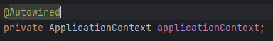
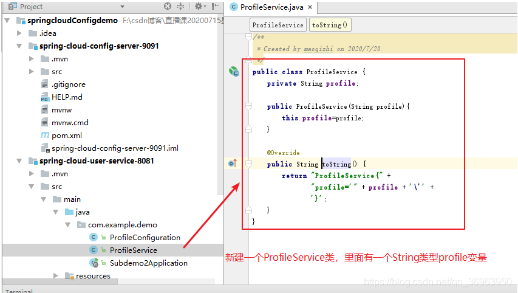
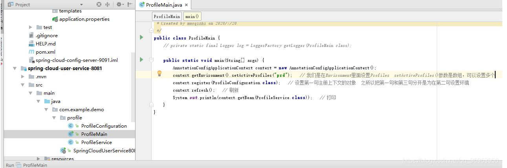
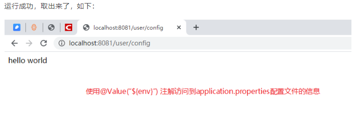

# 个人总结

## :hamburger:Spring反射内置工具类ReflectionUtils

回顾下class对象的三种实现

```java
1.Object ——> getClass();
Demo demo = new Demo();
Class<? extends Demo> clazz = demo.getClass();

2.任何数据对象（包括数据基本类型）都有一个静态的class属性
Class<Demo> clazz = Demo.class;

3.通过Class类的静态方法：forName（String className）
Class clazz = Class.forName("com.demo.Demo");
```

**对属性的操作**

**public static Field findField(Class<?> clazz, String name) 在类中查找指定属性**

```java
public void getRuleByUtil() {
    try {
        Class clazz=Class.forName("com.alibaba.csp.sentinel.slots.block.degrade.DegradeRuleManager");
        Field circuitBreakers = ReflectionUtils.findField(clazz, "circuitBreakers");
    }catch (ClassNotFoundException e){
        throw new RuntimeException(e);
    }
}
```

**public static Field findField(Class<?> clazz, @Nullable String name, @Nullable Class<?> type) 更精确的在类中查找指定属性，可以在指定属性的类型**

```java
public void getRuleByUtil() {
    try {
        Class clazz=Class.forName("com.alibaba.csp.sentinel.slots.block.degrade.DegradeRuleManager");
        Field circuitBreakers = ReflectionUtils.findField(clazz, "circuitBreakers"，Map.class);
    }catch (ClassNotFoundException e){
        throw new RuntimeException(e);
    }
}
```

**public static Object getField(Field field, @Nullable Object target) 获取对象的值**

```java
public void getRuleByUtil() {
    try {
        Class clazz=Class.forName("com.alibaba.csp.sentinel.slots.block.degrade.DegradeRuleManager");
        Field circuitBreakers = ReflectionUtils.findField(clazz, "circuitBreakers");
        ReflectionUtils.makeAccessible(circuitBreakers);
        HashMap<String, List<CircuitBreaker>> map= (HashMap<String, List<CircuitBreaker>>) ReflectionUtils.getField(circuitBreakers,clazz);
        System.out.println(map);
    }catch (ClassNotFoundException e){
        throw new RuntimeException(e);
    }
}
```

**void setField(Field field, Object target, Object value)，可以设置 target 对象的 field 属性值，值为 value。**

```java
public void getRuleByUtil() {
    try {
        Class clazz=Class.forName("com.alibaba.csp.sentinel.slots.block.degrade.DegradeRuleManager");
        Field circuitBreakers = ReflectionUtils.findField(clazz, "circuitBreakers");
        ReflectionUtils.makeAccessible(circuitBreakers);
        HashMap<String, List<CircuitBreaker>> map= (HashMap<String, List<CircuitBreaker>>) ReflectionUtils.setField(circuitBreakers,clazz,Lists.newArrayList());
        System.out.println(map);
    }catch (ClassNotFoundException e){
        throw new RuntimeException(e);
    }
}
```

❤️**void makeAccessible(Field field)，取消java的权限控制检查，方便private私有访问权限的操作。**


**对方法的操作**

Method findMethod(Class clazz, String name)，在类中查找指定名字方法
Method findMethod(Class clazz, String name, Class… paramTypes)，有的时候同一个类可能会有多个方法名相同，形参数不同的重载方法，可以使用这个方法更精确的在类中找到指定方法；
Method[] getAllDeclaredMethods(Class leafClass)，获得类中所有方法，包括继承而来的。


**执行方法**
Object invokeMethod(Method method, Object target)，执行无参数的方法；

Object invokeMethod(Method method, Object target, Object… args)，执行有参数的方法

void makeAccessible(Method method)，如果是私有方法，可以取消 Java 权限检查，以便后续执行该私有方法


## :hamburger:ApplicationContext

### 一、**基础概念**

​		Spring容器最基本的接口就是BeanFactory。BeanFactory负责配置、创建、管理Bean；

​		ApplicationContext由BeanFactory派生而来；BeanFactory的许多功能需要编程实现，而在ApplicationContext中则可以通过配置的方式实现；

​		ApplicationContext因此也称之为Spring上下文。Spring容器负责管理Bean与Bean之间的依赖关系。

### 二、**案例学习**

​		创建一个user对象

```java
@Data
public class User {
    private String id;
    private String name;
    private Integer age;
}
```

​		创建一个applicationContext.xml的配置文件


```xml
<?xml version="1.0" encoding="UTF-8" ?>
<beans xmlns="http://www.springframework.org/schema/beans"
       xmlns:xsi="http://www.w3.org/2001/XMLSchema-instance"
       xmlns:p="http://www.springframework.org/schema/p"
       xsi:schemaLocation="http://www.springframework.org/schema/beans
        http://www.springframework.org/schema/beans/spring-beans-3.0.xsd">

    <!--    singleton-->
    <bean id="UserSingleton" class="com.chenxi.demo.po.User" scope="singleton">
        <property name="id" value="1"/>
        <property name="name" value="辰兮"/>
        <property name="age" value="22"/>
    </bean>

    <!--    prototype-->
    <bean id="UserPrototype" class="com.chenxi.demo.po.User" scope="prototype" >
        <property name="id" value="2"/>
        <property name="name" value="辰兮要努力"/>
        <property name="age" value="23"/>
    </bean>

</beans>
```

创建一个测试类帮助我们学习ApplicationContext

```java
import com.chenxi.demo.po.User;
import org.slf4j.Logger;
import org.slf4j.LoggerFactory;
import org.springframework.context.ApplicationContext;
import org.springframework.context.support.ClassPathXmlApplicationContext;

/**
 * @program: ApplicationContextDemo
 * @description: ApplicationContext入门学习
 * @author: 辰兮要努力
 * @create: 2021-11-10 22:07:54
 */
public class ApplicationContextDemo {

    //打印日志
    private static final Logger logger = LoggerFactory.getLogger(ApplicationContextDemo.class);

    public static void main(String[] args) {
        /**
         *
         * ApplicationContext体系结构
         * 主要实现类：
         * ClassPathXmlApplicationContext：默认从类路径加载配置文件
         * FileSystemXmlApplicationContext：默认从文件系统中装载配置文件
         */
        ApplicationContext applicationContext = new ClassPathXmlApplicationContext("applicationContext.xml");

        /**
         * Singleton：单实例（在容器启动完成之前就已经创建好了，保存在容器中了，任何时候获取都是获取之前创建好的那个对象）
         */
        User user = (User) applicationContext.getBean("UserSingleton");
        User user1 = (User) applicationContext.getBean("UserSingleton");
        /**
         * 换一种写法：<T> T getBean(String var1, Class<T> var2) throws BeansException;
         */
        User user2 =  applicationContext.getBean("UserSingleton",User.class);

        logger.info("user.hashCode()是:{}",user.hashCode());
        logger.info("user1.hashCode()是:{}",user1.hashCode());

        logger.info("user是:{}",user);
        logger.info("user1是:{}",user1);
        logger.info("user == user1 :{}",user == user1);


        /**
         * Prototype：多实例（容器启动默认不会创建多实例bean对象，只有在获取的时候才创建，每次获取都会创建一个新的实例对象）
         */
        User user3 = (User) applicationContext.getBean("UserPrototype");
        User user4 = (User) applicationContext.getBean("UserPrototype");

        logger.info("user3.hashCode()是:{}",user3.hashCode());
        logger.info("user4.hashCode()是:{}",user4.hashCode());
        logger.info("user3是:{}",user3);
        logger.info("user4是:{}",user4);
        logger.info("user3 == user4 :{}",user3 == user4);

    }
}
```


代码逻辑

创建Spring的工厂类

```java
ApplicationContext applicationContext = new ClassPathXmlApplicationContext("applicationContext.xml");
```

通过工厂解析XML获取Bean实例

```java
User user = (User) applicationContext.getBean("UserSingleton");
```

在springBoot项目中也可以通过注解的形式引入




此处示例为 , 通过applicationContext创建JdbcTemplate的实例对象

**拓展补充**

1、对象相等则hashCode一定相等；
2、hashCode相等对象未必相等

### **ApplicationContext总结**

如果说BeanFactory是Spring的心脏，那么ApplicationContext就是完整的身躯了。

ApplicationContext由BeanFactory派生而来，提供了更多面向实际应用的功能。

Context我们通常解释为上下文环境，用“容器”来表述它更容易理解一些，ApplicationContext则是“应用的容器”


## :hamburger:Environment  env

### **env 的 profiles 基本使用**

首先，我们知道，整个spring应用运行的环境信息：profiles + [properties](https://so.csdn.net/so/search?q=properties&spm=1001.2101.3001.7020)

先看profiles，在代码中的配置为：

```xml
spring.profiles.active=prd/test/dev...
```

**profiles作用：对bean逻辑分组**

先定义一个ProfileService类，包含一个私有属性profile，如下：



新建一个ProfileConfiguration配置类，将新建的ProfileService类的实例bean定义在这里，等到springboot项目启动的时候，将可以将ProfileService实例bean装载的ioc容器中去了，整个如下：


在ProfileConfiguraiton配置类的各个bean上，加上@Profile注解，模拟设置两种不同环境下的bean，声明不同环境的bean


```
金手指：使用@Profile对不同的bean逻辑分布 xml 和注解都可以
```

​		现在我们不使用SpringbootApplication类启动了，直接写一个main方法启动即可，如下，在启动之前，在Environment里面设置profile，setActiveProfile()蚕食是数组，可以设置躲着，这里测试之用，先设置“prd”，最后context.getBean可以取出ioc容器中的bean，打印到控制台就好。



```
一般来说，getBean和@Autowired两种方式都可以取出ioc容器中的bean.
```

运行springboot工程，如果打印出来的ioc容器中的bean，prd环境中的bean，就可以了。


至此，对于env 的 profiles设置成功。

###  **配置环境三地方：启动类、application.properties配置文件、Run/Debug Configuration**

​		我们能够配置环境的地方不止一个，不仅像上面在启动类中可以配置，还是在application.properties配置文件中配置，还可以在 Run/Debug Configuration 中配置


**setActiveProfiles()参数是数组，可以设置多个**


### **env 的 properties：存放属性的环境或文件信息 @Value(“{xxx}”)**

 **用@Value取出普通配置**

新建一个UserController类，打印出application.properties配置文件中的env属性即可，如下：




所以，我们看到，properties存放属性的环境或文件信息。

 **用@Value取出系统配置，如java.version**

@Value注解还可以访问到系统环境变量的信息，如java.version，取出当前jdk版本


**用Environment实例bean取出系统配置，如java.version**

我们用@Autowired取出spring ioc容器中的Environment实例bean，然后直接用Environment实例bean（不用@Value）来取，如下：

```
取出spring ioc容器中的实例bean有两种方式，getBean方法 或 @Autowired注解。
```


**在举两个 Environment实例Bean取值的例子**

例一:


例二:


## :hamburger:注解

### @DateTimeFormat

声明应将字段或方法参数格式化为日期或时间

@DateTimeFormat(pattern = DatePattern.*NORM_DATETIME_PATTERN*) Date pushTime

DatePattern = > 日期格式化类，提供常用的日期格式化对象

*NORM_DATETIME_PATTERN* = > 标准日期时间格式，精确到秒：yyyy-MM-dd HH:mm:ss


### @Valid

#### post请求校验

**对象属性校验**

- 在入参对象的字段上添加校验注解，比如@Min
- 在请求对象前面添加注解@Valid

```java
@Data
public class User {
    @Min(value = 10,message = "年龄必须大于10岁")
    private Integer age;
}
​
@PostMapping("checkBodyParam")
public String checkBodyParam(@RequestBody @Valid User user){
  return "ok";
}
```

**嵌套属性校验**

- 在嵌套对象上添加注解valid
- 在请求对象前面添加注解valid

```java
@Data
public class UserClass {
    private String className;
    @Valid
    private User user;
}
​
@PostMapping("checkBodyMultilevelParam")
public String checkBodyMultilevelParam(@RequestBody @Valid UserClass userClass){
  return "ok";
}
```

#### get请求参数校验

- 在类上使用@Validated注解
- 在参数前面添加参数校验的注解

```java
@RestController
@RequestMapping("/paramTest")
@Validated
public class ParamTestController {
  @GetMapping("checkParam")
  public String checkParam(@RequestParam  @Max(value = 99, message = "不能大于99岁") Integer age) {
    return "ok";
  }
  
  @GetMapping("checkPath/{id}")
  public String checkPath(@PathVariable  @Pattern(regexp = "^[0-9]*$", message = "id参数值必须是正整数") String id)   {
    return "ok";
  }
}
```


### @ControllerAdvice 

该注解用于定义一个全局异常处理器类 , 它可以拦截所有 `@Controller` 注解的控制器中抛出的异常。

*Controller增强器 给Controller增加统一的操作和处理 

```java
/**
 * 统一异常处理类
 */
@ControllerAdvice
public class GlobalExceptionHandler {

    @ExceptionHandler(Exception.class)
    @ResponseBody
    public Result error(Exception e){
        e.printStackTrace();
        return Result.build(null , 201,"出现了异常") ;
    }
}
```


### @ExceptionHandler

捕获抛出指定类型异常 , 我们可以为不同类型的异常编写不同的处理方法，从而实现对不同异常的个性化处理。

下面是一个使用 `@ExceptionHandler` 注解处理特定异常的例子：

```java
@ControllerAdvice
public class GlobalExceptionHandler {
    
    @ExceptionHandler(NullPointerException.class)
    public ResponseEntity<String> handleNullPointerException(NullPointerException ex) {
        // 处理空指针异常逻辑
        return ResponseEntity.status(HttpStatus.BAD_REQUEST).body("Null Pointer Exception");
    }
}
```


## :hamburger:ThreadLocal

 ThreadLocal意为线程本地变量，用于解决多线程并发时访问共享变量的问题。


- set(T value)：设置线程本地变量的内容。
- get()：获取线程本地变量的内容。
- remove()：移除线程本地变量。**注意在线程池的线程复用场景中在线程执行完毕时一定要调用remove**，避免在线程被重新放入线程池中时被本地变量的旧状态仍然被保存。

### 原理:

- Map里面存储ThreadLocal对象（key）和线程的变量副本（value）;

 那么如何究竟是如何实现在每个线程里面保存一份单独的本地变量呢？首先，在Java中的线程是什么呢？是的，就是一个Thread类的实例对象！**而一个实例对象中实例成员字段的内容肯定是这个对象独有的**，所以我们也可以将保存ThreadLocal线程本地变量作为一个Thread类的成员字段，这个成员字段就是：

```java
/* ThreadLocal values pertaining to this thread. This map is maintained
 * by the ThreadLocal class. */
ThreadLocal.ThreadLocalMap threadLocals = null;
```

 是一个在ThreadLocal中定义的Map对象，保存了该线程中的所有本地变量。ThreadLocalMap中的Entry的定义如下：

```java
static class Entry extends WeakReference<ThreadLocal<?>> {
    /** The value associated with this ThreadLocal. */
    Object value;
    // key为一个ThreadLocal对象，v就是我们要在线程之间隔离的对象
    Entry(ThreadLocal<?> k, Object v) {
        super(k);
        value = v;
    }
}
```

### 应用场景:

```java
场景一：在重入方法中替代参数的显式传递

​ 假如在我们的业务方法中需要调用其他方法，同时其他方法都需要用到同一个对象时，可以使用ThreadLocal替代参数的传递或者static静态全局变量。这是因为使用参数传递造成代码的耦合度高，使用静态全局变量在多线程环境下不安全。当该对象用ThreadLocal包装过后，就可以保证在该线程中独此一份，同时和其他线程隔离。

​ 例如在Spring的@Transaction事务声明的注解中就使用ThreadLocal保存了当前的Connection对象，避免在本次调用的不同方法中使用不同的Connection对象。
public class UserAuthContext {
    private static ThreadLocal<String> authTokenHolder = new ThreadLocal<>();

    public static void setAuthToken(String authToken) {
        authTokenHolder.set(authToken);
    }

    public static String getAuthToken() {
        return authTokenHolder.get();
    }

    public static void clearAuthToken() {
        authTokenHolder.remove();
    }
}

public class AuthenticationService {
    public void authenticate(String username, String password) {
        // 身份验证逻辑
        String authToken = generateAuthToken();
        UserAuthContext.setAuthToken(authToken);
        // 其他逻辑
    }

    public void processRequest() {
        String authToken = UserAuthContext.getAuthToken();
        // 使用身份验证信息进行请求处理
        // 其他逻辑
    }

    public void logout() {
        UserAuthContext.clearAuthToken();
        // 其他逻辑
    }
}
```

```java
场景二：全局存储用户信息

​ 可以尝试使用ThreadLocal替代Session的使用，当用户要访问需要授权的接口的时候，可以现在拦截器中将用户的Token存入ThreadLocal中；之后在本次访问中任何需要用户用户信息的都可以直接冲ThreadLocal中拿取数据。例如自定义获取用户信息的类AuthHolder：

public class UserContext {
    private static ThreadLocal<User> userHolder = new ThreadLocal<>();

    public static void setCurrentUser(User user) {
        userHolder.set(user);
    }

    public static User getCurrentUser() {
        return userHolder.get();
    }

    public static void clearCurrentUser() {
        userHolder.remove();
    }
}

public class UserService {
    public void login(User user) {
        UserContext.setCurrentUser(user);
        // 其他逻辑
    }

    public void logout() {
        User user = UserContext.getCurrentUser();
        // 其他逻辑
        UserContext.clearCurrentUser();
    }
}

public class SomeService {
    public void doSomething() {
        User user = UserContext.getCurrentUser();
        // 其他逻辑
    }
}
```

```java
场景三：解决线程安全问题

​ 依赖于ThreadLocal本身的特性，对于需要进行线程隔离的变量可以使用ThreadLocal进行封装。

public class DBConnectionManager {
    private static ThreadLocal<Connection> connectionHolder = new ThreadLocal<>();

    public static Connection getConnection() {
        Connection connection = connectionHolder.get();
        if (connection == null) {
            connection = createConnection();
            connectionHolder.set(connection);
        }
        return connection;
    }

    public static void releaseConnection() {
        Connection connection = connectionHolder.get();
        if (connection != null) {
            releaseConnection(connection);
            connectionHolder.remove();
        }
    }

    private static Connection createConnection() {
        // 创建数据库连接的逻辑
    }

    private static void releaseConnection(Connection connection) {
        // 释放数据库连接的逻辑
    }
}
```

## :hamburger:Linux命令

### grep '过滤' -A -B -C 5

cat uat-idata-search.log | grep 'ERROR' **-A 5**

查看过滤后数据的**后面5行**

cat uat-idata-search.log | grep 'ERROR' **-B 5**

查看过滤后数据的**前面5行**

cat uat-idata-search.log | grep 'ERROR' **-C 5**

查看过滤后数据的**前后各5行**


### tail -f

实时查询 

tail -2f uat-idata-search.log

显示前两条的日志记录 , 后面采用实时查询


## :hamburger:AOP

### JointPoint接口

**需要获取方法签名、传入的实参等信息时，可以在通知方法声明JoinPoint类型的形参。**

- 1：JoinPoint 接口通过 getSignature() 方法获取目标方法的签名（方法声明时的完整信息）
- 2：通过目标方法签名对象获取方法名
- 3：通过 JoinPoint 对象获取外界调用目标方法时传入的实参列表组成的数组


### 相关注解

**@Aspect**注解： 添加到切面类上 表示这个类是一个切面类

**@Before**注解：声明当前方法是前置通知方法   // value属性：指定切入点表达式，由切入点表达式控制当前通知方法要作用在哪一个目标方法上 

**@AfterReturning**注解：在方法

**@AfterThrowing**注解：在方法抛出异常后执行

**@After**注解：声明当前方法是后置通知方法

**@Pointcut** 将切点提取，在增强上进行引用

提取

```java
// 切入点表达式重用
@Pointcut("execution(public int com.atguigu.aop.api.Calculator.add(int,int)))")
public void declarPointCut() {}
```

提取切点注解使用@Pointcut(切点表达式) ， 需要添加到一个无参数无返回值方法上即可！

引用

```java
@Before(value = "declarPointCut()")
public void printLogBeforeCoreOperation(JoinPoint joinPoint) {
```

**@Order** 相同目标方法上同时存在多个切面时,使用 @Order 注解可以控制切面的优先级 数字越小 优先级越高

**@Around**环绕通知对应整个 try...catch...finally 结构，包括前面四种通知的所有功能。

```java
// 使用@Around注解标明环绕通知方法
@Around(value = "com.atguigu.aop.aspect.AtguiguPointCut.transactionPointCut()")
public Object manageTransaction(
    
        // 通过在通知方法形参位置声明ProceedingJoinPoint类型的形参，
        // Spring会将这个类型的对象传给我们
        ProceedingJoinPoint joinPoint) {
    
    // 通过ProceedingJoinPoint对象获取外界调用目标方法时传入的实参数组
    Object[] args = joinPoint.getArgs();
    
    // 通过ProceedingJoinPoint对象获取目标方法的签名对象
    Signature signature = joinPoint.getSignature();
    
    // 通过签名对象获取目标方法的方法名
    String methodName = signature.getName();
    
    // 声明变量用来存储目标方法的返回值
    Object targetMethodReturnValue = null;
    
    try {
    
        // 在目标方法执行前：开启事务（模拟）
        log.debug("[AOP 环绕通知] 开启事务，方法名：" + methodName + "，参数列表：" + Arrays.asList(args));
    
        // 过ProceedingJoinPoint对象调用目标方法
        // 目标方法的返回值一定要返回给外界调用者
        targetMethodReturnValue = joinPoint.proceed(args);
    
        // 在目标方法成功返回后：提交事务（模拟）
        log.debug("[AOP 环绕通知] 提交事务，方法名：" + methodName + "，方法返回值：" + targetMethodReturnValue);
    
    }catch (Throwable e){
    
        // 在目标方法抛异常后：回滚事务（模拟）
        log.debug("[AOP 环绕通知] 回滚事务，方法名：" + methodName + "，异常：" + e.getClass().getName());
    
    }finally {
    
        // 在目标方法最终结束后：释放数据库连接
        log.debug("[AOP 环绕通知] 释放数据库连接，方法名：" + methodName);
    
    }
    
    return targetMethodReturnValue;
}
```


### **切点表达式语法**


**对实现了接口的类应用切面**


**对没实现接口的类应用切面new**


**如果使用AOP技术，目标类有接口，必须使用接口类型接收IoC容器中代理组件！**

## :hamburger:数据并集后,数据量过大,开启并行流进行速度优化

```java
private static List<ProductCategorySummaryDetailsDTO> parseResult(JSONObject jsonObject, JSONObject signJsonObject) {
        // 取出边际贡献率表中的项目号
        JSONArray projectNumberBuckets = JSONUtil.parseArray(JSONPath.eval(jsonObject, "$.aggregations.project_number.buckets[*]"));
        List<String> checkList = projectNumberBuckets.parallelStream()
                .map(JSONUtil::parseObj)
                .map(buckets -> buckets.getStr(KEY))
                .collect(Collectors.toList());
        // 取出签单表中的项目号
        JSONArray projectNoBuckets = JSONUtil.parseArray(JSONPath.eval(signJsonObject, "$.aggregations.project_no.buckets[*]"));
        List<String> signList = projectNoBuckets.parallelStream()
                .map(JSONUtil::parseObj)
                .map(signBuckets -> signBuckets.getStr(KEY))
                .collect(Collectors.toList());
        // 拿到两个表项目号的并集，进行数据汇总
        List<String> union = Stream.concat(checkList.stream(), signList.stream())
                .distinct()
                .collect(Collectors.toList());
        return union.parallelStream()
                .map(projectNo -> {
                    ProductCategorySummaryDetailsDTO dto = new ProductCategorySummaryDetailsDTO();
                    // 项目号
                    dto.setProjectNumber(projectNo);
                    // 如果边际贡献率表中有此项目号，存入计算相关到检数据
                    projectNumberBuckets.parallelStream()
                            .map(JSONUtil::parseObj)
                            .filter(buckets -> projectNo.equals(buckets.getStr(KEY)))
                            .findFirst()
                            .ifPresent(buckets -> {
                                // 取出非聚合所需字段值(所属大区 - 客户名称 - 项目名称 - 销售)
                                cn.hutool.json.JSONObject source = buckets.getJSONObject("otherSource").getJSONObject(HITS).getJSONArray(HITS).getJSONObject(INTEGER_0).getJSONObject(SOURCE);
                                // 所属大区
                                dto.setBrmZone(source.getStr(NewProductEnum.BRM_ZONE.getFields()));
                                // 客户名称
                                dto.setCustomerName(source.getStr(NewProductEnum.KHMC.getFields()));
                                // 项目名称
                                dto.setProjectName(source.getStr(NewProductEnum.OPPORTUNITY_NAME.getFields()));
                                // 销售
                                dto.setSales(source.getStr(NewProductEnum.ownername.getFields()));
                                // 取出并计算新产品到检情况下的(金额 人次 客单价 折扣)
                                cn.hutool.json.JSONObject qysjJsonObject = buckets.getJSONObject(NewProductEnum.QYSJ.getFields()).getJSONArray(BUCKETS).getJSONObject(INTEGER_0);
                                cn.hutool.json.JSONObject checkJsonObject = qysjJsonObject.getJSONObject(NewProductEnum.CHECK_DATE.getFields()).getJSONArray(BUCKETS).getJSONObject(INTEGER_0);
                                // 到检 - 人次
                                dto.setCheckCount(checkJsonObject.getBigDecimal(DOC_COUNT));
                                // 到检 - 金额(销售价)
                                dto.setCheckAmount(checkJsonObject.getJSONObject(NewProductEnum.SALE_PRICE_AMOUNT.getFields()).getBigDecimal(VALUE));
                                // 到检 - 金额(市场价)
                                dto.setCheckMarketAmount(checkJsonObject.getJSONObject(NewProductEnum.MARKET_PRICE_AMOUNT.getFields()).getBigDecimal(VALUE));
                                // 到检 - 客单价 => 金额/人次
                                dto.setCheckATV(CalculateUtil.div(dto.getCheckAmount(), dto.getCheckCount(), INT_2));
                                // 到检 - 折扣
                                dto.setCheckDiscount(CalculateUtil.div(dto.getCheckAmount(), dto.getCheckMarketAmount(), INT_3).multiply(BigDecimal.TEN));
                            });
                    // 如果签约表中有此项目号，存入计算相关签约数据
                    projectNoBuckets.parallelStream()
                            .map(JSONUtil::parseObj)
                            .filter(signBuckets -> projectNo.equals(signBuckets.getStr(KEY)))
                            .findFirst()
                            .ifPresent(signBuckets -> {
                                // 取出非聚合所需字段值(所属大区 - 客户名称 - 项目名称 - 销售)
                                cn.hutool.json.JSONObject source = signBuckets.getJSONObject("otherSource").getJSONObject(HITS).getJSONArray(HITS).getJSONObject(INTEGER_0).getJSONObject(SOURCE);
                                // 所属大区
                                dto.setBrmZone(Optional.ofNullable(dto.getBrmZone()).orElse(source.getStr(NewProductSignEnum.BRM_ZONE.getFields())));
                                // 客户名称
                                dto.setCustomerName(Optional.ofNullable(dto.getCustomerName()).orElse(source.getStr(NewProductSignEnum.KHMC.getFields())));
                                // 项目名称
                                dto.setProjectName(Optional.ofNullable(dto.getProjectName()).orElse(source.getStr(NewProductSignEnum.OPPORTUNITY_NAME.getFields())));
                                // 销售
                                dto.setSales(Optional.ofNullable(dto.getSales()).orElse(source.getStr(NewProductSignEnum.OWNERNAME.getFields())));
                                // 销售 - 人次
                                dto.setSalesCount(signBuckets.getJSONObject(NewProductSignEnum.CHECKITEM_COUNT.getFields()).getBigDecimal(VALUE));
                                // 销售 - 金额(销售价)
                                dto.setSalesAmount(signBuckets.getJSONObject(NewProductSignEnum.salepricetotal.getFields()).getBigDecimal(VALUE));
                                // 销售 - 金额(市场价)
                                dto.setSalesMarketAmount(signBuckets.getJSONObject(NewProductSignEnum.standpricetotal.getFields()).getBigDecimal(VALUE));
                                // 销售 - 客单价 => 金额/人次
                                dto.setSalesATV(CalculateUtil.div(dto.getSalesAmount(), dto.getSalesCount(), INT_2));
                                // 销售 - 折扣
                                dto.setSalesDiscount(CalculateUtil.div(dto.getSalesAmount(), dto.getSalesMarketAmount(), INT_3).multiply(BigDecimal.TEN));
                            });
                    // 取出并计算新产品余量情况下的(金额 人次 客单价 折扣)
                    // 如果余量为负数默认显示0
                    Function<BigDecimal, BigDecimal> default0 =
                            bigDecimal -> NumberUtil.isLess(bigDecimal, BigDecimal.ZERO)
                                    ? BigDecimal.ZERO
                                    : bigDecimal;
                    // 余量 - 人次
                    dto.setMarginCount(default0.apply(dto.getSalesCount().subtract(dto.getCheckCount())));
                    // 余量 - 金额(销售价)
                    dto.setMarginAmount(default0.apply(dto.getSalesAmount().subtract(dto.getCheckAmount())));
                    // 余量 - 金额(市场价)
                    dto.setMarginMarketAmount(default0.apply(dto.getSalesMarketAmount().subtract(dto.getCheckMarketAmount())));
                    // 余量 - 客单价 => 金额/人次
                    dto.setMarginATV(default0.apply(CalculateUtil.div(dto.getMarginAmount(), dto.getMarginCount(), INT_2)));
                    // 余量 - 折扣
                    dto.setMarginDiscount(default0.apply(CalculateUtil.div(dto.getMarginAmount(), dto.getMarginMarketAmount(), INT_3).multiply(BigDecimal.TEN)));
                    return dto;
                })
                .collect(Collectors.toList());
    }
```

## :hamburger:对处理完成的数据 , 进行分页排序


入参继承此类

```java
@Data
public class PageVo {
    @ApiModelProperty("当前页")
    @NotNull(message = "当前页不能为空")
    protected Integer pageNum;
    @ApiModelProperty("每页查询记录数")
    @NotNull(message = "每页查询记录数不能为空")
    protected  Integer pageSize;

    @ApiModelProperty("排序")
    protected List<Order> sortList;

    @ApiModelProperty(hidden = true)
    @JSONField(deserialize = false, serialize = false)
    @JsonIgnore
    public Page getPage() {
        Page page = new Page(this.pageNum > 0 ? Math.decrementExact(this.pageNum) : this.pageNum, this.pageSize);
        if (page.getEndPosition() >= 10000) {
            throw new BusinessException("没法显示更多了，查询结果数量大于10000条数据");
        } else {
            return page;
        }
    }

    @ApiModelProperty(hidden = true)
    @JSONField(deserialize = false, serialize = false)
    @JsonIgnore
    public <T> Comparator<T> getSortComparator(String fieldName) {
        Function<Order, Comparator<T>> f = order -> {
            Comparator<T> comparing = Comparator.comparing(o -> NumberUtil.toBigDecimal(Optional.ofNullable(BeanUtil.getFieldValue(o,order.getField())).orElse(BigDecimal.ZERO).toString()).doubleValue());
            return (Direction.ASC == order.getDirection()) ? comparing : comparing.reversed();
        };
        return Optional.ofNullable(sortList).orElse(ListUtil.toList(new Order(fieldName,Direction.DESC))).stream()
                .map(f).reduce(Comparator::thenComparing).orElse(null);
    }
}
```

封装结果类

```java
@Data
@ApiModel("分页结果")
public class PageResult<T> implements Serializable {
    private static final long serialVersionUID = -2544574440233553703L;
    @ApiModelProperty
    private List<T> result;

    @ApiModelProperty("每页显示的条数")
    private Integer pageSize;
    @ApiModelProperty("当前页数")
    private Integer pageNum;

    @ApiModelProperty("总条数")
    protected Integer total;
    @ApiModelProperty("总条数(千分位)")
    protected String totalStr;

    @ApiModelProperty("附加数据")
    private Object additionalData;


    public String getTotalStr() {
        return DecimalFormatUtil.POSITIVE_INTEGER_FORMAT.format(new BigDecimal(Objects.isNull(this.total) ? "0" : this.total.toString()));
    }

}
```

使用示例:

```java
//封装返回数据
PageResult<ProductCategorySummaryDetailsDTO> result = new PageResult<>();
result.setTotal(resultData.size());
result.setPageNum(vo.getPageNum());
result.setPageSize(vo.getPageSize());
result.setResult(
        resultData.stream()
                .sorted(vo.getSortComparator(SALES_AMOUNT))
                .skip(vo.getPage().getStartPosition())
                .limit(vo.getPageSize())
                .collect(Collectors.toList()));
```


## :hamburger:枚举类处理字段映射

```java
public enum DataSourceEnum {
    B(1,"B端推送"),
    C(2,"C端推送"),
    IM(3,"人员导入")
    ;

    @Getter
    private Integer type;

    @Getter
    private String desc;

    DataSourceEnum(Integer type, String desc) {
        this.type = type;
        this.desc = desc;
    }

    public static Map<Integer, String> getAllValues() {
        Map<Integer, String> map = new HashMap<>();
        DataSourceEnum[] values = DataSourceEnum.values();
        for (DataSourceEnum value : values) {
            map.put(value.getType(), value.getDesc());
        }
        return map;
    }
    
    public static String getTypeName(Integer type) {
        for (int i = 0; i < DataSourceEnum.values().length; i ++) {
            if (Objects.equals(type, DataSourceEnum.desc()[i].type)) {
                return DataSourceEnum.values()[i].deptName;
            }
        }
        return "";
    }
}
```

## :hamburger:java8排序sort

1.单排序

```java
properties.sort(Comparator.comparing(x -> x.distance));
list.sort(Comparator.comparing(UserInformation::getName));

//正序
list=list.stream().sorted().collect(Collectors.toList());
list.stream().sorted(Comparator.comparing(Student::getAge))

//逆序
list.stream().sorted(Comparator.reverseOrder())
list.stream().sorted(Comparator.comparing(Student::getAge).reversed())
```

2.多字段排序

```java
//先根据id排序,id相同根据年龄排序
list.sort(Comparator.comparing(UserInformation::getId).thenComparing(UserInformation::getAge));

//多字段排序,指定正序还是倒序:
list.stream()            .sorted(Comparator.comparing(Article::getRecommend,Comparator.reverseOrder())
                    .thenComparing(Article::getTop,Comparator.reverseOrder())
                    .thenComparing(Article::getReleaseTime,Comparator.reverseOrder()))
            .collect(Collectors.toList());
```

3.自定义排序

```java
List<String> sortListA = Arrays.asList("2023", "2022", "2021", "2020", "2019", "2018", "2017");
List<String> sortListB = Arrays.asList("春", "夏", "秋", "冬");
value = value.stream().sorted(Comparator.comparing(TotalListRegionSeasonDTO::getRegionNo, Comparator.comparing(sortListA::indexOf))
                        .thenComparing(TotalListRegionSeasonDTO::getSeasonName, Comparator.comparing(sortListB::indexOf))).collect(Collectors.toList());
```

4.反转排序

```java
salListsTopN.sort(Comparator.comparing(SalList::getSalQty).reversed());
```

5.使用工具类Collections 或者hutool包中的CollUtil.*sort*()

```
Collections.sort(list, Comparator.comparing(User::getAge));  
CollUtil.sort(list,Comparator.comparing(User::getAge))
```

6.含null值的排序

```
以 nullsLast()为例,项目逻辑中 dealerDistance 为 null 时排最后

Comparator.nullsLast(Comparator.reverseOrder())把 null 排序最后面,然后是 Comparator.reverseOrder(),null 值不参与逆序,null 还是在最后
Comparator.nullsLast(Double ::compareTo).reversed() 先是把 null 排最后面,再整体 reversed(),包括为 null 的,所以 null 在最前面
注:reverseOrder()是逆转排序即逆序,而 reversed()是逆转仔细理解,这两个在意思上还是有区别
```

示例:

```java
list=list.stream().sorted(Comparator.comparing(l -> l.getCreateTime(), Comparator.nullsFirst(Date::compareTo))).collect(Collectors.toList());

List<Map<String, Object>> collect = maps.stream() .sorted(Comparator.comparing((Map<String, Object> o) -> (Double) o.get("score"),
Comparator.nullsLast(Comparator.reverseOrder()))
.thenComparing((Map<String, Object> o) -> ((double) o.get("dealerDistance")),
Comparator.nullsLast(Comparator.naturalOrder())))
.collect(Collectors.toList());
```

