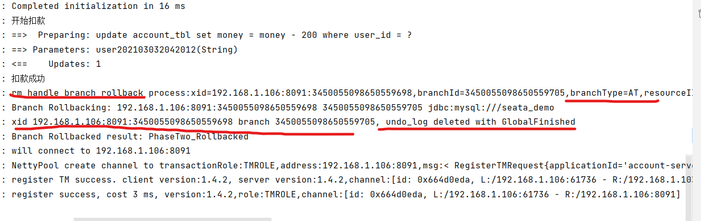
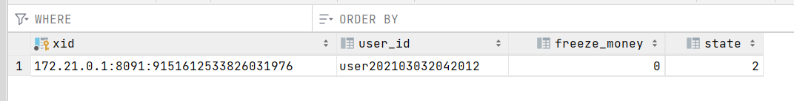

# 分布式事务

**在说分布式事务之前先一张图回顾下什么是本地事务**

大多数场景下，我们的应用都只需要操作单一的数据库，这种情况下的事务被称之为本地事务（Local Transaction）


**那什么是分布式事务呢**

简单的画个图好理解一下，拿下单减库存、扣余额来说举例：

当系统的体量很小时，单体架构完全可以满足现有业务需求，所有的业务共用一个数据库，整个下单流程或许只用在一个方法里同一个事务下操作数据库即可。此时做到所有操作要么全部提交 或 要么全部回滚很容易。


**分库分表、SOA**

可随着业务量的不断增长，单体架构渐渐扛不住巨大的流量，此时就需要对数据库、表做 `分库分表`处理，将应用 `SOA` 服务化拆分。也就产生了订单中心、用户中心、库存中心等，由此带来的问题就是业务间相互隔离，每个业务都维护着自己的数据库，数据的交换只能进行 `RPC` 调用。

当用户再次下单时，需同时对订单库 `order`、库存库 `storage`、用户库 `account` 进行操作，可此时我们只能保证自己本地的数据一致性，无法保证调用其他服务的操作是否成功，所以为了保证整个下单流程的数据一致性，就需要**分布式事务介入**。


## 分布式事物解决方案

实现分布式事务的方案比较多，常见的比如基于 `XA` 协议的 `2PC`、`3PC`，基于业务层的 `TCC`，还有**应用消息队列** + 消息表实现的最终一致性方案，还有 `Seata` 中间件


根据CAP和BASE理论产生的两种分布式事务处理思想：

1. **最终一致思想**（AP）：分支事务分别进行提交，如有不一致再想办法恢复数据
2. **强一致思想**（CP）：分支事务执行后不要提交，等待彼此结束，然后统一提交或回滚


### 2pc

基于 XA 协议实现的分布式事务，XA 协议中分为两部分：事务管理器和本地资源管理器。其中本地资源管理器往往由数据库实现，比如 Oracle、MYSQL 这些数据库都实现了 XA 接口，而事务管理器则作为一个全局的调度者。

两阶段提交（`2PC`），对业务侵⼊很小，它最⼤的优势就是对使⽤⽅透明，用户可以像使⽤本地事务⼀样使⽤基于 XA 协议的分布式事务，能够严格保障事务 ACID 特性。


可 `2PC`的缺点也是显而易见，它是一个强一致性的同步阻塞协议，事务执⾏过程中需要将所需资源全部锁定，也就是俗称的 `刚性事务`。所以它比较适⽤于执⾏时间确定的短事务，整体性能比较差。

一旦事务协调者宕机或者发生网络抖动，会让参与者一直处于锁定资源的状态或者只有一部分参与者提交成功，导致数据的不一致。因此，在⾼并发性能⾄上的场景中，基于 XA 协议的分布式事务并不是最佳选择。


### 3pc

三段提交（`3PC`）是二阶段提交（`2PC`）的一种改进版本 ，为解决两阶段提交协议的阻塞问题，上边提到两段提交，当协调者崩溃时，参与者不能做出最后的选择，就会一直保持阻塞锁定资源。

`2PC` 中只有协调者有超时机制，`3PC` 在协调者和参与者中都引入了超时机制，协调者出现故障后，参与者就不会一直阻塞。而且在第一阶段和第二阶段中又插入了一个准备阶段（如下图，看着有点啰嗦），保证了在最后提交阶段之前各参与节点的状态是一致的。


虽然 `3PC` 用超时机制，解决了协调者故障后参与者的阻塞问题，但与此同时却多了一次网络通信，性能上反而变得更差，也不太推荐。

### TCC

所谓的 `TCC` 编程模式，也是两阶段提交的一个变种，不同的是 `TCC` 为在业务层编写代码实现的两阶段提交。`TCC` 分别指 `Try`、`Confirm`、`Cancel` ，一个业务操作要对应的写这三个方法。

以下单扣库存为例，`Try` 阶段去占库存，`Confirm` 阶段则实际扣库存，如果库存扣减失败 `Cancel` 阶段进行回滚，释放库存。

TCC 不存在资源阻塞的问题，因为每个方法都直接进行事务的提交，一旦出现异常通过则 `Cancel` 来进行回滚补偿，这也就是常说的补偿性事务。

原本一个方法，现在却需要三个方法来支持，可以看到 TCC 对业务的侵入性很强，而且这种模式并不能很好地被复用，会导致开发量激增。还要考虑到网络波动等原因，为保证请求一定送达都会有重试机制，所以考虑到接口的幂等性。


### 消息事务（最终一致性）

消息事务其实就是基于消息中间件的两阶段提交，将本地事务和发消息放在同一个事务里，保证本地操作和发送消息同时成功。 下单扣库存原理图：


- 订单系统向 `MQ` 发送一条预备扣减库存消息，`MQ` 保存预备消息并返回成功 `ACK`
- 接收到预备消息执行成功 `ACK`，订单系统执行本地下单操作，为防止消息发送成功而本地事务失败，订单系统会实现 `MQ` 的回调接口，其内不断的检查本地事务是否执行成功，如果失败则 `rollback` 回滚预备消息；成功则对消息进行最终 `commit` 提交。
- 库存系统消费扣减库存消息，执行本地事务，如果扣减失败，消息会重新投，一旦超出重试次数，则本地表持久化失败消息，并启动定时任务做补偿。

基于消息中间件的两阶段提交方案，通常用在高并发场景下使用，牺牲数据的强一致性换取性能的大幅提升，不过实现这种方式的成本和复杂度是比较高的，还要看实际业务情况。


### Seata - AT模式

`Seata` 也是从两段提交演变而来的一种分布式事务解决方案，提供了 `AT`、`TCC`、`SAGA` 和 `XA` 等事务模式，这里重点介绍 `AT`模式。

既然 `Seata` 是两段提交，那我们看看它在每个阶段都做了点啥？下边我们还以下单扣库存、扣余额举例。


先介绍 `Seata` 分布式事务的几种角色：

- `Transaction Coordinator(TC)`:  全局事务协调者，用来协调全局事务和各个分支事务（不同服务）的状态， 驱动全局事务和各个分支事务的回滚或提交。
- `Transaction Manager™ `:  事务管理者，业务层中用来开启/提交/回滚一个整体事务（在调用服务的方法中用注解开启事务）。
- `Resource Manager(RM)`:  资源管理者，一般指业务数据库代表了一个分支事务（`Branch Transaction`），管理分支事务与 `TC` 进行协调注册分支事务并且汇报分支事务的状态，驱动分支事务的提交或回滚。

```
Seata 实现分布式事务，设计了一个关键角色 UNDO_LOG （回滚日志记录表），我们在每个应用分布式事务的业务库中创建这张表，这个表的核心作用就是，将业务数据在更新前后的数据镜像组织成回滚日志，备份在 UNDO_LOG 表中，以便业务异常能随时回滚。
```

```
AT模式如何做到对业务的无侵入：

一阶段：在一阶段，Seata会拦截业务sql，首先解析sql语义，找到业务sql要更新的业务数据，在业务数据被更新之前，将其保存成before image，然后执行业务sql更新业务数据，在业务数据更新之后，再将其保存成after image，最后生成行锁。以上操作全部在一个数据库事务内完成，这样保证了一阶段操作的原子性。
二阶段提交：二阶段如果是提交的话，因为业务sql在一阶段已经提交至数据库，所以Seata框架只需将一阶段保存的快照数据和行锁删除，完成数据清理即可。
二阶段回滚：二阶段如果是回滚的话，Seata就需要回滚一阶段已执行的业务sql，还原业务数据。回滚方式便是用before image 还原业务数据，但在还原前要首先校验脏写，对比数据库当前业务数据和after image，如果两份数据完全一致就说明没有脏写，可以还原业务数据。如果不一致，就说明有脏写，出现脏写就需要转人工处理。

AT模式的一阶段，二阶段提交和回滚都是由Seata框架自动生成，用户只需编写业务sql，便能轻松接入分布式事务，AT模式是一种对业务无任何侵入的分布式事务解决方案。 
```

#### 第一个阶段

比如：下边我们更新 `user` 表的 `name` 字段。

```sql
update user set name = '小富最帅' where name = '程序员内点事'
```

首先 Seata 的 `JDBC` 数据源代理通过对业务 SQL 解析，提取 SQL 的元数据，也就是得到 SQL 的类型（`UPDATE`），表（`user`），条件（`where name = '程序员内点事'`）等相关的信息。


先查询数据前镜像，根据解析得到的条件信息，生成查询语句，定位一条数据。

```sql
select  name from user where name = '程序员内点事'
```


紧接着执行业务 SQL，根据前镜像数据主键查询出后镜像数据

```sql
select name from user where id = 1
```


把业务数据在更新前后的数据镜像组织成回滚日志，将业务数据的更新和回滚日志在同一个本地事务中提交，分别插入到业务表和 `UNDO_LOG` 表中。

回滚记录数据格式如下：包括 `afterImage` 前镜像、`beforeImage` 后镜像、 `branchId` 分支事务ID、`xid` 全局事务ID

```json
{
    "branchId":641789253,
    "xid":"xid:xxx",
    "undoItems":[
        {
            "afterImage":{
                "rows":[
                    {
                        "fields":[
                            {
                                "name":"id",
                                "type":4,
                                "value":1
                            }
                        ]
                    }
                ],
                "tableName":"product"
            },
            "beforeImage":{
                "rows":[
                    {
                        "fields":[
                            {
                                "name":"id",
                                "type":4,
                                "value":1
                            }
                        ]
                    }
                ],
                "tableName":"product"
            },
            "sqlType":"UPDATE"
        }
    ]
}
```

这样就可以保证，任何提交的业务数据的更新一定有相应的回滚日志。

> 在本地事务提交前，各分支事务需向 `全局事务协调者` TC 注册分支 ( `Branch Id`) ，为要修改的记录申请 **全局锁** ，要为这条数据加锁，利用 `SELECT FOR UPDATE` 语句。而如果一直拿不到锁那就需要回滚本地事务。TM 开启事务后会生成全局唯一的 `XID`，会在各个调用的服务间进行传递。

有了这样的机制，本地事务分支（`Branch Transaction`）便可以在全局事务的第一阶段提交，并马上释放本地事务锁定的资源。相比于传统的 `XA` 事务在第二阶段释放资源，`Seata` 降低了锁范围提高效率，即使第二阶段发生异常需要回滚，也可以快速 从`UNDO_LOG` 表中找到对应回滚数据并反解析成 SQL 来达到回滚补偿。

最后本地事务提交，业务数据的更新和前面生成的 UNDO LOG 数据一并提交，并将本地事务提交的结果上报给全局事务协调者 TC。

#### 第二个阶段

第二阶段是根据各分支的决议做提交或回滚：

如果决议是全局提交，此时各分支事务已提交并成功，这时 `全局事务协调者（TC）` 会向分支发送第二阶段的请求。收到 TC 的分支提交请求，该请求会被放入一个异步任务队列中，并马上返回提交成功结果给 TC。异步队列中会异步和批量地根据 `Branch ID` 查找并删除相应 `UNDO LOG` 回滚记录。


如果决议是全局回滚，过程比全局提交麻烦一点，`RM` 服务方收到 `TC` 全局协调者发来的回滚请求，通过 `XID` 和 `Branch ID` 找到相应的回滚日志记录，通过回滚记录生成反向的更新 SQL 并执行，以完成分支的回滚。

```
注意：这里删除回滚日志记录操作，一定是在本地业务事务执行之后
注意：图中的undo_log并不是MySQL中MVCC机制的undo_log，而是一张为支持AT模式所建立的普通的数据库表
```


**Seata 对业务代码的侵入性非常小，代码中使用只需用 `@GlobalTransactional` 注解开启一个全局事务即可。**

```java
@Override
@GlobalTransactional(name = "create-order", rollbackFor = Exception.class)
public void create(Order order) {

    String xid = RootContext.getXID();

    LOGGER.info("------->交易开始");
    //本地方法
    orderDao.create(order);

    //远程方法 扣减库存
    storageApi.decrease(order.getProductId(), order.getCount());

    //远程方法 扣减账户余额
    LOGGER.info("------->扣减账户开始order中");
    accountApi.decrease(order.getUserId(), order.getMoney());
    LOGGER.info("------->扣减账户结束order中");

    LOGGER.info("------->交易结束");
    LOGGER.info("全局事务 xid： {}", xid);
}
```


### Seata - XA模式


1. TM告知TC开启全局事务
2. TM调用RM执行分支事务
3. RM向TC注册分支事务，开始执行
4. RM执行结束，向TC报告事务状态
5. TM感知到全局事务结束，通知TC，提交或回滚全局事务
6. TC检查分支事务的状态，通知RM应该进行提交还是回滚

**使用XA模式**

在所有参与到全局事务中的微服务配置文件里配置使用XA模式：

```yaml
seata:
  data-source-proxy-mode: XA
```

在全局事务的入口处使用`@GlobalTransactional`注解：

```java
@Override
@GlobalTransactional
public Long create(Order order) {
    orderMapper.insert(order);
    try {
        accountClient.deduct(order.getUserId(), order.getMoney());
        storageClient.deduct(order.getCommodityCode(), order.getCount());
    } catch (FeignException e) {
        log.error("下单失败，原因:{}", e.contentUTF8(), e);
        throw new RuntimeException(e.contentUTF8(), e);
    }
    return order.getId();
}
```

分支事务中由于其它事务执行失败而产生的提交和回滚：


### AT模式(弱一致) - 另一篇笔记中看到的

AT模式解决了XA模式的数据库锁占用问题


1. TM通知TC开启全局事务
2. TM调用RM分支执行事务
3. RM向TC注册分支事务，**记录执行前的快照**，执行SQL并**直接提交**
4. RM向TC报告自己的事务状态
5. TM发现所有RM执行完成，报告TC，检查所有分支事务的状态
6. 若有RM失败，TC进行回滚，从快照中恢复数据并删除快照
7. 若无RM失败，TC进行提交（实际上就是删除快照数据）

> 快照的删除在提交和回滚中都存在，由于进行该操作时事务已经被提交或回滚了，所以这个操作可以异步进行。

> 注意，图中的`undo_log`并不是MySQL中MVCC机制的`undo_log`，而是一张为支持AT模式所建立的普通的数据库表

**AT模式优点**：

1. 无需等待所有事务执行完成才提交事务，不会过分占用数据库锁
2. 偏向可用性

**AT模式缺点**：

1. 实现较为复杂（但Seata已经帮我们实现好了）
2. 无法保证强一致性
3. AT模式中因为提前提交事务，所以全局事务已经没有隔离性可言了，所以会出现脏写，丢失更新等问题

**AT模式用于解决隔离性问题的全局锁**

​		AT模式中的全局事务隔离性丢失问题来自于在一个事务A在第一阶段提交事务后，其它事务能够对它所提交的数据进行读写，而对于A所在的全局事务来说当前并未处于提交状态，该数据有可能在稍后被回滚，也就是其它事务会读到脏数据

​		AT模式通过使用全局锁的概念来解决这个问题，即提供一个新的表，该表中的每一条记录代表一个事务对一个表中的一个行进行锁定。


首先明确两个概念：

1. DB锁：数据库本身的锁，每个事务拥有一个（虽然在实践中可能被MVCC取代）
2. 全局锁：即AT模式自己通过维护锁的数据库表来实现的锁

这样，一个事务在第一阶段中会经历：

1. 获取DB锁，保存快照
2. 执行SQL
3. 获取全局锁
4. 若成功，提交事务，释放DB锁
5. 若失败，尝试几次后回滚该事务


**第一阶段若成功获取全局锁，那么从那一刻开始，其它事务就都无法操作它所操作的那行数据了**，所以，它可以放心大胆的提前提交而不用担心其它事务的脏读。

一个事务在第二阶段会经历：

1. 获取DB锁
2. 根据全局事务的成功失败状态，执行全局事务的提交/回滚操作
3. 释放DB锁

> **加了全局锁的AT模式的锁粒度仍然比XA要小，因为它加的锁只在Seata内可见，而非数据库锁**


**Seata AT模式中的CAS**

如果Seata的AT模式管理的事务碰上并非由Seata的AT模式管理的事务，并且它们操作同一条记录，那全局锁对于非AT模式不起作用，它根本就不会看那个锁表。

Seata的AT模式实际上是有一个类似CAS操作的，它在一阶段不仅记录更新前的快照，还记录更新后的快照，然后在二阶段，如果数据库中的数据和更新后的快照不匹配，代表中间有其它事务操作了这行数据，此时就发送警告，需要人工干预。


**Seata AT模式测试**

AT模式需要建立两张额外的表，快照表`undo_log`和全局锁表`lock_table`

> `lock_table`放到TC Server的数据库中，`undo_log`放到微服务的数据库中

开启AT模式：

```yaml
seata:
  data-source-proxy-mode: AT
```

重启微服务并测试：



可以看到在一个失败的全局事务里，分支事务通过`undo_log`进行了回滚，并且在回滚后该`undo_log`被删除。

我们在一个分支事务结束前打上一个断点，这样我们就能查看`undo_log`和`lock_table`表中的内容。


### Seata - TCC模式(弱一致)

TCC模式和AT模式的思想几乎一样，它也在第一阶段直接提交，但它并不是记录快照，而是通过手动编码为每个事务来完成资源的预留功能，这可以让TCC模式在拥有AT模式的高性能的同时并不用维护一个全局锁，并发性更好。

TCC模式的名字来源于其中的三个操作：`Try`、`Confirm`、`Cancel`


**TCC模式资源预留思想**


所谓资源预留就是事务在一阶段提交时将它所操作的资源预留起来，比如事务要扣款30，这时的预留操作可以是在提交的同时保留30的冻结金额。

在预留操作中，你必须在某些地方(比如数据库表)记录`(事务id, 预留行id, 预留值)`的元组，以便能够在该事务的二阶段找到它所预留的值。

在二阶段中，如果要提交，就把预留资源直接释放，如果要回滚，就使用预留资源来恢复原始表，来保证一致性。

> 看起来TCC资源预留和AT模式的快照没什么不一样的，但实际上TCC中每个事务保留了它一阶段操作的反向操作，在恢复时执行自己的反向操作（比如-30的反向操作是+30）。这和快照有本质区别，考虑在一个原本是100元的账户中扣款30的事务A，它的一阶段和二阶段之间事务B操作该账户的余额，资源预留所做的恢复操作是+30，而快照所做的恢复是重新设置成100元，**资源预留并没有让事务B的更新丢失，而快照却让它丢失了。这也是资源预留并不用维护全局锁的原因**。


**Seata中的TCC模式**


1. TM通知TC开启全局事务

2. TM调用每个RM分支事务开始执行

3. RM向TC注册分支事务，预留资源（Try），执行SQL并直接提交

4. RM将事务状态报告给TC

5. TM发现所有分支事务执行完毕，通知TC提交或回滚全局事务

6. TC判断所有RM的状态，若全部成功，则执行Confirm操作，释放预留资源，全局事务提交

7. 若有一个失败，则全局事务回滚，执行Cancel操作，从预留资源恢复

   

**TCC模式优点**：

1. 一阶段直接提交，无DB锁，无其它锁，性能好
2. 预留和恢复逻辑由自己编写，不依赖数据库，可以用在非事务型数据库

**TCC模式缺点**：

1. 编码复杂
2. 弱一致
3. 因为`Confirm`和`Cancel`也可能失败，需要处理这个过程
4. 有些业务并不适合TCC模式，比如下单操作是一个新增行的过程，没法也没必要使用TCC


**空回滚和业务悬挂**

在开始实现TCC模式之前要了解两个在Seata中可能发生的问题


**空回滚**：

假设某个事务阻塞了太久还没执行`try`阶段，TM超时了，通知TC。此时TC会调用所有RM的`cancel`阶段而不管它们是否`try`了。

也就是说你的业务可能还没`try`就被`cancel`了，此时你需要检测到这种状况并直接返回，否则如果因为你在根本没有待恢复的值的情况下误操作数据库而导致抛出了异常，TC会再次调用你的`cancel`。

**业务悬挂**：

假设在一个事务执行了空回滚后，它突然不阻塞了，又去执行`try`，此时TC认为全局事务已经结束了，这个`try`操作要执行的SQL已经脱离全局事务了，你需要检测到这种情况并不让这个`try`操作发生。


**实现TCC模式**

**创建冻结表**

```java
CREATE TABLE `account_freeze_tbl`(
  `xid` VARCHAR(128) NOT NULL,
  `user_id` VARCHAR(255) DEFAULT NULL,
  `freeze_money` INT(11) UNSIGNED DEFAULT 0,
  `state` INT(1) DEFAULT NULL,
  PRIMARY KEY (`xid`)
) ENGINE=InnoDB DEFAULT CHARSET=utf8 ROW_FORMAT=COMPACT;
```

在冻结表中提供了四个字段：

1. `xid`：发起冻结的事务id
2. `user_id`：用于定位account表中的行，是account表的主键
3. `freeze_money`：冻结金额
4. `state`：事务的状态，用于实现confirm、cancel的幂等性，避免空回滚和业务悬挂（0: try, 1: confirm, 2: cancel）。

实体类：

```java
@Data
@TableName("account_freeze_tbl")
public class AccountFreeze {
    @TableId(type = IdType.INPUT)
    private String xid;
    private String userId;
    private Integer freezeMoney;
    private Integer state;

    public static class State {
        public final static int TRY = 0;
        public final static int CONFIRM = 1;
        public final static int CANCEL = 2;
    }

    /**
     * 创建一个AccountFreeze，并自动填充xid
     * xid使用Seata提供的RootContext.getXID获取
     */
    public static AccountFreeze newAccountFreeze(String userId, Integer freezeMoney, Integer state) {
        AccountFreeze freeze = new AccountFreeze();
        freeze.setXid(RootContext.getXID());
        freeze.setUserId(userId);
        freeze.setFreezeMoney(freezeMoney);
        freeze.setState(state);
        return freeze;
    }

}
```

**创建用于冻结操作的Service**

```java
@LocalTCC
public interface AccountTCCService {

    @TwoPhaseBusinessAction(name = "tryDeduct", commitMethod = "confirm", rollbackMethod = "cancel")
    void tryDeduct(
            @BusinessActionContextParameter(paramName = "userId") String userId,
            @BusinessActionContextParameter(paramName = "money")  int money
    );

    boolean confirm(BusinessActionContext context);
    boolean cancel(BusinessActionContext context);
}
```

> 对于TCC模式来说，`@TwoPhaseBusinessAction`标记的方法就是`try`阶段，同时`commitMethod`指定的方法就是`confirm`阶段，`rollbackMethod`指定的方法就是`cancel`阶段。

> 被`@BusinessActionContextParameter`标注的参数会被添加到阶段二方法中的`BusinessActionContext`中。

try阶段实现：

```java
@Autowired
private AccountFreezeMapper freezeMapper;
@Autowired
private AccountMapper accountMapper;

@Override
public void tryDeduct(String userId, int money) {
    // 业务悬挂判断
    if (freezeMapper.selectById(RootContext.getXID()) != null) return;
    // 尝试扣款，由于数据库表中的字段是unsigned的，所以不用做检测
    accountMapper.deduct(userId, money);
    // 插入冻结金额
    freezeMapper.insert(AccountFreeze.newAccountFreeze(userId, money, AccountFreeze.State.TRY));
}
```

confirm阶段实现：

```java
@Override
public boolean confirm(BusinessActionContext context) {
    int effectedRows = freezeMapper.deleteById(context.getXid());
    return effectedRows == 1;
}
```

cancel阶段实现：

```java
@Override
public boolean cancel(BusinessActionContext context) {
    Map<String, Object> actionContext = context.getActionContext();

    AccountFreeze freeze = freezeMapper.selectById(context.getXid());
    // 尚未执行try，空回滚
    if (freeze == null) {
        // 插入一个CANCEL状态的AccountFreeze信息
        freeze = AccountFreeze.newAccountFreeze((String) actionContext.get("userId"), 0, AccountFreeze.State.CANCEL, context.getXid());
        freezeMapper.insert(freeze);
        return true;
    }

    // 幂等性保证，已经cancel过了
    if (freeze.getState() == AccountFreeze.State.CANCEL) return true;

    accountMapper.refund(freeze.getUserId(), freeze.getFreezeMoney());
    freeze.setState(AccountFreeze.State.CANCEL);
    freeze.setFreezeMoney(0);
    int effectedRows = freezeMapper.updateById(freeze);
    return effectedRows == 1;
}
```

**测试&结果**

在执行一次需要回滚的全局事务后，`account_freeze_tbl`表中多了一条cancel数据。




### Seata - Saga模式

**此处为 GPT回答内容 以及 相关举例**


Seata中的Saga模式是一种基于补偿（Compensating）机制的分布式事务模式。

在Saga模式中，事务被分解为一系列的子事务，每个子事务都有对应的正向操作和补偿操作。正向操作是事务的正常执行操作，而补偿操作是在事务失败时执行的逆向操作，用于回滚之前的操作。


Saga模式的执行过程如下：

1. 开始事务：事务协调器（Saga Coordinator）开始一个新的Saga事务。
2. 执行子事务：Saga协调器依次调用各个参与者（Participants）执行子事务的正向操作。
3. 提交子事务：如果所有子事务的正向操作都成功执行，Saga协调器提交所有子事务，事务完成。
4. 回滚子事务：如果任何一个子事务的正向操作失败，Saga协调器依次调用已执行的子事务的补偿操作进行回滚。


Saga模式的特点：

- Saga模式通过补偿操作实现了事务的可回退性，即使在事务执行过程中发生故障，也可以通过执行补偿操作将事务回滚到之前的状态。
- Saga模式相对于XA模式和AT模式来说，对性能的影响较小，因为每个子事务都是独立执行的，不需要全局的事务协调器。
- Saga模式适用于一些非关键性的业务场景，可以容忍一定的数据不一致性。


总而言之，Saga模式是一种通过补偿操作实现分布式事务的模式，可以提供一定程度的事务一致性，并且对性能的影响较小。但需要开发者编写补偿操作逻辑来保证数据的一致性。


**举例:**

当一个用户下单购买商品时，可以使用Saga模式来处理相关的分布式事务。

假设有以下参与者：

1. 订单服务（Order Service）：负责创建订单和扣减库存。
2. 支付服务（Payment Service）：负责处理用户支付操作。
3. 物流服务（Logistics Service）：负责处理订单的物流信息。


下面是一个简化的Saga模式的执行流程：

1. 用户下单：订单服务创建订单并扣减库存。
2. 支付：支付服务发起支付操作，将订单金额从用户账户中扣除。
3. 物流：物流服务开始处理订单的物流信息。
4. 提交事务：如果以上所有步骤都成功执行，Saga协调器提交整个事务，订单完成。
5. 回滚事务：如果任何一个步骤失败，Saga协调器依次调用已执行步骤的补偿操作进行回滚。例如，回滚支付操作，将订单金额退回到用户账户，并回滚库存扣减操作。


在这个例子中，Saga模式确保了订单、支付和物流等操作的一致性。如果在任何一个步骤失败，Saga协调器会根据补偿操作将事务回滚到之前的状态，保证数据的一致性。

需要注意的是，实际应用中的Saga模式可能更加复杂，涉及更多的参与者和步骤。开发者需要根据具体业务需求和系统架构设计合适的Saga模式来处理分布式事务。


**代码示例:**

```java
public class OrderService {
    public void createOrder() {
        // 第一步：创建订单并扣减库存
        try {
            // 执行创建订单和扣减库存的操作
            // ...
            // 如果成功，继续下一步
        } catch (Exception e) {
            // 处理异常并启动补偿操作
            // 回滚订单创建和库存扣减的操作
            // ...
            throw e;
        }
    }
}

public class PaymentService {
    public void processPayment() {
        // 第二步：处理支付
        try {
            // 执行处理支付的操作
            // ...
            // 如果成功，继续下一步
        } catch (Exception e) {
            // 处理异常并启动补偿操作
            // 回滚支付处理的操作
            // ...
            throw e;
        }
    }
}

public class LogisticsService {
    public void processLogistics() {
        // 第三步：处理物流
        try {
            // 执行处理物流的操作
            // ...
            // 如果成功，继续下一步
        } catch (Exception e) {
            // 处理异常并启动补偿操作
            // 回滚物流处理的操作
            // ...
            throw e;
        }
    }
}

public class SagaCoordinator {
    public void executeSaga() {
        try {
            OrderService orderService = new OrderService();
            PaymentService paymentService = new PaymentService();
            LogisticsService logisticsService = new LogisticsService();

            // 第一步：创建订单并扣减库存
            orderService.createOrder();

            // 第二步：处理支付
            paymentService.processPayment();

            // 第三步：处理物流
            logisticsService.processLogistics();

            // 如果所有步骤都成功，提交事务
            // ...
        } catch (Exception e) {
            // 处理异常并启动回滚操作
            // 调用补偿操作以相反的顺序回滚事务
            // ...
        }
    }
}

public class Main {
    public static void main(String[] args) {
        SagaCoordinator sagaCoordinator = new SagaCoordinator();
        sagaCoordinator.executeSaga();
    }
}
```

在这个例子中，`OrderService`、`PaymentService`和`LogisticsService`代表Saga模式中的参与者。每个服务负责执行自己的步骤并处理可能发生的异常。`SagaCoordinator`协调执行各个步骤，并在某个步骤失败时处理回滚过程。


当调用`executeSaga()`方法时，按顺序执行各个步骤。如果任何一个步骤失败，会抛出异常，触发补偿操作以回滚之前的步骤。


这只是一个简化的例子，在实际场景中，您需要处理更复杂的情况，如分布式事务、重试和补偿操作。